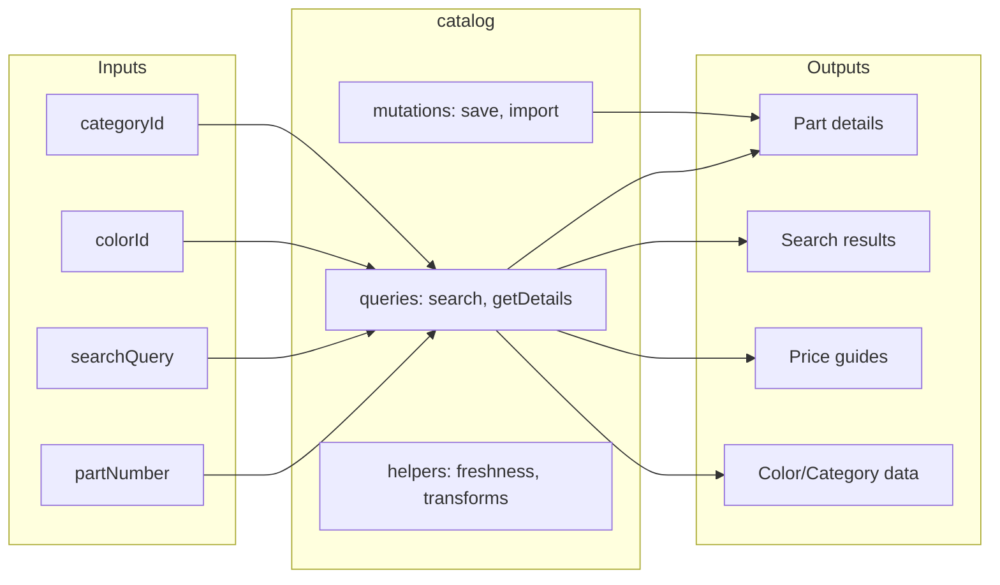
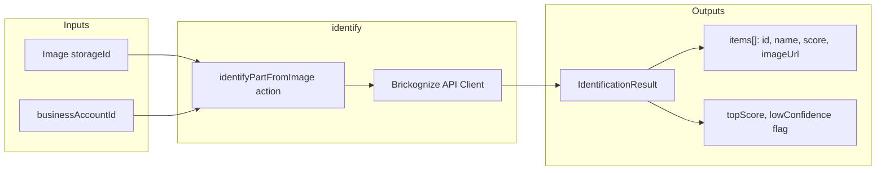
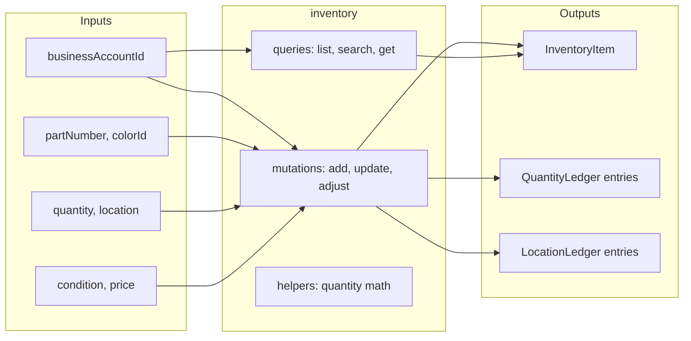
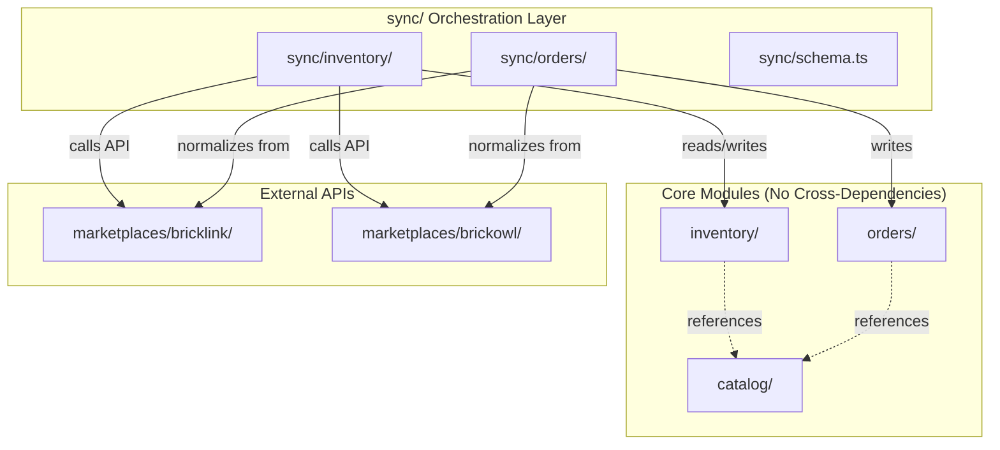
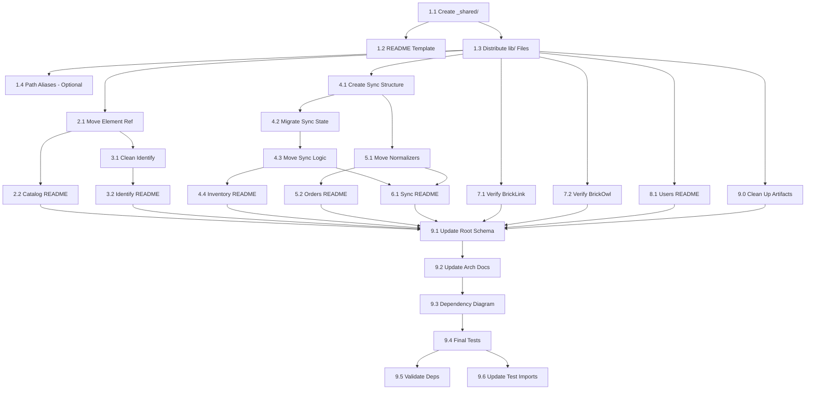

# Modular Architecture Refactor Plan

## Overview

This plan outlines the refactoring of the BrickOps Convex backend from its current structure to a cleaner, more modular architecture where each domain is self-contained with clear inputs/outputs and minimal coupling.

### Goals

1. **Self-contained modules** - Each domain folder contains all its code with no side effects
2. **Clear boundaries** - Each module has documented inputs/outputs via Mermaid diagrams
3. **Unidirectional dependencies** - Core modules don't depend on each other; orchestration happens in dedicated sync layer
4. **Easier onboarding** - New developers can understand a module by reading its README.md

### Current Issues

| Module          | Issue                                                                               |
| --------------- | ----------------------------------------------------------------------------------- |
| `identify/`     | Contains `bricklinkElementReference` table (element mapping isn't "identification") |
| `inventory/`    | Has marketplace sync embedded in schema (`marketplaceSync`, `marketplaceOutbox`)    |
| `orders/`       | Has normalizers for both marketplaces embedded                                      |
| `ratelimiter/`  | Should be shared infrastructure, not a domain                                       |
| `lib/`          | Contains domain-specific external API clients mixed with pure utilities             |
| `lib/external/` | Has ~10 files that need to be distributed to appropriate modules                    |
| `api/`          | Contains `rebrickable.ts` - unclear ownership                                       |
| Root level      | Has `hello.ts`, `hello_impl.ts` debug files that should be cleaned up               |
| `orders/`       | Contains `refactor_baseline/` test artifacts that should be cleaned up              |

### Target Architecture

```
convex/
├── _shared/                    # Cross-cutting infrastructure
│   ├── auth/                   # Authentication helpers
│   ├── ratelimit/              # Rate limiting
│   ├── encryption/             # Credential encryption
│   └── http/                   # Generic HTTP client, retry logic
│
├── catalog/                    # Global LEGO Parts Catalog
│   ├── README.md               # Module docs with Mermaid diagram
│   ├── schema.ts
│   ├── validators.ts
│   ├── queries.ts
│   ├── mutations.ts
│   └── helpers.ts
│
├── identify/                   # Part Identification Service
│   ├── README.md
│   ├── schema.ts
│   ├── validators.ts
│   ├── actions.ts
│   └── helpers.ts
│
├── inventory/                  # Inventory Management (CORE)
│   ├── README.md
│   ├── schema.ts               # inventoryItems, ledgers ONLY
│   ├── validators.ts
│   ├── queries.ts
│   ├── mutations.ts
│   └── helpers.ts
│
├── orders/                     # Order Management (CORE)
│   ├── README.md
│   ├── schema.ts
│   ├── validators.ts
│   ├── queries.ts
│   ├── mutations.ts
│   └── helpers.ts
│
├── sync/                       # NEW: Orchestration Layer
│   ├── README.md
│   ├── schema.ts               # syncState, outbox tables
│   ├── inventory/              # Inventory → Marketplace sync
│   │   ├── actions.ts
│   │   └── worker.ts
│   └── orders/                 # Marketplace → Orders ingestion
│       ├── actions.ts
│       └── normalizers/
│
├── marketplaces/               # External Marketplace APIs
│   ├── README.md
│   ├── shared/
│   ├── bricklink/
│   └── brickowl/
│
├── users/                      # User & Business Account Management
│   ├── README.md
│   ├── schema.ts
│   └── ...
│
├── schema.ts                   # Root schema (imports from modules)
├── crons.ts                    # Scheduled jobs
├── http.ts                     # HTTP endpoints
├── auth.ts                     # Convex Auth (MUST stay at root)
└── auth.config.ts              # Convex Auth config (MUST stay at root)
```

**Note:** `auth.ts` and `auth.config.ts` are Convex Auth framework files that must remain at the root level per Convex conventions.

### Dependency Hierarchy

```
┌─────────────────────────────────────────────────────┐
│                    UI / Frontend                     │
└─────────────────────────────────────────────────────┘
                          │
                          ▼
┌─────────────────────────────────────────────────────┐
│              sync/ (Orchestration)                   │
│   Coordinates inventory ↔ marketplaces ↔ orders     │
└─────────────────────────────────────────────────────┘
                          │
          ┌───────────────┼───────────────┐
          ▼               ▼               ▼
    ┌──────────┐    ┌──────────┐    ┌──────────┐
    │ inventory │    │  orders  │    │ catalog  │
    │  (core)   │    │  (core)  │    │ (global) │
    └──────────┘    └──────────┘    └──────────┘
                          │
                          ▼
┌─────────────────────────────────────────────────────┐
│              marketplaces/ (External APIs)           │
│         bricklink/  |  brickowl/  |  shared/        │
└─────────────────────────────────────────────────────┘
                          │
                          ▼
┌─────────────────────────────────────────────────────┐
│             _shared/ (Infrastructure)                │
│    auth  |  ratelimit  |  encryption  |  http       │
└─────────────────────────────────────────────────────┘
```

**Dependency Rules:**

- Core modules (`inventory`, `orders`, `catalog`) do NOT import from each other
- `sync/` orchestrates between modules - it's the only place cross-module coordination happens
- `marketplaces/` is a pure API wrapper with no business logic
- `_shared/` has no business domain knowledge

---

## Phase 1: Foundation & Infrastructure Consolidation

**Goal:** Consolidate shared infrastructure into `_shared/` without breaking existing code.

---

### Task 1.1: Create `_shared/` Directory Structure

**Agent Instructions:** Create new directory structure and move pure infrastructure code.

**Context:**

- Currently, shared utilities are scattered across `lib/`, `ratelimiter/`, and embedded in domain modules
- We need a single `_shared/` location for cross-cutting concerns

**Steps:**

1. Create `convex/_shared/` directory
2. Create subdirectories: `auth/`, `ratelimit/`, `encryption/`, `http/`
3. Move encryption utilities:
   - `convex/lib/encryption.ts` → `convex/_shared/encryption/index.ts`
   - `convex/lib/webcrypto.ts` → `convex/_shared/encryption/webcrypto.ts`
4. Move rate limiting:
   - `convex/ratelimiter/*` → `convex/_shared/ratelimit/`
   - `convex/lib/dbRateLimiter.ts` → `convex/_shared/ratelimit/dbRateLimiter.ts`
5. Move HTTP utilities from `convex/lib/external/`:
   - `httpClient.ts` → `_shared/http/client.ts`
   - `retry.ts` → `_shared/http/retry.ts`
   - `types.ts` → `_shared/http/types.ts`
6. Update all import paths across the codebase (use grep to find all imports)
7. Create `convex/_shared/README.md` documenting the infrastructure modules
8. Run `pnpm test:backend` to verify no breakage

**Files to Move:**

```
convex/lib/encryption.ts        → convex/_shared/encryption/index.ts
convex/lib/webcrypto.ts         → convex/_shared/encryption/webcrypto.ts
convex/ratelimiter/consume.ts   → convex/_shared/ratelimit/consume.ts
convex/ratelimiter/rateLimitConfig.ts → convex/_shared/ratelimit/config.ts
convex/ratelimiter/schema.ts    → convex/_shared/ratelimit/schema.ts
convex/lib/dbRateLimiter.ts     → convex/_shared/ratelimit/dbRateLimiter.ts
convex/lib/external/httpClient.ts → convex/_shared/http/client.ts
convex/lib/external/retry.ts    → convex/_shared/http/retry.ts
convex/lib/external/types.ts    → convex/_shared/http/types.ts
```

**Acceptance Criteria:**

- [ ] All moved files exist in new locations
- [ ] Old file locations are deleted
- [ ] All import paths updated across codebase (including `__tests__/` files)
- [ ] `convex/_shared/README.md` exists with documentation
- [ ] `pnpm test:backend` passes
- [ ] No TypeScript errors

**Estimated Files Affected:** ~20-30 files (import path updates, including test files)

---

### Task 1.2: Create Module README Template

**Agent Instructions:** Establish documentation standard for all modules.

**Context:**

- Each module needs a consistent README format
- READMEs should include Mermaid diagrams for visual understanding

**Steps:**

1. Create `docs/templates/module-readme-template.md`
2. Include these sections:
   - Module description (1-2 sentences)
   - Mermaid diagram showing inputs/outputs
   - Tables Owned (list with descriptions)
   - Public Functions (table with function name, type, description)
   - Dependencies (what this module uses)
   - Used By (what modules use this)
   - Internal Functions (brief list)
3. Create an example by documenting `convex/users/` as `convex/users/README.md`

**Template Structure:**

```markdown
# Module Name

Brief description of what this module does.

## Inputs & Outputs

\`\`\`mermaid
graph LR
subgraph Inputs
A[input1]
B[input2]
end

    subgraph module_name
        C[function1]
        D[function2]
    end

    subgraph Outputs
        E[output1]
        F[output2]
    end

    A --> C
    B --> C
    C --> E
    D --> F

\`\`\`

## Tables Owned

| Table       | Description            |
| ----------- | ---------------------- |
| `tableName` | What this table stores |

## Public Functions

| Function       | Type                  | Description  |
| -------------- | --------------------- | ------------ |
| `functionName` | query/mutation/action | What it does |

## Dependencies

- `_shared/auth` - For authentication
- `_shared/ratelimit` - For rate limiting

## Used By

- `sync/inventory` - For sync orchestration

## Internal Functions

- `internalFunctionName` - Brief description
```

**Acceptance Criteria:**

- [ ] Template file exists at `docs/templates/module-readme-template.md`
- [ ] Template includes all required sections
- [ ] Example README created for `convex/users/README.md`
- [ ] Mermaid diagrams render correctly in GitHub/docs viewer

---

### Task 1.3: Distribute Remaining `lib/` Files

**Agent Instructions:** Move domain-specific clients to their modules and shared utilities to `_shared/`.

**Context:**

- After Task 1.1, `lib/` still contains domain-specific API clients and other utilities
- These need to be moved to their appropriate modules to complete the cleanup

**Files to Move:**

| Current Location              | Destination                           | Rationale                    |
| ----------------------------- | ------------------------------------- | ---------------------------- |
| `lib/external/brickognize.ts` | `identify/client.ts`                  | Domain-specific API client   |
| `lib/external/brickowl.ts`    | `marketplaces/brickowl/httpClient.ts` | Domain-specific API client   |
| `lib/external/email.ts`       | `_shared/email/index.ts`              | Cross-cutting infrastructure |
| `lib/external/env.ts`         | `_shared/env.ts`                      | Cross-cutting infrastructure |
| `lib/external/metrics.ts`     | `_shared/metrics/index.ts`            | Cross-cutting infrastructure |
| `lib/external/validate.ts`    | `_shared/validation/index.ts`         | Cross-cutting infrastructure |
| `lib/normalization.ts`        | `_shared/normalization.ts`            | Generic utility              |
| `lib/oauth.ts`                | `_shared/auth/oauth.ts`               | Auth infrastructure          |
| `lib/upstreamRequest.ts`      | `_shared/http/upstreamRequest.ts`     | HTTP infrastructure          |
| `api/rebrickable.ts`          | `catalog/rebrickable.ts`              | Catalog data source          |

**Steps:**

1. For each file in the table above:
   - Read the file to understand its dependencies
   - Create the destination file
   - Update all imports that reference the old location
   - Delete the old file
2. After all moves, verify `lib/external/` only contains files moved in Task 1.1
3. If `lib/` is empty, delete the directory
4. If `api/` is empty, delete the directory
5. Run `pnpm test:backend` to verify no breakage

**Acceptance Criteria:**

- [ ] All files moved to appropriate locations
- [ ] `lib/external/` directory is empty and deleted
- [ ] `lib/` directory is empty and deleted (or contains only re-exports during transition)
- [ ] `api/` directory is empty and deleted
- [ ] All import paths updated across codebase
- [ ] `pnpm test:backend` passes

**Estimated Files Affected:** ~30-40 files (import path updates)

---

### Task 1.4: Add Import Path Aliases (Optional)

**Agent Instructions:** Configure TypeScript path aliases for cleaner imports.

**Context:**

- With deep nesting like `../_shared/encryption/`, imports become verbose
- Path aliases improve readability and make future refactoring easier

**Steps:**

1. Update `tsconfig.json` to add path aliases:
   ```json
   {
     "compilerOptions": {
       "paths": {
         "@shared/*": ["./convex/_shared/*"],
         "@catalog/*": ["./convex/catalog/*"],
         "@inventory/*": ["./convex/inventory/*"],
         "@orders/*": ["./convex/orders/*"],
         "@sync/*": ["./convex/sync/*"],
         "@marketplaces/*": ["./convex/marketplaces/*"]
       }
     }
   }
   ```
2. Verify Convex bundler supports these aliases (check Convex docs)
3. If supported, update a few imports as a test
4. Document the aliases in `_shared/README.md`

**Note:** This task is optional and should only be done if Convex supports path aliases. Skip if it causes bundler issues.

**Acceptance Criteria:**

- [ ] Path aliases configured (if supported)
- [ ] At least one import updated to use alias as proof-of-concept
- [ ] Documentation updated
- [ ] OR: Task marked as "Not Supported" with explanation

---

## Phase 2: Catalog Module Cleanup

**Goal:** Ensure catalog module is self-contained and properly documented.

---

### Task 2.1: Move Element Reference Table to Catalog

**Agent Instructions:** The `bricklinkElementReference` table belongs in catalog, not identify.

**Context:**

- `bricklinkElementReference` maps LEGO element IDs to part numbers
- This is catalog reference data, not part identification
- Currently located in `convex/identify/schema.ts`

**Current Location:** `convex/identify/schema.ts`
**Target Location:** `convex/catalog/schema.ts`

**Steps:**

1. Read `convex/identify/schema.ts` to understand current table definition
2. Read `convex/catalog/schema.ts` to understand existing structure
3. Move `bricklinkElementReference` table definition from `identify/schema.ts` to `catalog/schema.ts`
4. Update `convex/identify/schema.ts` exports (may become empty or minimal)
5. Update `convex/schema.ts` root imports if needed
6. Search codebase for any references to `bricklinkElementReference`:
   - Use grep for: `bricklinkElementReference`, `by_element`, `by_part` (the indexes)
7. Update all import paths that reference this table
8. Run `pnpm test:backend` to verify

**Acceptance Criteria:**

- [ ] `bricklinkElementReference` table exists only in `catalog/schema.ts`
- [ ] `identify/schema.ts` no longer exports this table
- [ ] All queries/mutations referencing this table work correctly
- [ ] `pnpm test:backend` passes

**Files Affected:**

- `convex/identify/schema.ts`
- `convex/catalog/schema.ts`
- `convex/schema.ts`
- Any files querying `bricklinkElementReference`

---

### Task 2.2: Create Catalog Module README

**Agent Instructions:** Document the catalog module with Mermaid diagram.

**Context:**

- Catalog is a "root" module with no domain dependencies
- It provides global LEGO parts data to other modules
- Tables: parts, colors, categories, priceGuides, catalogPartOverlay, bricklinkElementReference

**Steps:**

1. Read all files in `convex/catalog/` to understand the module
2. Create `convex/catalog/README.md` using the template from Task 1.2
3. Create Mermaid diagram showing:
   - Inputs: partNumber, searchQuery, colorId, categoryId
   - Functions: searchParts, getPartDetails, etc.
   - Outputs: Part details, search results, price guides
4. Document all tables with descriptions
5. List all public functions (queries, mutations, actions)
6. Document that this module has NO domain dependencies

**Mermaid Diagram:**



**Acceptance Criteria:**

- [ ] `convex/catalog/README.md` exists
- [ ] Mermaid diagram renders correctly
- [ ] All tables documented
- [ ] All public functions documented
- [ ] Dependencies section states "None (root module)"

---

## Phase 3: Identify Module Cleanup

**Goal:** Make identify module focused solely on part identification.

---

### Task 3.1: Clean Up Identify Module

**Agent Instructions:** After element reference is moved (Task 2.1), verify identify is self-contained.

**Depends On:** Task 2.1

**Context:**

- The identify module should ONLY handle part identification via Brickognize
- After moving element reference, the schema may be empty
- The module should have no knowledge of catalog structure

**Steps:**

1. Verify `identify/schema.ts` is empty or only contains identification-related tables
2. Review `identify/helpers.ts` - ensure no catalog coupling exists
3. Review `identify/actions.ts` - verify it only:
   - Takes an image
   - Calls Brickognize API
   - Returns identification results
4. Consider if we need an `identificationSessions` table for tracking (optional)
5. Remove any dead code or unused imports
6. Run `pnpm test:backend` to verify

**Acceptance Criteria:**

- [ ] Module has no external domain dependencies (only `_shared/`)
- [ ] No imports from `catalog/`, `inventory/`, `orders/`
- [ ] `identify/schema.ts` contains only identification-related tables (or is minimal)
- [ ] `pnpm test:backend` passes

---

### Task 3.2: Create Identify Module README

**Agent Instructions:** Document the identify module.

**Depends On:** Task 3.1

**Steps:**

1. Create `convex/identify/README.md` using the template
2. Create Mermaid diagram:



3. Document the action and its return types
4. Document confidence threshold logic from `helpers.ts`
5. Note external dependency on Brickognize API

**Acceptance Criteria:**

- [ ] `convex/identify/README.md` exists
- [ ] External API dependency (Brickognize) is clearly documented
- [ ] Input/output types are documented
- [ ] Confidence threshold logic is explained

---

## Phase 4: Inventory Module Decoupling

**Goal:** Remove marketplace sync concerns from core inventory module.

**⚠️ This phase contains high-risk tasks requiring careful execution.**

---

### Task 4.1: Create Sync Module Structure

**Agent Instructions:** Create the new `sync/` orchestration module structure.

**Context:**

- The `sync/` module will own all coordination between core modules and marketplaces
- It will contain sync state, outbox tables, and orchestration logic
- This task creates the structure; later tasks will move code into it

**Steps:**

1. Create directory structure:
   ```
   convex/sync/
   ├── README.md
   ├── schema.ts
   ├── inventory/
   │   ├── actions.ts
   │   └── worker.ts
   └── orders/
       ├── actions.ts
       └── normalizers/
   ```
2. Create `convex/sync/schema.ts` with placeholder for new tables (will be populated in Task 4.2)
3. Create stub files with minimal exports:
   - `sync/inventory/actions.ts` - empty export
   - `sync/inventory/worker.ts` - empty export
   - `sync/orders/actions.ts` - empty export
4. Create `convex/sync/README.md` explaining the orchestration role
5. Update `convex/schema.ts` to import from sync (even if empty initially)

**Acceptance Criteria:**

- [ ] Directory structure exists as specified
- [ ] `sync/schema.ts` compiles (even if minimal)
- [ ] `sync/README.md` documents the module's purpose
- [ ] `pnpm test:backend` passes

---

### Task 4.2: Migrate Marketplace Sync State from Inventory

**Agent Instructions:** Move `marketplaceSync` field from `inventoryItems` to dedicated sync table.

**Depends On:** Task 4.1

**⚠️ HIGH RISK - Requires data migration and careful testing**

**Context:**

- Currently, `inventoryItems` has embedded `marketplaceSync` object
- This couples inventory to marketplace concerns
- We need to extract this to a separate `inventorySyncState` table in `sync/`

**Current Schema (in inventory/schema.ts):**

```typescript
marketplaceSync: v.optional(v.object({
  bricklink: v.optional(v.object({
    lotId, status, lastSyncAttempt, error, lastSyncedSeq, lastSyncedAvailable
  })),
  brickowl: v.optional(v.object({
    lotId, status, lastSyncAttempt, error, lastSyncedSeq, lastSyncedAvailable
  })),
})),
```

**New Schema (in sync/schema.ts):**

```typescript
inventorySyncState: defineTable({
  itemId: v.id("inventoryItems"),
  provider: v.union(v.literal("bricklink"), v.literal("brickowl")),
  lotId: v.optional(v.string()),
  status: v.union(
    v.literal("pending"),
    v.literal("syncing"),
    v.literal("synced"),
    v.literal("failed"),
    v.literal("disabled"),
  ),
  lastSyncAttempt: v.optional(v.number()),
  lastSyncedSeq: v.optional(v.number()),
  lastSyncedAvailable: v.optional(v.number()),
  error: v.optional(v.string()),
})
  .index("by_item", ["itemId"])
  .index("by_item_provider", ["itemId", "provider"])
  .index("by_status", ["status"])
  .index("by_provider_status", ["provider", "status"]);
```

**Steps:**

1. Add `inventorySyncState` table to `sync/schema.ts`
2. Update `convex/schema.ts` to include the new table
3. Create migration mutation `sync/migrations/migrateInventorySyncState.ts`:
   - Read all `inventoryItems` with `marketplaceSync` data
   - For each item with bricklink sync data, create `inventorySyncState` record
   - For each item with brickowl sync data, create `inventorySyncState` record
   - Log migration progress
4. Run migration in development environment
5. Verify data integrity:
   - Count original sync records vs migrated records
   - Spot check several records
6. Update queries/mutations that read `marketplaceSync`:
   - Search for `marketplaceSync` in codebase
   - Update to query `inventorySyncState` table instead
7. Update inventory queries to join with sync state when needed
8. After all code is updated and tested, remove `marketplaceSync` field from `inventoryItems` schema
9. Move `marketplaceOutbox` table from `inventory/schema.ts` to `sync/schema.ts`
10. Run full test suite

**Files Affected:**

- `convex/sync/schema.ts` (add table)
- `convex/inventory/schema.ts` (remove marketplaceSync, remove marketplaceOutbox)
- `convex/schema.ts` (update imports)
- `convex/inventory/sync.ts`
- `convex/inventory/syncWorker.ts`
- `convex/inventory/queries.ts`
- Multiple marketplace files that check sync status

**Acceptance Criteria:**

- [ ] `inventorySyncState` table exists in `sync/schema.ts`
- [ ] `marketplaceOutbox` table moved to `sync/schema.ts`
- [ ] Migration script exists and works
- [ ] All sync state queries use new table
- [ ] `inventoryItems` schema has no `marketplaceSync` field
- [ ] `pnpm test:backend` passes
- [ ] Data integrity verified

---

### Task 4.3: Move Sync Logic to Sync Module

**Agent Instructions:** Move inventory sync orchestration from `inventory/` to `sync/inventory/`.

**Depends On:** Task 4.2

**Context:**

- `inventory/sync.ts` and `inventory/syncWorker.ts` contain marketplace sync orchestration
- This logic belongs in `sync/inventory/` to maintain clean separation

**Steps:**

1. Move `inventory/sync.ts` → `sync/inventory/orchestrator.ts`
2. Move `inventory/syncWorker.ts` → `sync/inventory/worker.ts`
3. Update internal function paths in the moved files
4. Update `convex/crons.ts` to reference new locations
5. Search for all imports of old paths and update:
   - `internal.inventory.sync.*` → `internal.sync.inventory.*`
   - `internal.inventory.syncWorker.*` → `internal.sync.inventory.*`
6. Update any direct imports in other files
7. Delete old files after all references updated
8. Run `pnpm test:backend`

**Files Affected:**

- `convex/inventory/sync.ts` (move)
- `convex/inventory/syncWorker.ts` (move)
- `convex/sync/inventory/orchestrator.ts` (new)
- `convex/sync/inventory/worker.ts` (new)
- `convex/crons.ts`
- Files importing sync functions

**Acceptance Criteria:**

- [ ] Sync logic exists only in `sync/inventory/`
- [ ] Old files deleted from `inventory/`
- [ ] Cron jobs reference new locations
- [ ] All internal references updated
- [ ] `pnpm test:backend` passes

---

### Task 4.4: Create Inventory Module README

**Agent Instructions:** Document the clean inventory module.

**Depends On:** Task 4.3

**Steps:**

1. Create `convex/inventory/README.md` using the template
2. Create Mermaid diagram:



3. Document tables: `inventoryItems`, `inventoryQuantityLedger`, `inventoryLocationLedger`
4. Document all public queries and mutations
5. Explicitly note: "Marketplace sync is handled by `sync/` module"

**Acceptance Criteria:**

- [ ] `convex/inventory/README.md` exists
- [ ] No mention of marketplace sync in inventory module
- [ ] All tables documented
- [ ] All public functions documented

---

## Phase 5: Orders Module Decoupling

**Goal:** Remove marketplace normalizers from core orders module.

---

### Task 5.1: Move Order Normalizers to Sync Module

**Agent Instructions:** Move `orders/normalizers/` to `sync/orders/normalizers/`.

**Context:**

- Order normalizers transform marketplace-specific order formats to unified format
- This is orchestration/integration logic, not core order business logic
- Moving to `sync/` keeps orders module clean

**Steps:**

1. Copy entire `orders/normalizers/` directory to `sync/orders/normalizers/`
2. Update imports within the normalizer files (relative paths may change)
3. Search for all imports of `orders/normalizers/`:
   - `convex/orders/ingestion.ts`
   - Marketplace order actions
4. Update all import paths to `sync/orders/normalizers/`
5. Consider moving `orders/ingestion.ts` to `sync/orders/ingestion.ts` if it's purely orchestration
6. Delete old `orders/normalizers/` directory
7. Run `pnpm test:backend`

**Files Affected:**

- `convex/orders/normalizers/*` (move)
- `convex/sync/orders/normalizers/*` (new)
- `convex/orders/ingestion.ts` (update imports or move)
- Marketplace order actions

**Acceptance Criteria:**

- [ ] Normalizers exist only in `sync/orders/normalizers/`
- [ ] Old directory deleted
- [ ] Order ingestion works correctly
- [ ] `pnpm test:backend` passes

---

### Task 5.2: Create Orders Module README

**Agent Instructions:** Document the clean orders module.

**Depends On:** Task 5.1

**Steps:**

1. Create `convex/orders/README.md` using the template
2. Create Mermaid diagram showing:
   - Order creation/update inputs
   - Order query outputs
   - No direct marketplace dependencies
3. Document tables: orders, orderItems (if exists)
4. Document public functions
5. Note: "Order ingestion from marketplaces is handled by `sync/orders/`"

**Acceptance Criteria:**

- [ ] `convex/orders/README.md` exists
- [ ] Module has no marketplace-specific code
- [ ] All tables and functions documented

---

## Phase 6: Sync Module Completion

**Goal:** Complete the sync orchestration module documentation.

---

### Task 6.1: Create Sync Module README

**Agent Instructions:** Document the orchestration layer comprehensively.

**Depends On:** Task 4.3, Task 5.1

**Steps:**

1. Create comprehensive `convex/sync/README.md`
2. Create architecture diagram:



3. Document data flows:
   - **Inventory → Marketplace:** How inventory changes sync to BrickLink/BrickOwl
   - **Marketplace → Orders:** How orders are ingested and normalized
4. Document tables owned: `inventorySyncState`, `marketplaceOutbox`
5. Document the worker/cron job pattern

**Acceptance Criteria:**

- [ ] `convex/sync/README.md` clearly explains orchestration responsibilities
- [ ] Both data flows documented with diagrams
- [ ] Tables and their purposes documented

---

## Phase 7: Marketplaces Module Verification

**Goal:** Ensure marketplace modules are pure API wrappers with no business logic.

**Note on Marketplace Catalog Subdirectories:**
The BrickLink module has `marketplaces/bricklink/catalog/` with subdirectories for categories, colors, parts, and priceGuides. These are for:

- Fetching catalog data **from** the BrickLink API
- Transforming and storing it in our `catalog/` tables

This is a **catalog sync** flow (Marketplace API → Our Catalog). The current structure is acceptable because:

- The marketplace module only calls its own API and transforms responses
- The actual persistence to `catalog/` tables should happen via actions that call `catalog/` mutations
- If marketplace modules write directly to `catalog/` tables, this should be refactored to go through `sync/catalog/` (future task)

---

### Task 7.1: Verify BrickLink Module Isolation

**Agent Instructions:** Ensure BrickLink module only handles API communication.

**Steps:**

1. Review all files in `marketplaces/bricklink/`
2. Verify the module ONLY:
   - Makes API calls to BrickLink
   - Transforms API responses via transformers
   - Manages its own tables (credentials, notifications)
3. Check for violations:
   - No direct `ctx.db.insert/patch/delete` on `inventoryItems` or `orders`
   - No business logic decisions (those belong in `sync/`)
4. Document any violations found
5. If violations exist, create follow-up tasks to fix them
6. Update `marketplaces/bricklink/README.md` if needed

**Acceptance Criteria:**

- [ ] Module only makes API calls and transforms responses
- [ ] No direct writes to core tables (inventory, orders)
- [ ] README is accurate

---

### Task 7.2: Verify BrickOwl Module Isolation

**Agent Instructions:** Same verification as Task 7.1 for BrickOwl.

**Steps:**

1. Review all files in `marketplaces/brickowl/`
2. Apply same isolation criteria as Task 7.1
3. Document any violations
4. Update README if needed

**Acceptance Criteria:**

- [ ] Same criteria as Task 7.1

---

## Phase 8: Users Module Documentation

**Goal:** Document the users module.

---

### Task 8.1: Create Users Module README

**Agent Instructions:** Document user and business account management.

**Steps:**

1. Create `convex/users/README.md` using the template
2. Create Mermaid diagram showing:
   - User creation/authentication flow
   - Business account management
   - Role-based access control
3. Document tables: users, businessAccounts, invitations, etc.
4. Document authorization helpers in `authorization.ts`
5. Document public functions

**Acceptance Criteria:**

- [ ] `convex/users/README.md` exists
- [ ] RBAC logic documented
- [ ] All tables and functions documented

---

## Phase 9: Final Cleanup & Verification

**Goal:** Ensure all modules are properly isolated and documented.

---

### Task 9.0: Clean Up Debug and Test Artifacts

**Agent Instructions:** Remove debug files and relocate test fixtures.

**Context:**

- `convex/hello.ts` and `convex/hello_impl.ts` are debug/test files that don't belong in production
- `convex/orders/refactor_baseline/` contains test fixtures that should be in `__tests__/`

**Steps:**

1. Review `convex/hello.ts` and `convex/hello_impl.ts`:
   - If they are only used for testing/debugging, delete them
   - If they serve a purpose, document why they exist
2. Review `convex/orders/refactor_baseline/`:
   - If these are test fixtures, move to `__tests__/backend/orders/fixtures/`
   - Update any test files that reference these fixtures
   - If no tests use them, delete the directory
3. Search for any other debug/test files at root level that don't belong
4. Run `pnpm test` to verify nothing breaks

**Acceptance Criteria:**

- [ ] `hello.ts` and `hello_impl.ts` removed or documented
- [ ] `orders/refactor_baseline/` relocated or removed
- [ ] No orphaned test fixtures in `convex/`
- [ ] All tests pass

---

### Task 9.1: Update Root Schema Organization

**Agent Instructions:** Clean up `convex/schema.ts` imports and organization.

**Depends On:** All previous phases

**Steps:**

1. Organize imports by module with clear groupings
2. Add section comments:

   ```typescript
   // ============================================
   // Infrastructure
   // ============================================

   // ============================================
   // Core Business Domains
   // ============================================

   // ============================================
   // Orchestration
   // ============================================

   // ============================================
   // External Integrations
   // ============================================
   ```

3. Verify no orphaned tables (tables not imported from any module)
4. Verify all module schemas are properly exported

**Acceptance Criteria:**

- [ ] Root schema is well-organized with clear sections
- [ ] All tables accounted for
- [ ] No duplicate table definitions

---

### Task 9.2: Update Architecture Documentation

**Agent Instructions:** Update `docs/architecture/backend/architecture.md` to reflect new structure.

**Depends On:** Task 9.1

**Steps:**

1. Update the directory tree diagram in architecture.md
2. Update module descriptions to match new structure
3. Add section about the `sync/` orchestration layer
4. Add references to individual module READMEs
5. Document the dependency hierarchy rules
6. Update any examples that reference old paths

**Acceptance Criteria:**

- [ ] Architecture docs match actual structure
- [ ] New patterns (sync layer) documented
- [ ] Module README locations referenced

---

### Task 9.3: Create Module Dependency Diagram

**Agent Instructions:** Create a comprehensive dependency visualization.

**Steps:**

1. Create `docs/architecture/backend/module-dependencies.md`
2. Include full Mermaid diagram showing all module relationships
3. Document dependency rules explicitly:
   - Core modules don't import each other
   - Only sync/ coordinates between modules
   - All modules can use \_shared/
4. Include a table showing what each module can/cannot import

**Dependency Matrix:**
| Module | Can Import | Cannot Import |
|--------|------------|---------------|
| `_shared/*` | Nothing | All domains |
| `catalog` | `_shared/*` | inventory, orders, sync, marketplaces |
| `identify` | `_shared/*` | catalog, inventory, orders, sync, marketplaces |
| `inventory` | `_shared/*`, `catalog` | orders, sync, marketplaces |
| `orders` | `_shared/*`, `catalog` | inventory, sync, marketplaces |
| `sync` | `_shared/*`, `catalog`, `inventory`, `orders`, `marketplaces` | - |
| `marketplaces` | `_shared/*` | catalog, inventory, orders, sync |
| `users` | `_shared/*` | catalog, identify, inventory, orders, sync, marketplaces |

**Acceptance Criteria:**

- [ ] `docs/architecture/backend/module-dependencies.md` exists
- [ ] Complete dependency diagram
- [ ] Dependency rules clearly stated
- [ ] Matrix table included

---

### Task 9.4: Final Test Suite Run

**Agent Instructions:** Verify all tests pass after refactoring.

**Depends On:** All previous tasks

**Steps:**

1. Run `pnpm test:backend` - all backend tests
2. Run `pnpm test:frontend` - all frontend tests
3. Run `pnpm lint` - ensure no linting errors
4. Run `pnpm typecheck` - ensure no TypeScript errors
5. Document any failures and fix them
6. Create summary of test results

**Acceptance Criteria:**

- [ ] `pnpm test:backend` passes
- [ ] `pnpm test:frontend` passes
- [ ] `pnpm lint` passes
- [ ] `pnpm typecheck` passes
- [ ] No regressions from refactoring

---

### Task 9.5: Validate Dependency Rules

**Agent Instructions:** Programmatically verify that modules follow the dependency hierarchy.

**Depends On:** Task 9.4

**Context:**

- The dependency matrix defines what each module can/cannot import
- This task creates automated checks to catch violations

**Steps:**

1. Create a validation script `scripts/check-module-deps.sh`:

   ```bash
   #!/bin/bash
   # Check that core modules don't cross-import

   echo "Checking inventory/ doesn't import from orders/..."
   if rg "from ['\"].*orders" convex/inventory/ --quiet; then
     echo "VIOLATION: inventory/ imports from orders/"
     exit 1
   fi

   echo "Checking orders/ doesn't import from inventory/..."
   if rg "from ['\"].*inventory" convex/orders/ --quiet; then
     echo "VIOLATION: orders/ imports from inventory/"
     exit 1
   fi

   echo "Checking marketplaces/ doesn't import from core modules..."
   if rg "from ['\"].*/(inventory|orders|catalog|sync)/" convex/marketplaces/ --quiet; then
     echo "VIOLATION: marketplaces/ imports from core modules"
     exit 1
   fi

   echo "Checking _shared/ has no domain imports..."
   if rg "from ['\"].*/(inventory|orders|catalog|identify|sync|marketplaces|users)/" convex/_shared/ --quiet; then
     echo "VIOLATION: _shared/ imports from domain modules"
     exit 1
   fi

   echo "All dependency rules validated!"
   ```

2. Run the script and fix any violations found
3. Add to `package.json` scripts: `"check:deps": "bash scripts/check-module-deps.sh"`
4. Consider adding to CI pipeline

**Acceptance Criteria:**

- [ ] Validation script exists and runs successfully
- [ ] No dependency violations detected
- [ ] Script added to package.json
- [ ] Documentation updated to reference the check

---

### Task 9.6: Update Test File Imports

**Agent Instructions:** Update test files to use new import paths.

**Depends On:** Task 9.4

**Context:**

- Test files in `__tests__/backend/` likely import from old paths
- These need to be updated to match the new module structure

**Steps:**

1. Search for all imports in `__tests__/backend/` that reference moved files:
   ```bash
   rg "from ['\"].*convex/lib" __tests__/
   rg "from ['\"].*convex/ratelimiter" __tests__/
   ```
2. Update each import to the new path
3. Run `pnpm test:backend` to verify tests still pass
4. Update any mock paths that reference old locations

**Acceptance Criteria:**

- [ ] All test imports use new paths
- [ ] No references to deleted directories (`lib/`, `ratelimiter/`)
- [ ] All tests pass

---

## Task Dependency Graph



---

## Parallelization Strategy

The following task groups can be assigned to different AI agents working in parallel:

### Wave 1 (Foundation)

- **Agent A:** Task 1.1 (Create \_shared/)

### Wave 2 (After 1.1 completes)

- **Agent A:** Task 1.3 (Distribute lib/ Files) - **BLOCKING: Must complete before other waves**
- **Agent B:** Task 1.2 (README Template) - Can run in parallel

### Wave 3 (After 1.3 completes)

Run in parallel:

- **Agent A:** Task 2.1 (Move Element Ref) → Task 2.2 (Catalog README)
- **Agent B:** Task 4.1 (Create Sync Structure)
- **Agent C:** Task 7.1 (Verify BrickLink) + Task 7.2 (Verify BrickOwl)
- **Agent D:** Task 8.1 (Users README) + Task 9.0 (Clean Up Artifacts)
- **Agent E:** Task 1.4 (Path Aliases - Optional, can skip if problematic)

### Wave 4 (After dependencies complete)

Run in parallel:

- **Agent A:** Task 3.1 → Task 3.2 (Identify cleanup and README) - after 2.1
- **Agent B:** Task 4.2 (Migrate Sync State) - **⚠️ HIGH RISK - Senior/careful agent**
- **Agent C:** Task 5.1 → Task 5.2 (Orders normalizers and README)

### Wave 5 (After Wave 4)

- **Agent A:** Task 4.3 (Move Sync Logic)
- **Agent B:** Task 4.4 (Inventory README) - after 4.3

### Wave 6 (After Wave 5)

- **Agent A:** Task 6.1 (Sync README)

### Wave 7 (Final - Sequential)

Single agent, sequential execution:

- Task 9.1 → Task 9.2 → Task 9.3 → Task 9.4 → Task 9.5 + Task 9.6 (parallel)

---

## Risk Assessment

| Task                      | Risk Level | Mitigation Strategy                                                    |
| ------------------------- | ---------- | ---------------------------------------------------------------------- |
| 1.1 `_shared/` migration  | Medium     | Update imports incrementally, test after each file move                |
| 1.3 Distribute lib/ files | Medium     | Many files, many imports - update incrementally, test frequently       |
| 1.4 Path aliases          | Low        | Optional task, skip if Convex doesn't support                          |
| 2.1 Move element ref      | Low        | Simple table move, limited references                                  |
| 4.2 Sync state migration  | **HIGH**   | Create migration script, backup data first, test in dev, verify counts |
| 4.3 Move sync logic       | Medium     | Keep old imports working during transition, update incrementally       |
| 5.1 Move normalizers      | Low        | Pure code move, no data migration                                      |
| 9.0 Clean up artifacts    | Low        | Test artifacts, verify nothing depends on them                         |
| 9.5 Validate deps         | Low        | Creates new script, no existing code changes                           |
| 9.6 Update test imports   | Medium     | Many test files may need updates                                       |
| All README tasks          | Low        | Documentation only, no code changes                                    |

### High-Risk Task 4.2 Checklist

Before executing Task 4.2:

- [ ] Back up database state
- [ ] Run migration in development first
- [ ] Verify record counts match
- [ ] Spot check 5-10 random records
- [ ] Have rollback plan ready
- [ ] Test all sync functionality after migration

---

## Rollback Strategy

Each phase should create a git checkpoint for easy rollback:

### Git Checkpoints

```bash
# After each phase completes successfully:
git add -A && git commit -m "refactor(convex): complete Phase X.X - [description]"
```

### Phase-Specific Rollback

| Phase     | Rollback Method                                                  |
| --------- | ---------------------------------------------------------------- |
| Phase 1   | `git revert` commits; imports are the main concern               |
| Phase 2   | `git revert` schema change; no data migration                    |
| Phase 3   | `git revert`; documentation only                                 |
| Phase 4   | **Complex** - requires database rollback for Task 4.2, see below |
| Phase 5   | `git revert`; pure code move                                     |
| Phase 6-8 | `git revert`; documentation only                                 |
| Phase 9   | `git revert`; mostly documentation                               |

### Task 4.2 Rollback (Data Migration)

If Task 4.2 fails mid-migration:

1. **Stop all sync crons** immediately
2. Delete all records from `inventorySyncState` table
3. Revert schema changes via git
4. Re-deploy to restore `marketplaceSync` field
5. Verify inventory sync still works with old structure

**Prevention:** Run migration in development environment first. Only proceed to production after full verification.

---

## Success Metrics

After completing all phases:

1. **Module Independence:** No circular dependencies between core modules
2. **Documentation Coverage:** Every module has a README.md with Mermaid diagram
3. **Test Coverage:** All existing tests pass
4. **Clean Boundaries:**
   - `inventory/` has no marketplace code
   - `orders/` has no normalizer code
   - `identify/` has no catalog tables
   - `_shared/` has no domain-specific code
   - `lib/` directory no longer exists
5. **Automated Validation:** `pnpm check:deps` passes with no violations
6. **Onboarding Time:** A new developer can understand any module by reading its README
7. **No Dead Code:** Debug files and orphaned test fixtures removed

---

## Appendix: Files Reference

### Current File Locations (to move)

**Task 1.1 - Infrastructure to `_shared/`:**

```
convex/lib/encryption.ts          → convex/_shared/encryption/index.ts
convex/lib/webcrypto.ts           → convex/_shared/encryption/webcrypto.ts
convex/lib/dbRateLimiter.ts       → convex/_shared/ratelimit/dbRateLimiter.ts
convex/lib/external/httpClient.ts → convex/_shared/http/client.ts
convex/lib/external/retry.ts      → convex/_shared/http/retry.ts
convex/lib/external/types.ts      → convex/_shared/http/types.ts
convex/ratelimiter/*              → convex/_shared/ratelimit/*
```

**Task 1.3 - Remaining lib/ files:**

```
convex/lib/external/brickognize.ts → convex/identify/client.ts
convex/lib/external/brickowl.ts    → convex/marketplaces/brickowl/httpClient.ts
convex/lib/external/email.ts       → convex/_shared/email/index.ts
convex/lib/external/env.ts         → convex/_shared/env.ts
convex/lib/external/metrics.ts     → convex/_shared/metrics/index.ts
convex/lib/external/validate.ts    → convex/_shared/validation/index.ts
convex/lib/normalization.ts        → convex/_shared/normalization.ts
convex/lib/oauth.ts                → convex/_shared/auth/oauth.ts
convex/lib/upstreamRequest.ts      → convex/_shared/http/upstreamRequest.ts
convex/api/rebrickable.ts          → convex/catalog/rebrickable.ts
```

**Task 2.1 - Element reference table:**

```
convex/identify/schema.ts (bricklinkElementReference) → convex/catalog/schema.ts
```

**Tasks 4.2-4.3 - Inventory sync:**

```
convex/inventory/sync.ts       → convex/sync/inventory/orchestrator.ts
convex/inventory/syncWorker.ts → convex/sync/inventory/worker.ts
```

**Task 5.1 - Order normalizers:**

```
convex/orders/normalizers/* → convex/sync/orders/normalizers/*
```

**Task 9.0 - Files to delete/relocate:**

```
convex/hello.ts              → DELETE (debug file)
convex/hello_impl.ts         → DELETE (debug file)
convex/orders/refactor_baseline/* → __tests__/backend/orders/fixtures/ OR DELETE
```

### New File Locations (to create)

```
# Infrastructure (_shared/)
convex/_shared/README.md
convex/_shared/encryption/index.ts
convex/_shared/encryption/webcrypto.ts
convex/_shared/ratelimit/*
convex/_shared/http/client.ts
convex/_shared/http/retry.ts
convex/_shared/http/types.ts
convex/_shared/http/upstreamRequest.ts
convex/_shared/email/index.ts
convex/_shared/env.ts
convex/_shared/metrics/index.ts
convex/_shared/validation/index.ts
convex/_shared/normalization.ts
convex/_shared/auth/oauth.ts

# Sync module
convex/sync/schema.ts
convex/sync/README.md
convex/sync/inventory/orchestrator.ts
convex/sync/inventory/worker.ts
convex/sync/orders/actions.ts
convex/sync/orders/normalizers/*

# Module READMEs
convex/catalog/README.md
convex/identify/README.md
convex/inventory/README.md
convex/orders/README.md
convex/users/README.md

# Documentation
docs/templates/module-readme-template.md
docs/architecture/backend/module-dependencies.md

# Scripts
scripts/check-module-deps.sh
```

### Files That Stay at Root (Do NOT Move)

```
convex/auth.ts           # Convex Auth framework - MUST stay at root
convex/auth.config.ts    # Convex Auth config - MUST stay at root
convex/schema.ts         # Root schema aggregator
convex/crons.ts          # Cron job definitions
convex/http.ts           # HTTP route definitions
```

---

## Follow-up Tasks (Discovered During Verification)

### Task F1: Create Catalog Sync Orchestration Layer

**Discovered During:** Task 7.1 (BrickLink Module Isolation Verification)

**Problem:**
The BrickLink module (`marketplaces/bricklink/catalog/refresh.ts`) contains mutations that write directly to tables owned by the `catalog/` module:
- `upsertColor` writes to `colors` table
- `upsertPriceGuide` writes to `partPrices` table

This violates the module isolation principle where marketplace modules should only handle API communication and response transformation.

**Proposed Solution:**
Create a `sync/catalog/` orchestration layer (similar to `sync/inventory/` and `sync/orders/`) that handles persistence of catalog data fetched from external APIs.

**Steps:**

1. Create `sync/catalog/` directory structure:
   ```
   sync/catalog/
   ├── actions.ts      # Catalog sync orchestration
   └── mutations.ts    # Catalog persistence mutations (moved from bricklink)
   ```

2. Move `upsertColor` and `upsertPriceGuide` from `marketplaces/bricklink/catalog/refresh.ts` to `sync/catalog/mutations.ts`

3. Update BrickLink catalog actions to:
   - Fetch data from BrickLink API
   - Transform responses
   - Call `sync/catalog/` mutations for persistence

4. Apply same pattern to BrickOwl if it has similar catalog writes

5. Update module READMEs to reflect new dependency structure

**Acceptance Criteria:**

- [ ] `sync/catalog/` directory exists with appropriate structure
- [ ] Catalog persistence mutations moved from marketplace modules to sync layer
- [ ] BrickLink module only fetches and transforms catalog data
- [ ] BrickOwl module follows same pattern
- [ ] All tests pass
- [ ] Module READMEs updated
