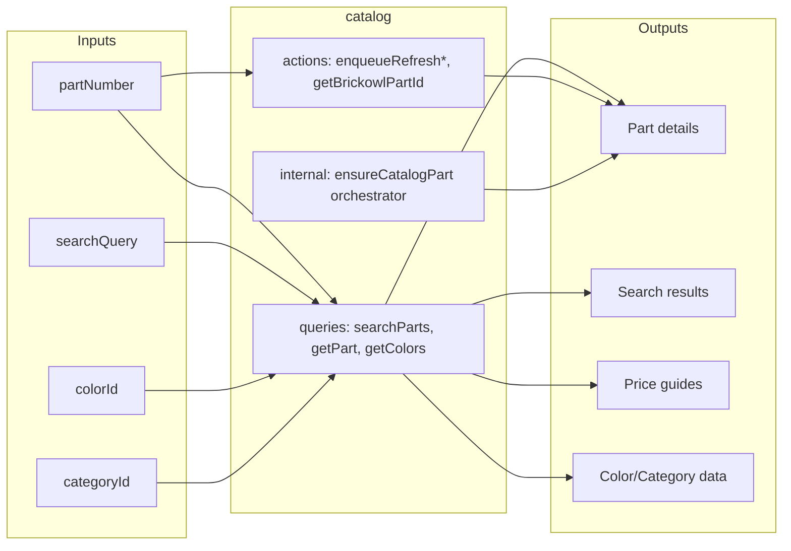

# Catalog

Root module providing global LEGO parts catalog data shared across all tenants. Manages parts, colors, categories, and price guides from BrickLink with cross-marketplace ID mappings (BrickOwl, LDraw, LEGO) and tenant-specific overlays.

## Inputs and Outputs

## Tables Owned

| Table                       | Description                                                               |
| --------------------------- | ------------------------------------------------------------------------- |
| `parts`                     | Global LEGO parts catalog (Bricklink-aligned, with cross-marketplace IDs) |
| `catalogPartOverlay`        | Tenant-specific part data (tags, notes, sort locations)                   |
| `partPrices`                | Price guides (new/used x stock/sold per part-color combination)           |
| `colors`                    | Color reference with BrickLink and BrickOwl mappings                      |
| `categories`                | BrickLink category hierarchy                                              |
| `partColors`                | Part-to-color availability relationships                                  |
| `bricklinkElementReference` | Element ID to part number mapping (from Bricklink codes.xml)              |

## Public Functions

| Function                 | Type   | Description                                           |
| ------------------------ | ------ | ----------------------------------------------------- |
| `searchParts`            | query  | Search parts by title, ID, or sort location (paginated) |
| `getPart`                | query  | Get single part with status (fresh/stale/missing)     |
| `getPartOverlay`         | query  | Get tenant-specific overlay for a part                |
| `getColors`              | query  | Get all colors                                        |
| `getPartColors`          | query  | Get available colors for a part with status           |
| `getCategories`          | query  | Get all categories                                    |
| `getPriceGuide`          | query  | Get price guide for part-color combination            |
| `enqueueRefreshPart`     | action | Trigger part data refresh via orchestrator            |
| `enqueueRefreshPartColors` | action | Trigger part colors refresh                         |
| `enqueueRefreshPriceGuide` | action | Trigger price guide refresh                         |
| `getBrickowlPartId`      | action | Get BrickOwl ID from BrickLink ID                     |
| `getBrickowlPartIds`     | action | Bulk get BrickOwl IDs from BrickLink IDs              |
| `ensurePartCompleteness` | action | (Deprecated) Delegates to ensureCatalogPart           |

## Dependencies

- `users/authorization` - For `requireActiveUser` auth checks
- `shared/ratelimit` - For rate limiting BrickLink API calls
- `shared/metrics` - For recording operational metrics
- `marketplaces/bricklink/catalog/` - BrickLink API data fetching (parts, colors, prices)
- `marketplaces/brickowl/catalog` - BrickOwl ID lookups via Rebrickable

> **Note:** There is currently a call to `inventory/mutations.promoteItemsForPart` in `ensure.ts`. This creates a domain dependency that should ideally be removed to maintain catalog as a pure root module.

## Used By

- `inventory/` - Part catalog lookups, ensures parts exist before adding inventory
- `orders/` - Part information for order items
- `identify/` - Part identification uses catalog for part data
- `marketplaces/` - Cross-marketplace ID mappings for sync

## Internal Functions

**Part operations:**

- `getPartInternal` - Get part data for internal use
- `getPartByBrickowlId` - Lookup part by BrickOwl ID
- `upsertPart` - Insert or update part data
- `updatePartBrickowlId` - Update BrickOwl ID on existing part
- `getBricklinkPartIdsFromBrickowl` - Reverse lookup: BrickOwl ID to BrickLink IDs

**Color operations:**

- `getColorInternal` - Get color data for internal use
- `getColorByBrickowlColorId` - Lookup color by BrickOwl color ID
- `getPartColorsInternal` - Get part colors for internal use
- `upsertPartColors` - Insert or update part-color relationships
- `upsertColor` - Insert or update global color entry

**Price operations:**

- `getPriceGuideInternal` - Get price guide data for internal use
- `upsertPriceGuide` - Insert or update price guide records (all 4 types)

**Category operations:**

- `upsertCategory` - Insert or update category data

**Orchestration (self-scheduling pattern):**

- `ensureCatalogPart` - Main orchestrator: fetches part, colors, prices with rate limiting and retries
- `ensureColor` - Single color ensure with BrickOwl mapping
- `getPartFreshnessStatus` - Check if part data needs refresh
- `getColorFreshnessStatus` - Check if color data needs refresh

**Helpers:**

- `isFresh` - Check if timestamp is within freshness window (30 days default)
- `isColorComplete` - Check if color has BrickOwl mapping
- `normalizeImageUrl` - Convert protocol-relative URLs to HTTPS
- `ensurePartPlaceholder` - Create placeholder part for async enrichment
