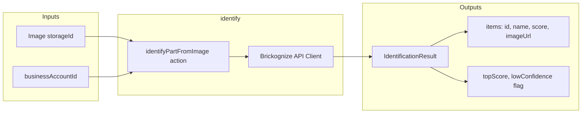

# Identify

Stateless module providing LEGO part identification via the Brickognize external API. Accepts uploaded images and returns identification predictions with confidence scores.

## Inputs and Outputs



## Tables Owned

None. This module is stateless - identification requests are processed synchronously and results are returned directly without persistence.

> **Note:** Future enhancement could add an `identificationSessions` table for tracking usage analytics or identification history.

## Public Functions

| Function                | Type     | Description                                                 |
| ----------------------- | -------- | ----------------------------------------------------------- |
| `identifyPartFromImage` | action   | Identify LEGO parts from uploaded image via Brickognize API |
| `generateUploadUrl`     | mutation | Generate Convex storage upload URL for image capture        |

## Dependencies

- `users/authorization` - For `requireActiveUser` auth checks
- `shared/http/client` - `ExternalHttpClient` base class for API communication
- `shared/http/types` - Error normalization utilities
- `shared/metrics` - For health check metrics recording
- `shared/ratelimit/dbRateLimiter` - Per-user rate limiting

## External API: Brickognize

This module integrates with the [Brickognize API](https://api.brickognize.com) for part identification.

| Property       | Value                          |
| -------------- | ------------------------------ |
| Base URL       | `https://api.brickognize.com`  |
| Predict        | `POST /predict/`               |
| Health Check   | `GET /health`                  |
| Rate Limit     | 100 requests per 60 seconds    |

## Used By

- Frontend part identification workflow (`src/components/identify/`)
- Not currently used by other backend modules

## Internal Functions

- `consumeIdentificationRate` - Internal mutation for per-user rate limit consumption

## Key Types

### IdentificationResult

Return type from `identifyPartFromImage`:

```typescript
type IdentificationResult = {
  provider: "brickognize";
  listingId: string | null;
  durationMs: number;
  requestedAt: number;
  boundingBox: BrickognizeBoundingBox | null;
  items: IdentificationResultItem[];
  topScore: number;
  lowConfidence: boolean;
};
```

### IdentificationResultItem

Individual prediction within results:

```typescript
type IdentificationResultItem = {
  id: string;           // Part number (e.g., "3001")
  name: string;         // Part name
  type: string;         // Item type (default: "part")
  category: string | null;
  score: number;        // Confidence score (0-1)
  imageUrl: string | null;
  externalSites: BrickognizeExternalSite[];
};
```

## Confidence Threshold Logic

The module uses a confidence threshold to flag uncertain identifications:

| Constant               | Value   | Description                              |
| ---------------------- | ------- | ---------------------------------------- |
| `CONFIDENCE_THRESHOLD` | 0.75    | Minimum score for confident match        |
| `IDENTIFY_LIMIT`       | 100     | Max identifications per user per window  |
| `IDENTIFY_WINDOW_MS`   | 3600000 | Rate limit window (1 hour)               |

**Threshold behavior:**
- `topScore` = highest `score` among all returned items
- `lowConfidence` = `true` when `topScore < 0.75`
- Frontend can use `lowConfidence` flag to prompt user verification
