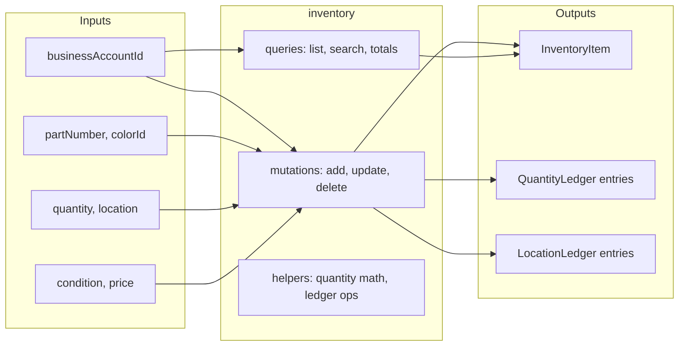

# Inventory

Core module for managing LEGO parts inventory with event-sourced quantity and location tracking. Handles inventory items with lifecycle states, ledger-based change history, and integration points for marketplace synchronization.

## Inputs and Outputs

## Tables Owned

| Table                      | Description                                                    |
| -------------------------- | -------------------------------------------------------------- |
| `inventoryItems`           | Core inventory records with quantity, location, and lifecycle  |
| `inventoryQuantityLedger`  | Event-sourced quantity changes with sequence tracking          |
| `inventoryLocationLedger`  | Event-sourced location changes with audit trail                |

> **Note:** Marketplace sync state (`inventorySyncState`, `marketplaceOutbox`) is managed by the `sync/` module.

## Public Functions

| Function                    | Type     | Description                                              |
| --------------------------- | -------- | -------------------------------------------------------- |
| `listInventoryItems`        | query    | List all active inventory items for business account     |
| `listInventoryItemsFiltered`| query    | Server-side filtered/sorted/paginated inventory listing  |
| `getInventoryTotals`        | query    | Get item counts and quantity totals                      |
| `getItemSyncStatus`         | query    | Get marketplace sync status for an item                  |
| `getItemQuantityLedger`     | query    | Get quantity change history for an item                  |
| `getItemLocationLedger`     | query    | Get location change history for an item                  |
| `calculateOnHandQuantity`   | query    | Reconcile quantity from ledger entries                   |
| `getUnifiedInventoryHistory`| query    | Combined quantity/location history with filtering        |
| `addInventoryItem`          | mutation | Create new inventory item with initial stock             |
| `updateInventoryItem`       | mutation | Update item details, quantity, or location               |
| `deleteInventoryItem`       | mutation | Soft delete (archive) an inventory item                  |

## Dependencies

- `users/authorization` - For `requireActiveUser` and `requireUserRole` auth checks
- `catalog/mutations` - For `ensurePartPlaceholder` when adding new parts
- `catalog/helpers` - For `isColorComplete` to check color readiness
- `sync/inventory/helpers` - For sync state CRUD operations (upsertSyncState, getLastSyncedSeq, etc.)

## Used By

- `sync/inventory/` - Reads inventory items and ledger entries for marketplace synchronization
- `orders/` - Adjusts inventory quantities when orders are processed
- Frontend components - Display and manage inventory through queries/mutations

## Internal Functions

**Item operations:**

- `getInventoryItem` - Get inventory item by ID (used by sync actions)
- `promoteItemsForPart` - Promote items from `awaiting_catalog` to `ready_to_sync` after catalog enrichment

**Ledger queries (for sync worker):**

- `computeDeltaFromWindow` - Compute quantity delta for a sequence range
- `getCurrentLedgerSeq` - Get latest sequence number for an item
- `getLedgerEntryAtSeq` - Get ledger entry at specific sequence

**Helpers:**

- `requireUser` - Require authenticated user with business account
- `assertBusinessMembership` - Validate user belongs to business account
- `getNextSeqForItem` - Get next sequence number for ledger entry
- `getCurrentAvailableFromLedger` - Get current quantity from latest ledger entry
- `shouldSyncInventoryToMarketplace` - Check if provider sync is enabled
- `enqueueMarketplaceSync` - Add message to marketplace outbox
- `formatApiError` - Format API errors for display
- `ensureBrickowlIdForPartAction` - Ensure BrickOwl ID exists for part

## Lifecycle States

Inventory items progress through lifecycle states:

| State              | Description                                          |
| ------------------ | ---------------------------------------------------- |
| `awaiting_catalog` | Part or color catalog data not yet complete          |
| `ready_to_sync`    | Ready for marketplace sync (part + color complete)   |
| `synced`           | Successfully synced to at least one marketplace      |
| `error`            | Sync failed with error                               |

## Ledger Event Sourcing

Quantity changes are tracked with sequence numbers for reliable sync:

- Each ledger entry has a monotonic `seq` number per item
- `preAvailable` and `postAvailable` provide running balances
- `correlationId` links related operations across ledger and outbox
- Sync worker uses sequence windows to compute deltas

## Architecture Notes

- **Marketplace sync is handled by `sync/` module** - This module focuses on inventory business logic
- Soft delete pattern: items are archived, not hard deleted
- Event sourcing via ledgers enables audit trails and reliable sync
- Lifecycle states gate marketplace sync until catalog data is ready
