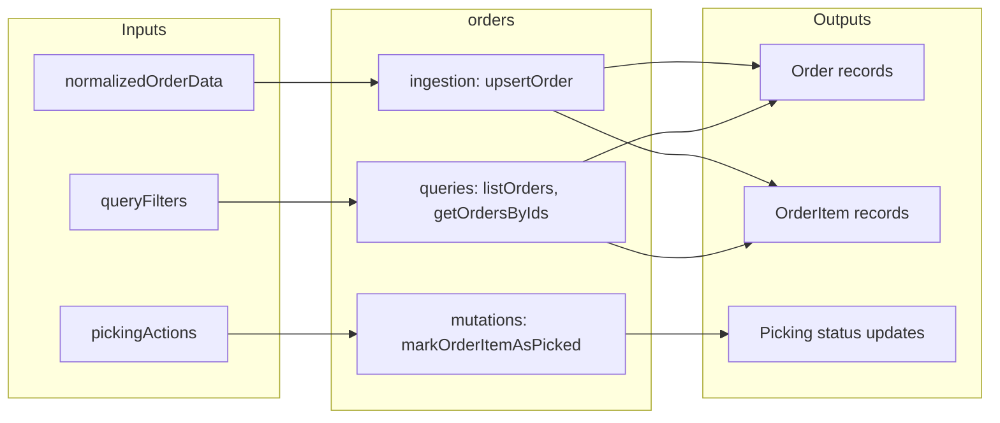

# Orders

Core order management module that handles order storage, querying, and picking workflows. Provides the data layer for order records and line items without marketplace-specific logic.

## Inputs and Outputs



## Tables Owned

| Table | Description |
| ----- | ----------- |
| `orders` | Order header records with buyer info, status, costs, shipping details |
| `orderItems` | Line items for each order with part details, quantities, pick status |
| `orderNotifications` | Webhook/notification processing queue for marketplace events |

## Public Functions

### Queries

| Function | Type | Description |
| -------- | ---- | ----------- |
| `listOrders` | query | List all orders for the authenticated user's business account |
| `listOrdersFiltered` | query | List orders with filtering, sorting, and pagination (QuerySpec pattern) |
| `getOrdersByIds` | query | Get orders matching the provided orderIds |
| `getOrderItemsForOrders` | query | Get order items for multiple orders, grouped by orderId |
| `getPickableItemsForOrders` | query | Get all order items for selected orders with inventory matching info |

### Mutations

| Function | Type | Description |
| -------- | ---- | ----------- |
| `markOrderItemAsPicked` | mutation | Mark an order item as picked and update inventory reserved quantity |
| `updateOrderStatusIfFullyPicked` | mutation | Update order status to "PACKED" if all items are picked |
| `markOrdersAsPicked` | mutation | Mark multiple orders as "PACKED" if all items are picked/issue |
| `markOrderItemAsIssue` | mutation | Mark an order item as having an issue |
| `markOrderItemAsSkipped` | mutation | Mark an order item as skipped |
| `markOrderItemAsUnpicked` | mutation | Mark an order item as unpicked and restore inventory reserved quantity |

## Dependencies

- `users/authorization` - For `requireActiveUser` auth checks
- `inventory/helpers` - For `requireUser`, `assertBusinessMembership`
- `inventory/` - For inventory item lookups during picking

## Used By

- Frontend order listing and picking UI
- `sync/orders/` - For order ingestion from marketplaces

## Internal Functions

- `upsertOrder` (ingestion.ts) - Internal mutation for upserting order and order items from normalized data

## Module Structure

```
orders/
├── README.md           # This file
├── schema.ts           # Order tables (orders, orderItems, orderNotifications)
├── queries.ts          # Public queries for listing and fetching orders
├── mutations.ts        # Public mutations for picking workflow
├── ingestion.ts        # Internal order upsert logic
└── refactor_baseline/  # Test fixtures and snapshots (dev/test only)
```

## Order Status Flow

Orders progress through these statuses:

```
PENDING → UPDATED → PAID → PACKED → SHIPPED → RECEIVED → COMPLETED
                      ↓
                    HOLD (alert statuses)
                      ↓
                  CANCELLED
```

## Order Item Status Flow

Order items progress through these pick statuses:

```
unpicked → picked
         → skipped
         → issue
```

## Notes

- **Order ingestion from marketplaces is handled by `sync/orders/`** - This module only stores and manages order data
- The `ingestion.ts` file contains inline normalization logic that duplicates `sync/orders/normalizers/` - this is a known technical debt item
- Order normalization (transforming marketplace-specific formats to unified format) lives in `sync/orders/normalizers/`
