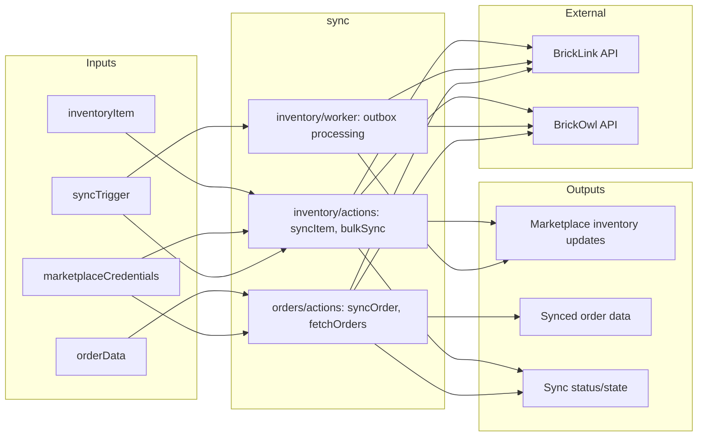

# Sync

Orchestration layer that coordinates synchronization between core modules (inventory, orders, catalog) and marketplace integrations (BrickLink, BrickOwl). Owns the sync state, outbox processing, and ensures consistent data flow across marketplace boundaries.

## Inputs and Outputs



## Tables Owned

| Table | Description |
| ----- | ----------- |
| *(Coming in Task 4.2)* | `inventorySyncState` - Per-item sync state tracking |

## Public Functions

| Function | Type | Description |
| -------- | ---- | ----------- |
| *(Coming in Task 4.3)* | | Inventory and order sync actions |

## Dependencies

- `inventory/` - Core inventory data and item management
- `orders/` - Order data and processing
- `marketplaces/bricklink/` - BrickLink API client for inventory and orders
- `marketplaces/brickowl/` - BrickOwl API client for inventory and orders
- `catalog/` - Part and color lookups for cross-marketplace ID mapping
- `users/authorization` - Auth checks for sync operations

## Used By

- External schedulers (cron jobs for periodic sync)
- Marketplace webhooks (real-time sync triggers)
- `inventory/` - Triggers sync when items are added/updated
- `orders/` - Triggers sync when orders are processed

## Internal Functions

*(Coming in Task 4.3 - inventory sync migration)*

**Inventory sync:**

- `syncInventoryItem` - Sync single item to marketplaces
- `bulkSyncInventory` - Batch sync operations
- `processOutboxBatch` - Worker for processing pending sync operations

**Order sync:**

- `syncOrder` - Sync order status to marketplaces
- `fetchMarketplaceOrders` - Pull orders from marketplace APIs

## Module Structure

```
sync/
├── README.md           # This file
├── schema.ts           # Sync tables (inventorySyncState, etc.)
├── inventory/
│   ├── actions.ts      # Inventory sync actions
│   └── worker.ts       # Outbox worker for background sync
└── orders/
    ├── actions.ts      # Order sync actions
    └── normalizers/    # Order normalization (future migration)
```

## Migration Notes

This module is being created as part of Phase 4 (Inventory Decoupling) of the modular architecture refactor. See `_notes/modular-architecture-refactor-plan.md` for details.

**Task sequence:**

1. Task 4.1 - Create module structure (this task)
2. Task 4.2 - Extract sync schema from inventory
3. Task 4.3 - Migrate sync logic from `inventory/sync.ts` and `inventory/syncWorker.ts`
