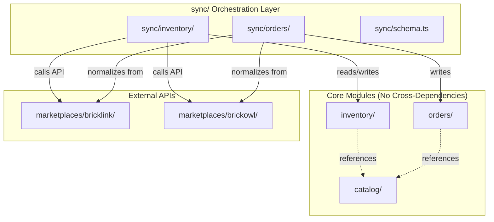
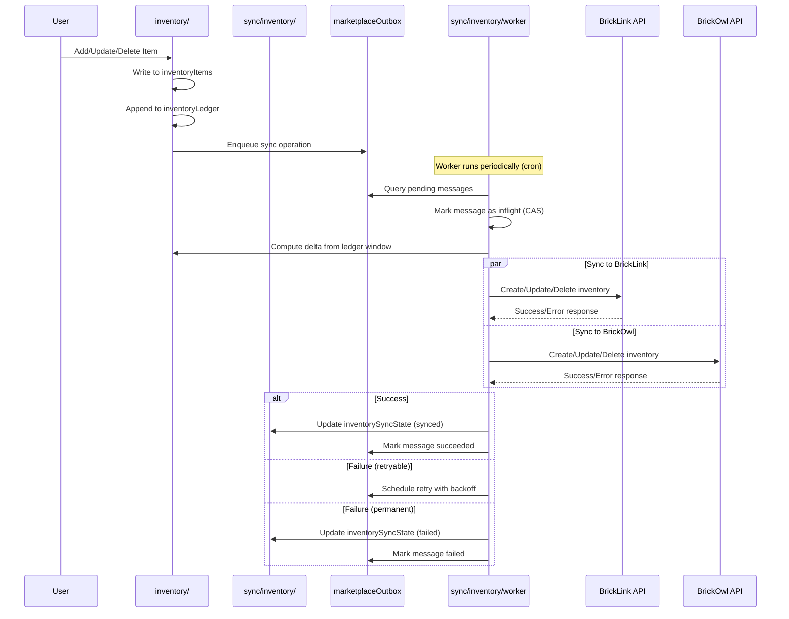
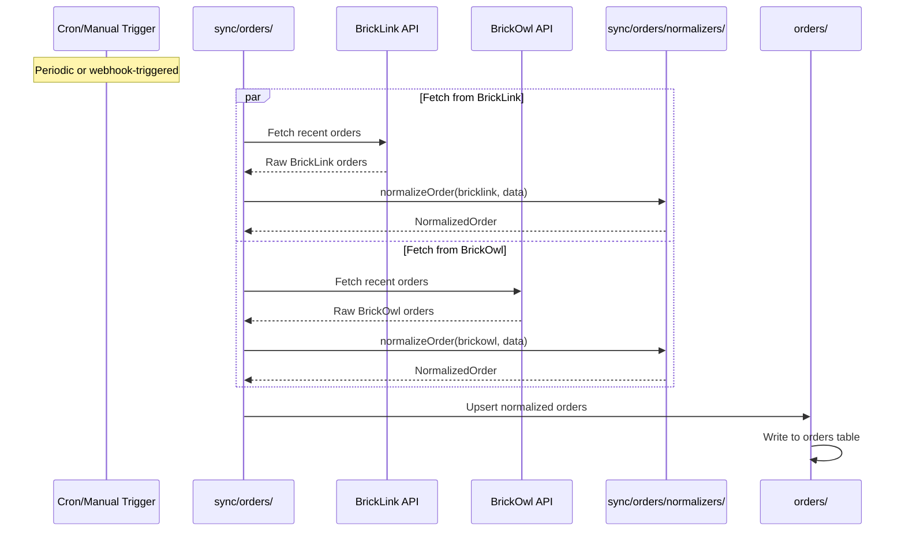
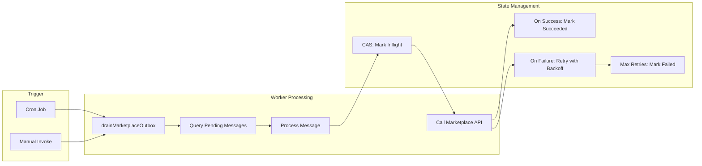

# Sync Module

The **sync module** is the orchestration layer that coordinates data synchronization between BrickOps core modules and external marketplace APIs. It owns all sync state, implements the transactional outbox pattern, and ensures reliable data flow across marketplace boundaries.

## Architecture Overview



## Data Flows

### 1. Inventory → Marketplace (Outbound Sync)

Pushes local inventory changes to external marketplaces (BrickLink, BrickOwl).



**Key Concepts:**

- **Ledger-Based Sync**: Inventory changes are recorded in `inventoryLedger` with sequence numbers. The sync system tracks `lastSyncedSeq` per provider to compute deltas.
- **Transactional Outbox**: Sync operations are enqueued atomically with inventory writes, ensuring no operations are lost.
- **Idempotency**: Each sync operation has an idempotency key derived from the item ID and sequence window.

### 2. Marketplace → Orders (Inbound Sync)

Pulls orders from external marketplaces and normalizes them into the unified order format.



**Key Concepts:**

- **Provider Normalizers**: Each marketplace has a dedicated normalizer that transforms provider-specific order data into a common `NormalizedOrder` format.
- **Unified Schema**: All orders share the same structure regardless of source marketplace, enabling consistent order processing.

## Tables Owned

| Table                | Description                                                                       |
| -------------------- | --------------------------------------------------------------------------------- |
| `inventorySyncState` | Per-item, per-provider sync status tracking. One row per (itemId, provider) pair. |
| `marketplaceOutbox`  | Transactional outbox for marketplace sync operations. Worker drains this queue.   |

### inventorySyncState Schema

Tracks marketplace sync state for each inventory item per provider.

| Field                 | Type                        | Description                                                        |
| --------------------- | --------------------------- | ------------------------------------------------------------------ |
| `itemId`              | `Id<inventoryItems>`        | Reference to the inventory item                                    |
| `provider`            | `"bricklink" \| "brickowl"` | Marketplace provider                                               |
| `lotId`               | `string \| number`          | Marketplace lot ID (BrickLink uses numbers, BrickOwl uses strings) |
| `status`              | `SyncStatus`                | Current sync state: pending, syncing, synced, failed, disabled     |
| `lastSyncAttempt`     | `number`                    | Timestamp of last sync attempt                                     |
| `lastSyncedSeq`       | `number`                    | Last ledger sequence applied to marketplace                        |
| `lastSyncedAvailable` | `number`                    | Denormalized available quantity at last sync                       |
| `error`               | `string`                    | Error message if sync failed                                       |

**Indexes:**

- `by_item` - Query all sync states for an item
- `by_item_provider` - Query specific provider state for an item
- `by_status` - Query items by sync status
- `by_provider_status` - Query items by provider and status

### marketplaceOutbox Schema

Transactional outbox for reliable marketplace sync operations.

| Field               | Type                               | Description                                 |
| ------------------- | ---------------------------------- | ------------------------------------------- |
| `businessAccountId` | `Id<businessAccounts>`             | Business account owning the item            |
| `itemId`            | `Id<inventoryItems>`               | Reference to the inventory item             |
| `provider`          | `"bricklink" \| "brickowl"`        | Target marketplace                          |
| `kind`              | `"create" \| "update" \| "delete"` | Operation type                              |
| `fromSeqExclusive`  | `number`                           | Start of ledger sequence window (exclusive) |
| `toSeqInclusive`    | `number`                           | End of ledger sequence window (inclusive)   |
| `idempotencyKey`    | `string`                           | Unique key for idempotent API calls         |
| `status`            | `OutboxStatus`                     | pending, inflight, succeeded, failed        |
| `attempt`           | `number`                           | Current attempt number (0-indexed)          |
| `nextAttemptAt`     | `number`                           | Timestamp when next retry is allowed        |
| `lastError`         | `string`                           | Error from last failed attempt              |
| `correlationId`     | `string`                           | Optional correlation ID for tracing         |

**Indexes:**

- `by_status_time` - Query pending messages ready for processing
- `by_item_provider` - Query outbox entries for a specific item/provider

## Public Functions

### Inventory Sync (sync/inventory/)

| Function                 | Type               | Description                                                           |
| ------------------------ | ------------------ | --------------------------------------------------------------------- |
| `syncInventoryChange`    | `internalAction`   | Sync an inventory change to all enabled marketplaces (immediate mode) |
| `retryFailedSync`        | `internalAction`   | Retry a failed sync operation with exponential backoff                |
| `drainMarketplaceOutbox` | `internalAction`   | Worker that processes pending outbox messages                         |
| `updateSyncStatuses`     | `internalMutation` | Update sync state after sync attempts                                 |
| `getLotIdForItem`        | `internalQuery`    | Get marketplace lot ID for an item/provider                           |

### Order Sync (sync/orders/)

| Function              | Type   | Description                                      |
| --------------------- | ------ | ------------------------------------------------ |
| `normalizeOrder`      | Helper | Transform provider order data to unified format  |
| `normalizeOrderItems` | Helper | Transform provider order items to unified format |

## Internal Functions

### Inventory Sync Helpers (sync/inventory/helpers.ts)

| Function                     | Description                                                   |
| ---------------------------- | ------------------------------------------------------------- |
| `getSyncStateForItem`        | Get sync state for a specific item and provider               |
| `getSyncStatesForItem`       | Get all sync states for an item (both providers)              |
| `getLastSyncedSeq`           | Get the lastSyncedSeq for a provider                          |
| `getLotId`                   | Get the marketplace lot ID for a provider                     |
| `getLastSyncedAvailable`     | Get lastSyncedAvailable for a provider                        |
| `buildLegacyMarketplaceSync` | Transform to legacy embedded format (migration compatibility) |
| `createSyncState`            | Create sync state for an item/provider                        |
| `updateSyncState`            | Update sync state for an item/provider                        |
| `getOrCreateSyncState`       | Get or create sync state (upsert pattern)                     |
| `upsertSyncState`            | Update or create sync state                                   |
| `deleteSyncStatesForItem`    | Delete all sync states for an item                            |
| `updateSyncStatuses`         | Update sync status for multiple providers                     |

### Worker Functions (sync/inventory/worker.ts)

| Function                      | Description                                  |
| ----------------------------- | -------------------------------------------- |
| `getPendingOutboxMessages`    | Query pending messages ready for processing  |
| `getSyncState`                | Get sync state for marketplace API calls     |
| `markOutboxInflight`          | CAS pattern: mark message as being processed |
| `markOutboxSucceeded`         | Mark outbox message as succeeded             |
| `markOutboxFailed`            | Mark as failed and schedule retry            |
| `markOutboxFailedPermanently` | Mark as failed with no more retries          |

### Order Normalizers (sync/orders/normalizers/)

| File                      | Description                        |
| ------------------------- | ---------------------------------- |
| `bricklink.ts`            | BrickLink order/item normalization |
| `brickowl.ts`             | BrickOwl order/item normalization  |
| `shared/errors.ts`        | Normalization error types          |
| `shared/normalization.ts` | Shared normalization utilities     |
| `shared/types.ts`         | Shared type definitions            |

## Worker Pattern

The sync module uses a **worker/cron pattern** for reliable background processing:



**Worker Characteristics:**

1. **Polling-Based**: Worker queries outbox for pending messages with `nextAttemptAt <= now`
2. **Compare-And-Swap (CAS)**: Before processing, worker atomically marks message as inflight to prevent double-processing
3. **Exponential Backoff**: Failed operations retry with increasing delays (1s, 2s, 4s, 8s, ...) up to 5 minutes max
4. **Jitter**: Random 0-5 second jitter added to prevent thundering herd
5. **Max Retries**: After 5 attempts, messages are marked as permanently failed
6. **Idempotent Operations**: Each sync operation includes an idempotency key for safe retries

## Dependencies

| Module                    | Usage                                                   |
| ------------------------- | ------------------------------------------------------- |
| `inventory/`              | Core inventory data, ledger queries, item lookup        |
| `orders/`                 | Order data persistence                                  |
| `marketplaces/bricklink/` | BrickLink API client for inventory and order operations |
| `marketplaces/brickowl/`  | BrickOwl API client for inventory and order operations  |
| `catalog/`                | Part and color lookups for cross-marketplace ID mapping |
| `shared/metrics`          | Metric recording for sync operations                    |

## Used By

| Consumer             | Usage                                              |
| -------------------- | -------------------------------------------------- |
| `inventory/`         | Triggers sync when items are added/updated/deleted |
| External schedulers  | Cron jobs for periodic sync operations             |
| Marketplace webhooks | Real-time sync triggers (future)                   |

## Module Structure

```
sync/
├── README.md              # This file
├── schema.ts              # Sync tables (inventorySyncState, marketplaceOutbox)
├── validators.ts          # Shared validators and TypeScript types
├── inventory/
│   ├── helpers.ts         # Sync state read/write helpers
│   ├── orchestrator.ts    # Immediate sync actions
│   └── worker.ts          # Outbox worker for background sync
├── orders/
│   ├── actions.ts         # Order sync actions (stub)
│   └── normalizers/       # Order normalization
│       ├── index.ts       # Normalizer registry
│       ├── types.ts       # Normalized order types
│       ├── bricklink.ts   # BrickLink normalizer
│       ├── brickowl.ts    # BrickOwl normalizer
│       └── shared/        # Shared normalization utilities
│           ├── errors.ts
│           ├── normalization.ts
│           └── types.ts
└── migrations/
    └── migrateInventorySyncState.ts  # Migration from embedded marketplaceSync
```

## Type Exports

The `validators.ts` file exports both Convex validators and TypeScript types:

```typescript
// Validators
export const marketplaceProvider;    // "bricklink" | "brickowl"
export const syncStatus;             // "pending" | "syncing" | "synced" | "failed" | "disabled"
export const outboxStatus;           // "pending" | "inflight" | "succeeded" | "failed"
export const outboxKind;             // "create" | "update" | "delete"
export const inventorySyncStateDoc;  // Full document validator
export const marketplaceOutboxDoc;   // Full document validator
export const legacyMarketplaceSync;  // Legacy embedded format (migration compatibility)

// TypeScript Types (derived via Infer)
export type MarketplaceProvider;
export type SyncStatus;
export type OutboxStatus;
export type OutboxKind;
export type InventorySyncStateDoc;
export type MarketplaceOutboxDoc;
export type LegacyMarketplaceSync;
```
