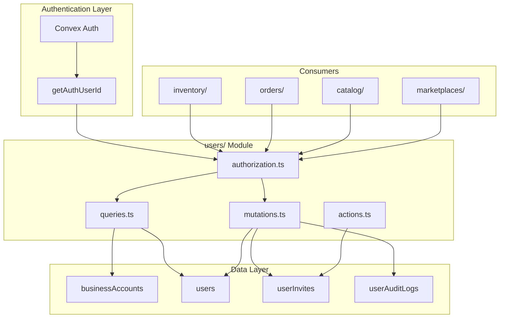
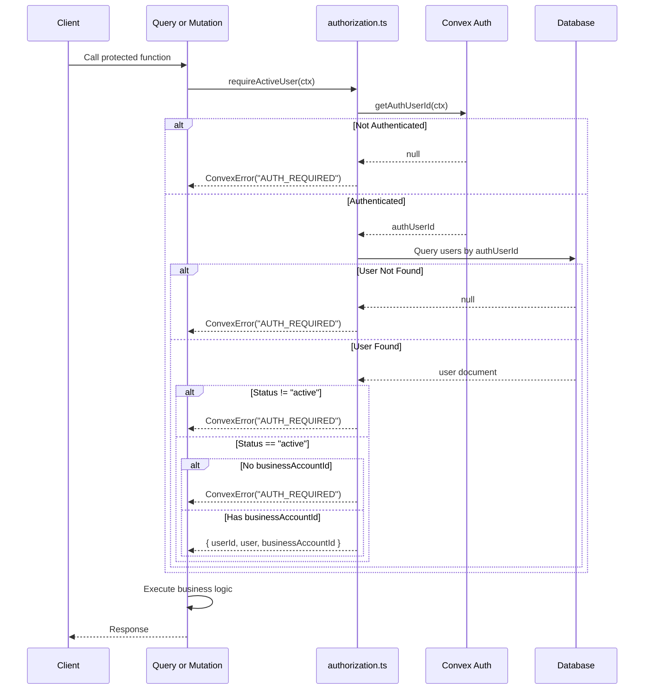
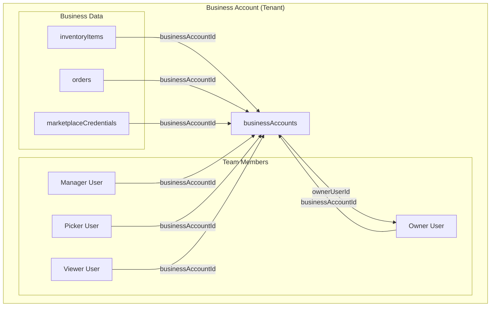
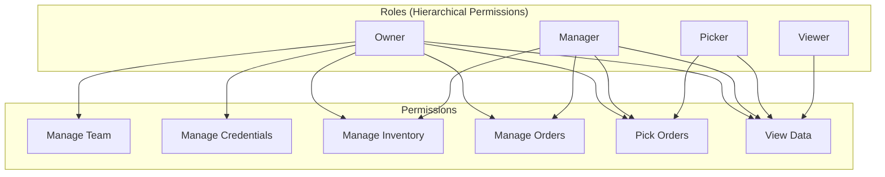
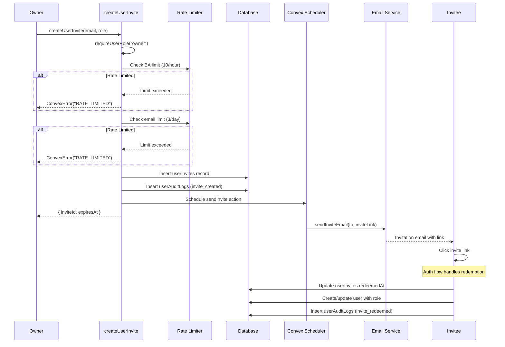

# Users Module

User and business account management with role-based access control (RBAC). Handles authentication state, user profiles, team invitations, and permission checks.

## Architecture Overview



## Data Flows

### 1. User Authentication Flow

Every protected operation in the application flows through the authorization helpers.



### 2. Business Account & Multi-Tenancy

All data in the application is scoped to a business account for multi-tenant isolation.



### 3. Role-Based Access Control (RBAC)



**Role Descriptions:**

| Role | Description | Key Capabilities |
| ---- | ----------- | ---------------- |
| `owner` | Full administrative control | Invite users, change roles, remove users, manage credentials |
| `manager` | Administrative access | Manage inventory, orders, catalog operations |
| `picker` | Operational access | Fulfill orders, view inventory |
| `viewer` | Read-only access | View all data, no modifications |

### 4. Invitation Flow



## Tables Owned

| Table | Description |
| ----- | ----------- |
| `businessAccounts` | Business/tenant accounts with owner reference and invite code |
| `users` | User profiles with role, status, and business account linkage |
| `userInvites` | Per-user invitations with role assignment, token, and expiration |
| `userAuditLogs` | Audit trail for user management events |
| `rateLimitEvents` | Generic rate limiting events for protecting sensitive endpoints |

### businessAccounts Schema

| Field | Type | Description |
| ----- | ---- | ----------- |
| `name` | `string` | Business account display name |
| `ownerUserId` | `Id<"users">?` | Reference to the owner user |
| `inviteCode` | `string` | Unique code for joining (regeneratable) |

**Indexes:** `by_owner`, `by_inviteCode`

### users Schema

| Field | Type | Description |
| ----- | ---- | ----------- |
| `name` | `string?` | Display name (derived from firstName + lastName) |
| `email` | `string?` | Email address |
| `firstName` | `string?` | First name |
| `lastName` | `string?` | Last name |
| `image` | `string?` | Profile image URL |
| `businessAccountId` | `Id<"businessAccounts">?` | Linked business account |
| `role` | `"owner" \| "manager" \| "picker" \| "viewer"` | RBAC role |
| `status` | `"active" \| "invited"` | Account status |
| `useSortLocations` | `boolean?` | User preference for location sorting |
| `updatedAt` | `number` | Last update timestamp |

**Indexes:** `by_businessAccount`, `by_email`, `by_status`

### userInvites Schema

| Field | Type | Description |
| ----- | ---- | ----------- |
| `businessAccountId` | `Id<"businessAccounts">` | Target business account |
| `email` | `string` | Invitee email address |
| `token` | `string` | Unique 16-byte hex token |
| `role` | `"manager" \| "picker" \| "viewer"` | Assigned role (not owner) |
| `expiresAt` | `number` | Expiration timestamp (epoch ms) |
| `redeemedAt` | `number?` | Redemption timestamp |
| `createdBy` | `Id<"users">` | Inviting user |

**Indexes:** `by_token`, `by_email`, `by_businessAccount`

### userAuditLogs Schema

| Field | Type | Description |
| ----- | ---- | ----------- |
| `businessAccountId` | `Id<"businessAccounts">` | Business account |
| `targetUserId` | `Id<"users">?` | Affected user |
| `action` | `"invite_created" \| "invite_redeemed" \| "role_updated" \| "user_removed"` | Event type |
| `fromRole` | `Role?` | Previous role (for role changes) |
| `toRole` | `Role?` | New role (for role changes) |
| `actorUserId` | `Id<"users">` | User who performed action |
| `reason` | `string?` | Optional reason |

**Indexes:** `by_targetUser`, `by_businessAccount`

## Public Functions

### Queries

| Function | Description |
| -------- | ----------- |
| `getCurrentUser` | Get authenticated user with business account details |
| `getAuthState` | Lightweight auth state for client-side guards (never throws) |
| `listMembers` | List all members in user's business account |

### Mutations

| Function | Auth | Description |
| -------- | ---- | ----------- |
| `updateProfile` | Active user | Update user's first/last name |
| `updatePreferences` | Active user | Update user preferences |
| `regenerateInviteCode` | Owner | Regenerate business account invite code |
| `createUserInvite` | Owner | Create invitation with role assignment |
| `updateUserRole` | Owner | Change a team member's role |
| `removeUser` | Owner | Soft-delete user from business account |

### Actions

| Function | Description |
| -------- | ----------- |
| `sendInvite` | Send invitation email via external email service |

## Authorization Helpers

The `authorization.ts` module exports helpers used across the codebase.

### requireActiveUser

Universal auth helper for queries, mutations, and actions.

```typescript
const { userId, user, businessAccountId } = await requireActiveUser(ctx);
```

**Checks performed:**
1. User is authenticated (via Convex Auth)
2. User record exists in database
3. User status is "active"
4. User is linked to a business account

**Throws:** `ConvexError` with code `"AUTH_REQUIRED"` if any check fails.

### requireUserRole

Ensures user has a specific role.

```typescript
const { userId, user, businessAccountId } = await requireUserRole(ctx, "owner");
```

**Usage:** Typically used for owner-only operations like team management.

**Throws:** `ConvexError` with code `"FORBIDDEN"` if role doesn't match.

## Dependencies

| Dependency | Usage |
| ---------- | ----- |
| `@convex-dev/auth/server` | Authentication via `getAuthUserId` |
| `shared/encryption/webcrypto` | Random hex generation for tokens |
| `shared/ratelimit/dbRateLimiter` | Rate limiting for invite creation |
| `shared/email` | Email delivery via Resend API |

## Used By

| Consumer | Usage |
| -------- | ----- |
| `catalog/` | `requireActiveUser` for catalog operations |
| `identify/` | `requireActiveUser` for part identification |
| `inventory/` | `requireActiveUser`, `requireUserRole("owner")` for inventory management |
| `orders/` | `requireActiveUser` for order queries |
| `marketplaces/shared/` | `requireActiveUser`, `requireUserRole("owner")` for credential management |
| `marketplaces/bricklink/` | Owner-only credential and webhook management |
| `marketplaces/brickowl/` | Owner-only credential management |

## Internal Functions

| Function | Type | Description |
| -------- | ---- | ----------- |
| `getActiveUserContext` | `internalQuery` | Allows actions to retrieve authenticated user context |

## Rate Limiting

The invitation system enforces rate limits to prevent abuse:

| Limit | Scope | Window |
| ----- | ----- | ------ |
| 10 invites | Per business account | 1 hour |
| 3 invites | Per email address | 24 hours |

Rate limit events are stored in `rateLimitEvents` with keys like:
- `ba:{businessAccountId}:invite_create`
- `email:{emailAddress}:invite_create`
