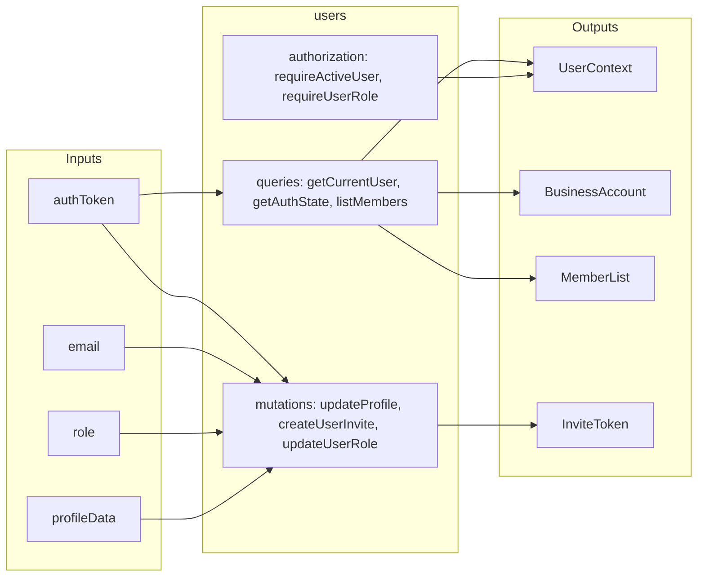

# Users

User and business account management with role-based access control (RBAC). Handles authentication state, user profiles, team invitations, and permission checks.

## Inputs and Outputs

## Tables Owned

| Table              | Description                                                                                  |
| ------------------ | -------------------------------------------------------------------------------------------- |
| `businessAccounts` | Business/tenant accounts with owner reference and invite code                                |
| `users`            | User profiles with role (owner/manager/picker/viewer), status, and business account linkage  |
| `userInvites`      | Per-user invitations with role assignment, token, and expiration                             |
| `userAuditLogs`    | Audit trail for user management events (invites, role changes, removals)                     |
| `rateLimitEvents`  | Generic rate limiting events for protecting sensitive endpoints                              |

## Public Functions

| Function               | Type     | Description                                                  |
| ---------------------- | -------- | ------------------------------------------------------------ |
| `getCurrentUser`       | query    | Get authenticated user with business account details         |
| `getAuthState`         | query    | Lightweight auth state for client-side guards (never throws) |
| `listMembers`          | query    | List all members in user's business account                  |
| `updateProfile`        | mutation | Update user's first/last name                                |
| `updatePreferences`    | mutation | Update user preferences (e.g., useSortLocations)             |
| `regenerateInviteCode` | mutation | Owner-only: regenerate business account invite code          |
| `createUserInvite`     | mutation | Owner-only: create invitation with role assignment           |
| `updateUserRole`       | mutation | Owner-only: change a team member's role                      |
| `removeUser`           | mutation | Owner-only: soft-delete user from business account           |
| `sendInvite`           | action   | Send invitation email via external email service             |

## Dependencies

- `@convex-dev/auth/server` - Authentication via Convex Auth (getAuthUserId)
- `shared/encryption/webcrypto` - Random hex generation for invite tokens
- `shared/ratelimit/dbRateLimiter` - Rate limiting for invite creation
- `lib/external/email` - Email delivery service

## Used By

- `catalog/` - Authorization checks for catalog operations
- `identify/` - Authorization for part identification
- `inventory/` - Authorization for inventory management
- `orders/` - Authorization for order queries
- `marketplaces/shared/` - Credential and auth helpers
- `marketplaces/bricklink/` - Owner-only credential management
- `marketplaces/brickowl/` - Owner-only credential management

## Internal Functions

- `getActiveUserContext` - Internal query for actions to retrieve authenticated user context
