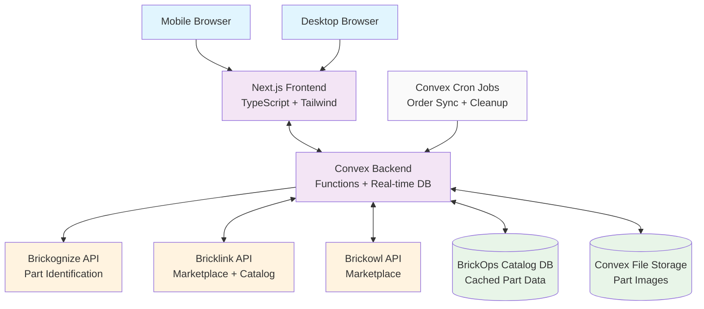
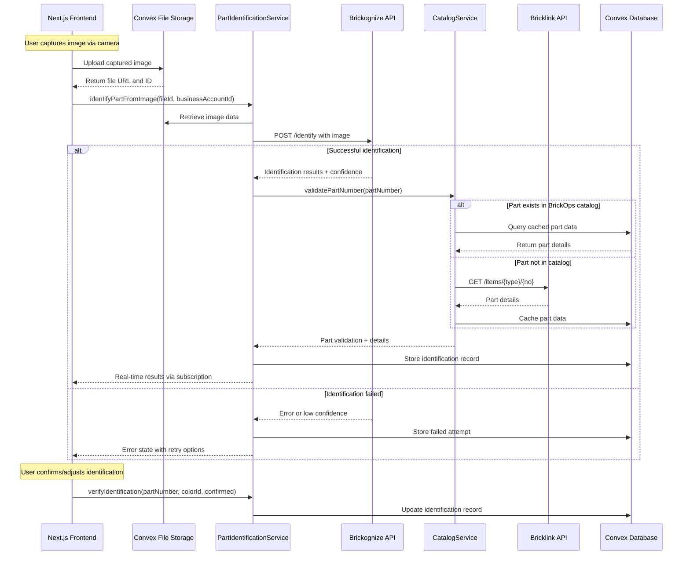
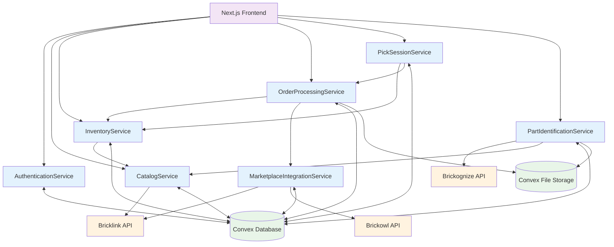
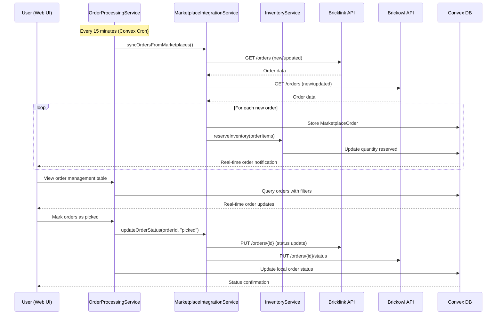
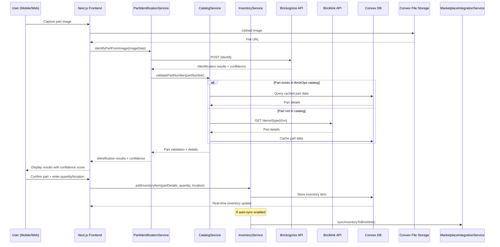
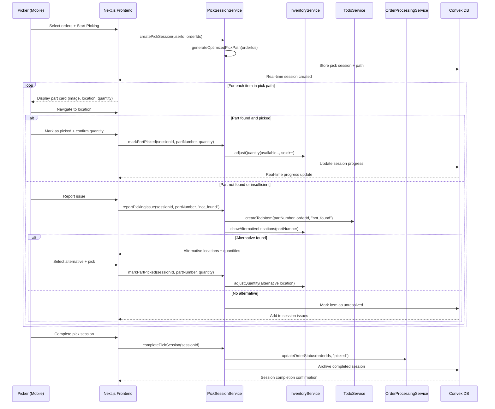

# BrickOps Architecture Document

## Introduction

This document outlines the overall project architecture for BrickOps, including backend systems, shared services, and non-UI specific concerns. Its primary goal is to serve as the guiding architectural blueprint for AI-driven development, ensuring consistency and adherence to chosen patterns and technologies.

**Relationship to Frontend Architecture:**
If the project includes a significant user interface, a separate Frontend Architecture Document will detail the frontend-specific design and MUST be used in conjunction with this document. Core technology stack choices documented herein (see "Tech Stack") are definitive for the entire project, including any frontend components.

### Starter Template or Existing Project

Based on review of the PRD, BrickOps will be built as a Next.js 14+ application with Convex for backend services. No specific starter template was identified in the requirements - the project will be built from standard Next.js and Convex initialization.

**Decision:** Starting from Next.js standard setup with Convex integration, allowing for maximum customization of the complex inventory management and API integration features required.

### Change Log

| Date       | Version | Description                            | Author              |
| ---------- | ------- | -------------------------------------- | ------------------- |
| 2025-01-20 | 1.0     | Initial architecture document creation | Winston (Architect) |

## High Level Architecture

### Technical Summary

BrickOps employs a **serverless-first architecture** built on Convex's real-time backend platform with a Next.js frontend, designed to handle complex inventory synchronization across multiple marketplaces. The system integrates three critical external APIs (Brickognize for part identification, Bricklink and Brickowl for marketplace operations) with intelligent rate limiting and caching strategies. The architecture prioritizes **real-time data consistency** through Convex's subscription model, ensuring inventory changes propagate instantly across all connected clients while maintaining Bricklink as the authoritative inventory source during MVP phase. Core architectural patterns include **event-driven workflows** for order processing, **intelligent API passthrough** for catalog management, and **location-optimized picking algorithms** for order fulfillment.

### High Level Overview

**Architectural Style:** **Serverless + Real-time Event-Driven**

- Convex serverless functions handle all business logic with automatic scaling
- Real-time subscriptions provide instant data synchronization across clients
- Event-driven workflows orchestrate complex multi-step processes (picking, order sync)

**Repository Structure:** **Monorepo** (from PRD Technical Assumptions)

- Single repository containing Next.js frontend and Convex backend
- Shared types and utilities between frontend and backend
- Simplified deployment and dependency management

**Service Architecture:** **Unified Serverless Backend** (from PRD Technical Assumptions)

- Convex functions serve as microservice-style boundaries
- Real-time database with built-in subscriptions
- No traditional server infrastructure to manage

**Primary Data Flow:**

1. **Inbound:** External API data (orders, catalog) → Convex functions → Real-time DB → Live UI updates
2. **User Actions:** UI interactions → Convex mutations → External API sync → Real-time propagation
3. **Background:** Scheduled functions handle periodic sync, rate limit management, and data validation

**Key Architectural Decisions:**

- **Convex as Single Backend:** Eliminates need for separate API server, database, and real-time infrastructure
- **Bricklink as Ground Truth:** Simplifies MVP by using existing inventory system as authoritative source
- **Intelligent Caching Layer:** BrickOps catalog database reduces API calls while ensuring data freshness
- **Event-Driven Workflows:** Pick sessions, order processing, and sync operations use event patterns for reliability

### High Level Project Diagram



### Architectural and Design Patterns

- **Serverless Functions Pattern:** Convex functions provide scalable, stateless business logic with automatic deployment and versioning - _Rationale:_ Eliminates infrastructure management while providing enterprise-grade scalability for inventory operations

- **Event-Driven Architecture:** Order processing, inventory sync, and pick workflows use event patterns with Convex subscriptions - _Rationale:_ Ensures data consistency across complex multi-step processes while enabling real-time UI updates

- **API Gateway Pattern:** Convex functions act as intelligent gateway for external API interactions with rate limiting and caching - _Rationale:_ Centralizes API management, implements consistent error handling, and respects rate limits across Brickognize, Bricklink, and Brickowl

- **Repository Pattern:** Data access abstracted through Convex schema definitions and query functions - _Rationale:_ Provides clean separation between business logic and data persistence while leveraging Convex's real-time capabilities

- **Circuit Breaker Pattern:** External API calls include fallback mechanisms and degraded service modes - _Rationale:_ Maintains system availability when external services are unavailable, critical for marketplace integrations

- **Eventual Consistency with Conflict Resolution:** Bricklink serves as authoritative source with intelligent conflict resolution - _Rationale:_ Simplifies MVP complexity while ensuring inventory accuracy across multiple systems

## Tech Stack

### Cloud Infrastructure

- **Provider:** Vercel (Frontend) + Convex (Backend Services)
- **Key Services:** Convex Functions, Convex Database, Convex File Storage, Convex Auth, Convex Cron
- **Deployment Regions:** Global edge deployment (Vercel) + US-based Convex backend

### Technology Stack Table

| Category                       | Technology          | Version     | Purpose                           | Rationale                                                                                     |
| ------------------------------ | ------------------- | ----------- | --------------------------------- | --------------------------------------------------------------------------------------------- |
| **Language**                   | TypeScript          | 5.3.3+      | Primary development language      | Strong typing essential for complex inventory/order data structures, excellent tooling        |
| **Runtime**                    | Node.js             | 20.11.0 LTS | JavaScript runtime                | Latest LTS provides stability, security, and performance for production use                   |
| **Frontend Framework**         | Next.js             | 14.1.0+     | React framework with SSR/SSG      | PRD requirement, provides optimal SEO and performance for web-responsive design               |
| **Backend Platform**           | Convex              | Latest      | Serverless backend + real-time DB | PRD requirement, eliminates infrastructure complexity while providing real-time subscriptions |
| **Styling**                    | Tailwind CSS        | 3.4.0+      | Utility-first CSS framework       | PRD requirement, rapid UI development with consistent design system                           |
| **State Management**           | React Built-in      | Latest      | Client state management           | PRD preference, useState/useReducer sufficient for most use cases                             |
| **State Management (Complex)** | Zustand             | 4.5.0+      | Advanced state management         | PRD backup option for complex client state if React built-in proves insufficient              |
| **Package Manager**            | pnpm                | 8.15.0+     | Package management                | Efficient for monorepo, faster installs, better disk usage                                    |
| **Testing Framework**          | Vitest              | 1.2.0+      | Unit and integration testing      | Fast, Vite-native, excellent TypeScript support                                               |
| **E2E Testing**                | Playwright          | 1.40.0+     | End-to-end testing                | Cross-browser testing for camera integration and complex workflows                            |
| **Linting**                    | ESLint              | 8.56.0+     | Code quality and standards        | Industry standard, catches errors and enforces conventions                                    |
| **Formatting**                 | Prettier            | 3.2.0+      | Code formatting                   | Consistent code style across team                                                             |
| **API Integration**            | Brickognize API     | Current     | Part identification               | PRD requirement for automated Lego part recognition                                           |
| **API Integration**            | Bricklink API       | Current     | Marketplace and catalog           | PRD requirement for inventory ground truth and marketplace operations                         |
| **API Integration**            | Brickowl API        | Current     | Secondary marketplace             | PRD requirement for multi-marketplace inventory management                                    |
| **Authentication**             | Convex Auth         | Latest      | User authentication               | PRD requirement, integrated with Convex platform                                              |
| **File Storage**               | Convex File Storage | Latest      | Image and document storage        | PRD requirement, integrated solution for part images                                          |
| **Deployment**                 | Vercel              | Latest      | Frontend hosting                  | PRD requirement, optimal Next.js hosting with global edge                                     |
| **Monitoring**                 | Convex Dashboard    | Latest      | Backend monitoring                | Built-in monitoring and logging for Convex functions                                          |

## State Management Architecture

### State Boundaries and Ownership

BrickOps implements a clear state separation strategy across the full stack to ensure optimal performance, consistency, and maintainability:

**Server State (Convex Database + Functions)**

- **Inventory Data**: All inventory items, quantities, locations, audit logs
- **Order Data**: Marketplace orders, pick sessions, todo items
- **Catalog Data**: Lego parts catalog, cached Bricklink data
- **User Authentication**: Business accounts, users, roles, sessions
- **External API State**: Sync status, rate limiting counters, API credentials

**Client State Management Strategy:**

```typescript
// State ownership boundaries for frontend
interface StateArchitecture {
  // SERVER STATE (Convex Real-time Subscriptions)
  serverState: {
    inventory: "useQuery(api.inventory.getByUser)"; // Real-time inventory data
    orders: "useQuery(api.orders.getByBusinessAccount)"; // Live order updates
    catalog: "useQuery(api.catalog.searchParts)"; // Cached catalog data
    pickSessions: "useQuery(api.picking.getActiveSessions)"; // Live picking progress
    users: "useQuery(api.auth.getBusinessAccountUsers)"; // Team member data
  };

  // CLIENT UI STATE (React Built-in: useState, useReducer)
  uiState: {
    modals: "useState<ModalState>"; // Modal visibility
    forms: "useState<FormData>"; // Form input values
    navigation: "useState<ActiveTab>"; // Current page/tab
    camera: "useState<CameraState>"; // Camera capture state
    notifications: "useState<NotificationQueue>"; // Toast notifications
    loading: "useState<LoadingStates>"; // Component loading states
  };

  // COMPLEX CLIENT STATE (Zustand Stores)
  complexClientState: {
    inventorySelection: "useInventoryStore"; // Multi-item selection
    pickingWorkflow: "usePickingStore"; // Pick session progress
    searchFilters: "useSearchStore"; // Complex filter state
    userPreferences: "usePreferencesStore"; // Settings and preferences
    cameraCapture: "useCameraStore"; // Camera workflow state
  };
}
```

**State Synchronization Patterns:**

1. **Real-time Server State Updates**

   ```typescript
   // Convex subscriptions automatically sync server state
   const inventory = useQuery(api.inventory.getByUser, { userId });
   const orders = useQuery(api.orders.getByBusinessAccount, {
     businessAccountId,
   });
   // Updates propagate automatically across all clients
   ```

2. **Optimistic UI Updates**

   ```typescript
   // Client state updates immediately, syncs to server
   const updateInventory = useMutation(api.inventory.updateQuantity);

   // Optimistic update pattern
   const handleQuantityChange = async (id: string, quantity: number) => {
     // Update local state immediately
     setOptimisticQuantity(quantity);

     // Sync to server (Convex handles rollback if fails)
     await updateInventory({ id, quantity });
   };
   ```

3. **Complex State Coordination**

   ```typescript
   // Zustand store coordinates between multiple UI states
   const usePickingStore = create<PickingState>((set, get) => ({
     currentPart: null,
     pickedItems: [],
     issues: [],

     // Coordinates with server state and UI state
     markPartPicked: async (partId: string) => {
       // Update local picking state
       set((state) => ({
         ...state,
         pickedItems: [...state.pickedItems, partId],
       }));

       // Trigger server mutation
       await markPartPickedMutation({ partId });

       // Update UI state for feedback
       showSuccessNotification("Part marked as picked");
     },
   }));
   ```

**Critical State Management Rules:**

1. **Server State Authority**: Convex database is always the source of truth for business data
2. **Real-time Sync**: All business data changes use Convex subscriptions for instant updates
3. **UI State Isolation**: Component UI state stays local unless it needs to persist or sync
4. **Complex State Centralization**: Multi-component shared state uses Zustand stores
5. **Optimistic Updates**: UI responds immediately, server confirms or corrects
6. **Error State Handling**: Server state errors propagate to UI through Convex error boundaries

## Data Models

### User

**Purpose:** Represents users within the multi-tenant business account system with role-based access control

**Key Attributes:**

- id: string - Unique user identifier
- email: string - User's email address (login credential)
- businessAccountId: string - Reference to business account (tenant isolation)
- role: "owner" | "manager" | "picker" | "view-only" - User's access level
- firstName: string - User's first name
- lastName: string - User's last name
- isActive: boolean - Account status
- createdAt: number - Account creation timestamp
- lastLoginAt: number - Last login tracking

**Relationships:**

- Belongs to one BusinessAccount
- Can create/modify inventory items (based on role)
- Can initiate pick sessions (based on role)

### BusinessAccount

**Purpose:** Represents tenant isolation boundary for multi-user businesses sharing inventory and orders

**Key Attributes:**

- id: string - Unique business account identifier
- name: string - Business name
- ownerId: string - Reference to account owner user
- bricklinkCredentials: object - Encrypted API credentials
- brickowlCredentials: object - Encrypted API credentials
- subscriptionStatus: "active" | "suspended" | "trial" - Account status
- createdAt: number - Account creation timestamp

**Relationships:**

- Has many Users
- Owns all inventory items and orders
- Contains API integration settings

### LegoPartCatalog

**Purpose:** Centralized catalog database maintaining comprehensive Lego part information with intelligent caching from Bricklink API

**Key Attributes:**

- partNumber: string - Official Lego part number (primary key)
- partName: string - Part description/name
- categoryId: string - Part category classification
- imageUrl: string - Primary part image URL
- colors: array - Available color variations with color IDs
- approximatePrice: number - Current market price estimate
- lastUpdated: number - Data freshness timestamp
- source: "brickops" | "bricklink" - Data origin for cache management

**Relationships:**

- Referenced by InventoryItem for part details
- Used by PartIdentification results

### InventoryItem

**Purpose:** Tracks actual inventory quantities and locations for each business account with status management

**Key Attributes:**

- id: string - Unique inventory item identifier
- businessAccountId: string - Tenant isolation
- partNumber: string - Reference to LegoPartCatalog
- colorId: string - Specific color variant
- location: string - Physical storage location (e.g., "C303")
- quantityAvailable: number - Available for sale
- quantityReserved: number - Reserved for pending orders
- quantitySold: number - Sold but not yet picked
- condition: "new" | "used" - Part condition
- createdAt: number - Item creation timestamp
- updatedAt: number - Last modification timestamp

**Relationships:**

- Belongs to BusinessAccount
- References LegoPartCatalog for part details
- Creates InventoryAuditLog entries on changes

### MarketplaceOrder

**Purpose:** Represents orders from Bricklink and Brickowl with unified structure for order management

**Key Attributes:**

- id: string - Internal order identifier
- businessAccountId: string - Tenant isolation
- marketplaceOrderId: string - Original marketplace order ID
- marketplace: "bricklink" | "brickowl" - Source marketplace
- customerName: string - Buyer information
- customerAddress: object - Shipping address details
- orderStatus: "pending" | "picked" | "shipped" | "completed" - Processing status
- totalValue: number - Order total amount
- orderItems: array - List of parts and quantities ordered
- syncedAt: number - Last sync timestamp from marketplace
- createdAt: number - Order import timestamp

**Relationships:**

- Belongs to BusinessAccount
- Contains references to InventoryItems via orderItems
- Can be included in PickSession

### PickSession

**Purpose:** Manages the picking workflow for one or multiple orders with optimized path generation and issue tracking

**Key Attributes:**

- id: string - Unique pick session identifier
- businessAccountId: string - Tenant isolation
- pickerUserId: string - User conducting the pick
- orderIds: array - List of orders being picked in this session
- status: "active" | "paused" | "completed" - Session status
- pickPath: array - Optimized picking sequence with locations
- currentPosition: number - Progress through pick path
- issuesEncountered: array - Parts marked as problematic
- startedAt: number - Session start time
- completedAt: number - Session completion time

**Relationships:**

- Belongs to BusinessAccount
- References MarketplaceOrders being picked
- Performed by User (picker)
- Generates InventoryAdjustments and TodoItems

### TodoItem

**Purpose:** Tracks parts that couldn't be fulfilled during picking and require refunds or resolution

**Key Attributes:**

- id: string - Unique todo item identifier
- businessAccountId: string - Tenant isolation
- partNumber: string - Part that couldn't be fulfilled
- colorId: string - Specific color variant
- quantityNeeded: number - Amount that couldn't be fulfilled
- orderId: string - Original order requiring this part
- reason: "not_found" | "damaged" | "insufficient_quantity" - Issue reason
- status: "pending" | "resolved" | "refunded" - Resolution status
- notes: string - Additional details or resolution notes
- createdAt: number - Issue creation timestamp

**Relationships:**

- Belongs to BusinessAccount
- References specific MarketplaceOrder
- Generated during PickSession issues

## Components

### AuthenticationService

**Responsibility:** Manages user authentication, role-based access control, and business account management using Convex Auth

**Key Interfaces:**

- `authenticate(email, password)` - User login with session creation
- `createBusinessAccount(ownerDetails, businessInfo)` - New business account setup
- `inviteUser(email, role, businessAccountId)` - Team member invitation
- `updateUserRole(userId, newRole)` - Role management by account owners
- `validateAccess(userId, resource, action)` - Permission checking

**Dependencies:** Convex Auth, User and BusinessAccount data models

**Technology Stack:** Convex functions with built-in authentication, encrypted credential storage

### CatalogService

**Responsibility:** Manages the centralized Lego parts catalog with intelligent API passthrough to Bricklink, implementing caching strategies and data freshness validation

**Key Interfaces:**

- `searchParts(query, filters)` - Part search across cached and live data
- `getPartDetails(partNumber)` - Detailed part information with price data
- `refreshPartData(partNumber)` - Force refresh from Bricklink API
- `batchImportParts(partNumbers)` - Bulk catalog population
- `validateDataFreshness(partNumber)` - Check if cached data is current

**Dependencies:** LegoPartCatalog model, Bricklink API integration, Convex file storage for images

**Technology Stack:** Convex functions with scheduled data refresh, intelligent caching logic

### InventoryService

**Responsibility:** Core inventory management with real-time updates, location tracking, and status management across available/reserved/sold quantities

**Key Interfaces:**

- `addInventoryItem(businessAccountId, partDetails, quantity, location)` - Add new inventory
- `updateQuantities(itemId, availableChange, reservedChange, soldChange)` - Quantity adjustments
- `searchInventory(businessAccountId, filters)` - Inventory search and filtering
- `getInventoryByLocation(businessAccountId, location)` - Location-based inventory lookup
- `auditInventoryChanges(businessAccountId, dateRange)` - Change history tracking

**Dependencies:** InventoryItem model, InventoryAuditLog, real-time subscriptions for live updates

**Technology Stack:** Convex mutations with real-time subscriptions, automatic audit logging

### MarketplaceIntegrationService

**Responsibility:** Handles bidirectional synchronization with Bricklink and Brickowl APIs, including order import, inventory sync, and rate limit management

**Key Interfaces:**

- `syncOrdersFromMarketplaces(businessAccountId)` - Import new and updated orders
- `syncInventoryToBricklink(businessAccountId, inventoryChanges)` - Push inventory changes
- `authenticateMarketplace(businessAccountId, marketplace, credentials)` - API credential management
- `handleRateLimits(apiProvider, operation)` - Smart rate limiting and throttling
- `getOrderUpdates(businessAccountId, sinceTimestamp)` - Incremental order sync

**Dependencies:** MarketplaceOrder model, external API wrappers, credential encryption

**Technology Stack:** Convex scheduled functions for periodic sync, API rate limiting middleware, encrypted credential storage

### OrderProcessingService

**Responsibility:** Manages order workflow from import to completion, including status updates, document generation, and marketplace synchronization

**Key Interfaces:**

- `processNewOrders(businessAccountId)` - New order intake and validation
- `generatePickSheets(orderIds)` - Pick sheet PDF generation
- `generateShippingLabels(orderIds)` - Shipping label creation
- `updateOrderStatus(orderId, newStatus)` - Status management with marketplace sync
- `exportOrdersToCSV(orderIds, format)` - Order data export

**Dependencies:** MarketplaceOrder model, InventoryService for quantity reservations, MarketplaceIntegrationService for status sync

**Technology Stack:** Convex functions with file generation, PDF creation libraries, CSV export utilities

### PickSessionService

**Responsibility:** Orchestrates the order picking workflow with optimized path generation, issue resolution, and inventory adjustments during picking

**Key Interfaces:**

- `createPickSession(userId, orderIds)` - Initialize picking session with path optimization
- `generateOptimizedPickPath(orderIds)` - Location-based picking route calculation
- `markPartPicked(sessionId, partNumber, quantityPicked)` - Progress tracking
- `reportPickingIssue(sessionId, partNumber, issueType, notes)` - Issue documentation
- `completePickSession(sessionId)` - Session finalization with inventory updates

**Dependencies:** PickSession model, InventoryService for location data, TodoItem creation for issues

**Technology Stack:** Convex functions with path optimization algorithms, real-time progress tracking

### PartIdentificationService

**Responsibility:** Integrates with Brickognize API for camera-based part identification, managing confidence scoring and manual verification workflows

**Key Interfaces:**

- `identifyPartFromImage(imageData, businessAccountId)` - Submit image for identification
- `getIdentificationResults(requestId)` - Retrieve identification results with confidence
- `verifyIdentification(partNumber, colorId, confirmed)` - Manual verification feedback
- `getIdentificationHistory(businessAccountId)` - Recent identification attempts
- `retryIdentification(imageData, hints)` - Re-attempt with user hints

**Dependencies:** Brickognize API integration, CatalogService for part validation, Convex file storage for image management

**Technology Stack:** Convex functions with external API integration, image processing utilities, confidence scoring logic

### Camera Integration Technical Flow

**Mobile/Desktop Camera → Brickognize → Catalog Validation → Inventory Addition**



**Technical Implementation Details:**

1. **Image Capture Standards:**

   - Minimum resolution: 640x480 pixels
   - Supported formats: JPEG, PNG, WebP
   - Maximum file size: 10MB
   - Auto-compression for optimal API performance

2. **Identification Processing Pipeline:**

   - Frontend uploads image → Convex File Storage
   - Convex HTTP action triggered for Brickognize API call
   - Real-time subscription updates frontend with results
   - Confidence threshold: 85% for auto-acceptance, <85% requires manual verification

3. **Error Handling & Retry Logic:**
   - Network failures: 3 retry attempts with exponential backoff
   - Low confidence results: Offer manual part selection
   - API rate limit hit: Queue request with user notification
   - Invalid image: Clear feedback with capture tips

### Component Diagrams



## External APIs

### Brickognize API

- **Purpose:** Automated Lego part identification from camera images with confidence scoring for mobile and desktop use
- **Documentation:** https://brickognize.com/api/docs (user should verify current URL)
- **Base URL(s):** https://api.brickognize.com/v1
- **Authentication:** API Key-based authentication with request headers
- **Rate Limits:** 1,000 identifications per month per API key (free tier), paid tiers available

**Key Endpoints Used:**

- `POST /identify` - Submit image for part identification with confidence scoring
- `GET /identify/{requestId}` - Retrieve identification results for async processing
- `GET /usage` - Check current API usage and remaining quota

**Integration Notes:** Critical for FR1 requirement of 95%+ accuracy. Must implement image preprocessing for optimal results and handle confidence thresholds for manual verification workflows. Consider caching successful identifications to reduce API usage.

### Bricklink API

- **Purpose:** Marketplace operations, inventory synchronization, order management, and catalog data passthrough for comprehensive Lego parts database

- **Documentation:** https://www.bricklink.com/v3/api.page (user should verify current URL)
- **Base URL(s):** https://api.bricklink.com/api/store/v1
- **Authentication:** OAuth 1.0a with consumer key/secret and access token/secret
- **Rate Limits:** 5,000 requests per day per API key, with burst limits of 10 requests per minute

**Key Endpoints Used:**

- `GET /orders` - Import orders from Bricklink marketplace
- `PUT /orders/{orderId}` - Update order status (picked, shipped, etc.)
- `GET /items/{type}/{no}` - Fetch part details for catalog passthrough
- `GET /inventories` - Retrieve current inventory for ground truth validation
- `POST /inventories` - Create new inventory items
- `PUT /inventories/{inventoryId}` - Update inventory quantities and status
- `DELETE /inventories/{inventoryId}` - Remove inventory items

**Integration Notes:** Serves as authoritative inventory source during MVP (FR19). Must implement robust OAuth flow for user credential management. Critical for FR8 bidirectional synchronization and FR11 automatic inventory adjustment.

### Brickowl API

- **Purpose:** Secondary marketplace integration for order import and inventory synchronization to expand market reach

- **Documentation:** https://www.brickowl.com/api (user should verify current URL)
- **Base URL(s):** https://api.brickowl.com/v1
- **Authentication:** API Key-based authentication with Bearer token
- **Rate Limits:** 10,000 requests per month per API key, 100 requests per hour burst limit

**Key Endpoints Used:**

- `GET /orders` - Import orders from Brickowl marketplace
- `PUT /orders/{orderId}/status` - Update order processing status
- `GET /catalog/lookup` - Part number validation and catalog verification
- `GET /inventory` - Retrieve current inventory listings
- `POST /inventory` - Create new inventory listings
- `PUT /inventory/{listingId}` - Update inventory quantities and pricing

**Integration Notes:** Secondary marketplace supporting FR7 and FR8 bidirectional sync requirements. Lower rate limits require more aggressive caching and batch processing strategies. Must handle differences in data formats compared to Bricklink API.

## Core Workflows

### Order Processing and Inventory Sync Workflow



### Part Identification and Inventory Addition Workflow



### Pick Session Workflow with Issue Resolution



## REST API Spec

Since BrickOps uses Convex serverless functions rather than a traditional REST API architecture, this section is not applicable. Convex functions provide a different paradigm where the frontend directly calls backend functions through the Convex client, eliminating the need for REST endpoint definitions.

**API Architecture Note:** BrickOps uses Convex's function-based API where:

- Frontend calls Convex functions directly via `useMutation()` and `useQuery()`
- Functions are defined in the Convex backend and automatically exposed
- Real-time subscriptions replace traditional polling or webhook patterns
- Authentication and authorization are handled at the function level

## Database Schema

```typescript
// convex/schema.ts
import { defineSchema, defineTable } from "convex/server";
import { v } from "convex/values";

export default defineSchema({
  // User Management
  businessAccounts: defineTable({
    name: v.string(),
    ownerId: v.id("users"),
    bricklinkCredentials: v.optional(
      v.object({
        consumerKey: v.string(),
        consumerSecret: v.string(),
        tokenValue: v.string(),
        tokenSecret: v.string(),
        encrypted: v.boolean(),
      })
    ),
    brickowlCredentials: v.optional(
      v.object({
        apiKey: v.string(),
        encrypted: v.boolean(),
      })
    ),
    subscriptionStatus: v.union(
      v.literal("active"),
      v.literal("suspended"),
      v.literal("trial")
    ),
    createdAt: v.number(),
  }).index("by_owner", ["ownerId"]),

  users: defineTable({
    email: v.string(),
    businessAccountId: v.id("businessAccounts"),
    role: v.union(
      v.literal("owner"),
      v.literal("manager"),
      v.literal("picker"),
      v.literal("view-only")
    ),
    firstName: v.string(),
    lastName: v.string(),
    isActive: v.boolean(),
    createdAt: v.number(),
    lastLoginAt: v.optional(v.number()),
  })
    .index("by_business_account", ["businessAccountId"])
    .index("by_email", ["email"]),

  // Catalog Management
  legoPartCatalog: defineTable({
    partNumber: v.string(), // Primary identifier
    partName: v.string(),
    categoryId: v.string(),
    imageUrl: v.optional(v.string()),
    colors: v.array(
      v.object({
        colorId: v.string(),
        colorName: v.string(),
        available: v.boolean(),
      })
    ),
    approximatePrice: v.optional(v.number()),
    lastUpdated: v.number(),
    source: v.union(v.literal("brickops"), v.literal("bricklink")),
  })
    .index("by_part_number", ["partNumber"])
    .index("by_category", ["categoryId"])
    .index("by_last_updated", ["lastUpdated"])
    .searchIndex("search_parts", {
      searchField: "partName",
      filterFields: ["categoryId", "source"],
    }),

  // Inventory Management
  inventoryItems: defineTable({
    businessAccountId: v.id("businessAccounts"),
    partNumber: v.string(),
    colorId: v.string(),
    location: v.string(),
    quantityAvailable: v.number(),
    quantityReserved: v.number(),
    quantitySold: v.number(),
    condition: v.union(v.literal("new"), v.literal("used")),
    createdAt: v.number(),
    updatedAt: v.number(),
  })
    .index("by_business_account", ["businessAccountId"])
    .index("by_part_and_business", ["businessAccountId", "partNumber"])
    .index("by_location", ["businessAccountId", "location"])
    .index("by_updated", ["updatedAt"]),

  inventoryAuditLog: defineTable({
    businessAccountId: v.id("businessAccounts"),
    inventoryItemId: v.id("inventoryItems"),
    userId: v.id("users"),
    changeType: v.union(
      v.literal("created"),
      v.literal("quantity_updated"),
      v.literal("location_changed"),
      v.literal("status_changed"),
      v.literal("deleted")
    ),
    previousValues: v.optional(v.any()),
    newValues: v.any(),
    reason: v.optional(v.string()),
    createdAt: v.number(),
  })
    .index("by_business_account", ["businessAccountId"])
    .index("by_inventory_item", ["inventoryItemId"])
    .index("by_date", ["createdAt"]),

  // Order Management
  marketplaceOrders: defineTable({
    businessAccountId: v.id("businessAccounts"),
    marketplaceOrderId: v.string(),
    marketplace: v.union(v.literal("bricklink"), v.literal("brickowl")),
    customerName: v.string(),
    customerAddress: v.object({
      street: v.string(),
      city: v.string(),
      state: v.string(),
      zipCode: v.string(),
      country: v.string(),
    }),
    orderStatus: v.union(
      v.literal("pending"),
      v.literal("picked"),
      v.literal("shipped"),
      v.literal("completed"),
      v.literal("cancelled")
    ),
    totalValue: v.number(),
    orderItems: v.array(
      v.object({
        partNumber: v.string(),
        colorId: v.string(),
        quantity: v.number(),
        unitPrice: v.number(),
        condition: v.union(v.literal("new"), v.literal("used")),
      })
    ),
    syncedAt: v.number(),
    createdAt: v.number(),
  })
    .index("by_business_account", ["businessAccountId"])
    .index("by_marketplace", ["businessAccountId", "marketplace"])
    .index("by_status", ["businessAccountId", "orderStatus"])
    .index("by_marketplace_order_id", ["marketplace", "marketplaceOrderId"])
    .index("by_sync_date", ["syncedAt"]),

  // Pick Session Management
  pickSessions: defineTable({
    businessAccountId: v.id("businessAccounts"),
    pickerUserId: v.id("users"),
    orderIds: v.array(v.id("marketplaceOrders")),
    status: v.union(
      v.literal("active"),
      v.literal("paused"),
      v.literal("completed")
    ),
    pickPath: v.array(
      v.object({
        partNumber: v.string(),
        colorId: v.string(),
        location: v.string(),
        quantityNeeded: v.number(),
        orderIds: v.array(v.id("marketplaceOrders")),
      })
    ),
    currentPosition: v.number(),
    issuesEncountered: v.array(
      v.object({
        partNumber: v.string(),
        colorId: v.string(),
        issueType: v.string(),
        notes: v.optional(v.string()),
        timestamp: v.number(),
      })
    ),
    startedAt: v.number(),
    completedAt: v.optional(v.number()),
  })
    .index("by_business_account", ["businessAccountId"])
    .index("by_picker", ["pickerUserId"])
    .index("by_status", ["businessAccountId", "status"]),

  // TODO Management
  todoItems: defineTable({
    businessAccountId: v.id("businessAccounts"),
    partNumber: v.string(),
    colorId: v.string(),
    quantityNeeded: v.number(),
    orderId: v.id("marketplaceOrders"),
    pickSessionId: v.optional(v.id("pickSessions")),
    reason: v.union(
      v.literal("not_found"),
      v.literal("damaged"),
      v.literal("insufficient_quantity"),
      v.literal("wrong_color")
    ),
    status: v.union(
      v.literal("pending"),
      v.literal("resolved"),
      v.literal("refunded")
    ),
    notes: v.optional(v.string()),
    resolvedAt: v.optional(v.number()),
    createdAt: v.number(),
  })
    .index("by_business_account", ["businessAccountId"])
    .index("by_order", ["orderId"])
    .index("by_status", ["businessAccountId", "status"])
    .index("by_created_date", ["createdAt"]),

  // Part Identification History
  partIdentifications: defineTable({
    businessAccountId: v.id("businessAccounts"),
    userId: v.id("users"),
    imageFileId: v.id("_storage"),
    identificationResults: v.array(
      v.object({
        partNumber: v.string(),
        colorId: v.optional(v.string()),
        confidence: v.number(),
        source: v.literal("brickognize"),
      })
    ),
    userConfirmedResult: v.optional(
      v.object({
        partNumber: v.string(),
        colorId: v.string(),
        wasCorrect: v.boolean(),
      })
    ),
    createdAt: v.number(),
  })
    .index("by_business_account", ["businessAccountId"])
    .index("by_user", ["userId"])
    .index("by_date", ["createdAt"]),
});
```

## Source Tree

```
brickops/
├── convex/                         # Convex backend functions and schema
│   ├── _generated/                 # Auto-generated Convex types
│   ├── functions/                  # Business logic functions
│   │   ├── auth.ts                # Authentication functions
│   │   ├── catalog.ts             # Catalog management functions
│   │   ├── inventory.ts           # Inventory operations
│   │   ├── marketplace.ts         # External API integrations
│   │   ├── orders.ts              # Order processing functions
│   │   ├── picking.ts             # Pick session management
│   │   └── identification.ts      # Part identification functions
│   ├── http.ts                    # HTTP actions for webhooks/external calls
│   ├── crons.ts                   # Scheduled functions (order sync)
│   ├── schema.ts                  # Database schema definitions
│   └── auth.config.js             # Convex Auth configuration
├── src/                           # Next.js frontend application
│   ├── app/                       # App Router (Next.js 14+)
│   │   ├── (auth)/               # Auth-protected routes
│   │   │   ├── dashboard/        # Main dashboard pages
│   │   │   ├── inventory/        # Inventory management pages
│   │   │   ├── orders/           # Order management pages
│   │   │   ├── picking/          # Pick session pages
│   │   │   └── settings/         # User/business settings
│   │   ├── auth/                 # Authentication pages
│   │   │   ├── signin/
│   │   │   ├── signup/
│   │   │   └── reset/
│   │   ├── globals.css           # Global Tailwind styles
│   │   ├── layout.tsx            # Root layout component
│   │   └── page.tsx              # Landing page
│   ├── components/               # Reusable UI components
│   │   ├── ui/                   # Base UI components (buttons, inputs, etc.)
│   │   ├── forms/                # Form components with validation
│   │   ├── tables/               # Data table components
│   │   ├── camera/               # Camera integration components
│   │   ├── picking/              # Pick session specific components
│   │   └── layout/               # Layout components (nav, sidebar, etc.)
│   ├── hooks/                    # Custom React hooks
│   │   ├── use-convex-auth.ts    # Authentication state management
│   │   ├── use-inventory.ts      # Inventory data hooks
│   │   ├── use-orders.ts         # Order management hooks
│   │   └── use-camera.ts         # Camera integration hooks
│   ├── lib/                      # Utility libraries and configurations
│   │   ├── utils.ts              # General utility functions
│   │   ├── validations.ts        # Form validation schemas (Zod)
│   │   ├── constants.ts          # App constants and enums
│   │   └── types.ts              # Shared TypeScript types
│   └── middleware.ts             # Next.js middleware for auth/routing
├── public/                       # Static assets
│   ├── icons/                    # App icons and favicons
│   ├── images/                   # Static images
│   └── logos/                    # Brand assets
├── __tests__/                    # Test files
│   ├── convex/                   # Backend function tests
│   ├── components/               # Component unit tests
│   ├── pages/                    # Page integration tests
│   └── e2e/                      # End-to-end tests (Playwright)
├── docs/                         # Project documentation
│   ├── api/                      # API documentation
│   ├── deployment/               # Deployment guides
│   └── development/              # Development setup guides
├── scripts/                      # Build and utility scripts
│   ├── setup-dev.js              # Development environment setup
│   ├── seed-data.js              # Database seeding for development
│   └── deploy.js                 # Deployment automation
├── .env.local                    # Local environment variables
├── .env.example                  # Environment variables template
├── convex.json                   # Convex project configuration
├── next.config.js                # Next.js configuration
├── tailwind.config.js            # Tailwind CSS configuration
├── tsconfig.json                 # TypeScript configuration
├── package.json                  # Dependencies and scripts
├── pnpm-workspace.yaml           # Monorepo workspace configuration
└── README.md                     # Project setup and documentation
```

## Infrastructure and Deployment

### Infrastructure as Code

- **Tool:** Vercel CLI v33.0.0+ with Convex CLI v1.9.0+
- **Location:** Configuration files at project root (`vercel.json`, `convex.json`)
- **Approach:** Declarative configuration with automatic provisioning - no traditional IaC tools needed as both platforms handle infrastructure automatically

### Deployment Strategy

- **Strategy:** Continuous Deployment with Git-based triggers and automatic previews
- **CI/CD Platform:** Vercel's built-in CI/CD with Convex automatic deployments
- **Pipeline Configuration:** `.github/workflows/` for GitHub Actions integration (optional advanced workflows)

### Environments

- **Development:** Local development with Convex dev deployment and Next.js dev server
- **Preview:** Automatic preview deployments on PR creation with isolated Convex environments
- **Production:** Production deployment with Convex production backend and Vercel production hosting

### Environment Promotion Flow

```
Development (Local)
    ↓ git push to feature branch
Preview Environment (Auto-deployed)
    ↓ merge to main branch
Production Environment (Auto-deployed)
    ↓ rollback if issues detected
Previous Stable Version
```

### Rollback Strategy

- **Primary Method:** Vercel instant rollback to previous deployment with Convex function versioning
- **Trigger Conditions:** Failed health checks, critical error rates above 1%, or manual trigger by team
- **Recovery Time Objective:** Under 5 minutes for frontend rollback, under 2 minutes for backend function rollback

## Error Handling Strategy

### General Approach

- **Error Model:** Structured error objects with error codes, user-friendly messages, and technical details using Convex's built-in error handling
- **Exception Hierarchy:** Domain-specific error types (InventoryError, APIIntegrationError, AuthenticationError) with consistent error formatting
- **Error Propagation:** Errors bubble up through service layers with context enrichment at each level, utilizing Convex's automatic error serialization

### Logging Standards

- **Library:** Convex built-in logging with structured log format
- **Format:** JSON structured logs with consistent field naming: `{ timestamp, level, service, correlationId, userId, businessAccountId, message, context, error }`
- **Levels:** ERROR (system failures), WARN (recoverable issues), INFO (business events), DEBUG (development diagnostics)
- **Required Context:**
  - Correlation ID: `req-${timestamp}-${randomId}` format for tracing requests across services
  - Service Context: Function name, component, and operation being performed
  - User Context: Always include businessAccountId for tenant isolation, userId when available (exclude PII)

### Error Handling Patterns

#### External API Errors

- **Retry Policy:** Exponential backoff with jitter (1s, 2s, 4s, 8s max) for transient failures, immediate retry for rate limits after cool-down period
- **Circuit Breaker:** Open circuit after 5 consecutive failures, half-open after 30 seconds, close after 3 successful requests
- **Timeout Configuration:** 10 seconds for Brickognize API, 15 seconds for Bricklink/Brickowl APIs (accounting for their slower response times)
- **Error Translation:** Map external API errors to user-friendly messages while preserving technical details for logging

#### Business Logic Errors

- **Custom Exceptions:** `InventoryInsufficientError`, `OrderNotFoundError`, `PartIdentificationFailedError`, `PickingConflictError`
- **User-Facing Errors:** Clear, actionable messages with suggested resolution steps (e.g., "Part not found at location C303. Check alternative locations or mark as issue.")
- **Error Codes:** Domain-prefixed codes (INV-001, ORD-001, API-001) for support and debugging reference

#### Data Consistency

- **Transaction Strategy:** Convex's built-in transactional mutations ensure atomicity for inventory updates and order processing
- **Compensation Logic:** Rollback patterns for failed multi-step operations (e.g., inventory reservation failure triggers order status reset)
- **Idempotency:** All external API calls and critical operations use idempotency keys to prevent duplicate processing

## Coding Standards

### Core Standards

- **Languages & Runtimes:** TypeScript 5.3.3+ with Node.js 20.11.0 LTS, strict mode enabled (`"strict": true` in tsconfig.json)
- **Style & Linting:** ESLint with `@typescript-eslint/recommended` and Prettier with 80-character line limit
- **Test Organization:** Tests co-located with source files using `.test.ts` suffix, organized by function/component being tested

### Naming Conventions

| Element          | Convention                        | Example                                   |
| ---------------- | --------------------------------- | ----------------------------------------- |
| Convex Functions | camelCase with domain prefix      | `inventoryAddItem`, `ordersProcessPickup` |
| Database Tables  | camelCase singular                | `inventoryItem`, `marketplaceOrder`       |
| React Components | PascalCase with descriptive names | `InventoryItemCard`, `PickSessionModal`   |

### Critical Rules

- **External API Rate Limits:** All external API calls MUST use the rate limiting wrapper functions - never call Brickognize, Bricklink, or Brickowl APIs directly
- **Tenant Isolation:** Every database query MUST filter by `businessAccountId` - no global queries across tenants allowed
- **Real-time Updates:** Use Convex subscriptions (`useQuery`) for all live data - never use polling or manual refresh patterns
- **Error Propagation:** All Convex functions MUST use structured error objects with error codes - never throw raw strings or generic errors
- **Authentication:** All protected functions MUST verify user authentication and business account access at function entry
- **Inventory Ground Truth:** All inventory changes MUST sync to Bricklink API - never update local inventory without external sync
- **File Upload Security:** User uploads MUST be validated for file type and size before storage - use Convex file validation helpers

## Test Strategy and Standards

### Testing Philosophy

- **Approach:** Test-after development with immediate test creation following feature completion - prioritizes development speed while ensuring comprehensive coverage
- **Coverage Goals:** 80% unit test coverage, 60% integration test coverage, 100% coverage for critical paths (inventory sync, order processing, payment workflows)
- **Test Pyramid:** 70% unit tests (fast feedback), 25% integration tests (API interactions), 5% end-to-end tests (critical user journeys)

### Test Types and Organization

#### Unit Tests

- **Framework:** Vitest 1.2.0+ with TypeScript support and Vite's fast hot module replacement
- **File Convention:** `*.test.ts` co-located with source files for maintainability
- **Location:** Adjacent to source files in respective directories (convex functions, React components, utility libraries)
- **Mocking Library:** Vitest's built-in mocking with manual mocks for external APIs
- **Coverage Requirement:** 80% statement coverage with emphasis on business logic functions

**AI Agent Requirements:**

- Generate tests for all public methods and React component interfaces
- Cover edge cases and error conditions (empty states, API failures, validation errors)
- Follow AAA pattern (Arrange, Act, Assert) with descriptive test names
- Mock all external dependencies (APIs, file system, timers) for isolation

#### Integration Tests

- **Scope:** Cross-component interactions, database operations, and external API integrations with real network calls to staging environments
- **Location:** `__tests__/integration/` directory organized by feature domain
- **Test Infrastructure:**
  - **Convex Database:** Test deployment with isolated data per test suite
  - **External APIs:** Sandbox/staging endpoints for Brickognize, Bricklink, Brickowl
  - **Authentication:** Test user accounts with limited permissions for safety

#### End-to-End Tests

- **Framework:** Playwright 1.40.0+ with cross-browser testing (Chrome, Firefox, Safari)
- **Scope:** Critical user journeys - part identification → inventory addition → order fulfillment → marketplace sync
- **Environment:** Staging environment with test marketplace accounts and sample data
- **Test Data:** Seed data with known part numbers and controlled marketplace orders for predictable results

### Test Data Management

- **Strategy:** Factory functions generate consistent test data with realistic part numbers, customer information, and order structures
- **Fixtures:** Static test data files for common scenarios (sample parts catalog, typical orders, error responses)
- **Factories:** Dynamic test data generation using libraries like `@faker-js/faker` for user information and randomized inventory quantities
- **Cleanup:** Automatic test data cleanup after each suite with Convex test utilities for database reset

### Continuous Testing

- **CI Integration:** GitHub Actions pipeline with parallel test execution - unit tests (2-3 minutes), integration tests (5-8 minutes), E2E tests (10-15 minutes)
- **Performance Tests:** Load testing for marketplace sync operations handling 1000+ orders using Artillery or similar tools
- **Security Tests:** Automated dependency scanning with npm audit and basic penetration testing for authentication endpoints

## Security

### Input Validation

- **Validation Library:** Zod schemas for all user inputs with strict type checking and sanitization
- **Validation Location:** Validate at Convex function entry point before any business logic execution
- **Required Rules:**
  - All external inputs MUST be validated using defined Zod schemas before processing
  - Validation at API boundary before database operations or external API calls
  - Whitelist approach preferred over blacklist - define allowed values explicitly
  - File uploads must validate file type, size (max 10MB for images), and scan for malicious content

### Authentication & Authorization

- **Auth Method:** Convex Auth with JWT tokens and secure session management
- **Session Management:** Automatic token refresh with secure httpOnly cookies for web sessions
- **Required Patterns:**
  - Every protected Convex function MUST verify authentication using `await ctx.auth.getUserIdentity()`
  - Role-based access control MUST check user role and business account membership before data access
  - Multi-tenant isolation MUST filter all queries by `businessAccountId` - no exceptions
  - API endpoints MUST validate both authentication and business account access permissions

### Secrets Management

- **Development:** Environment variables in `.env.local` with `.env.example` template (never commit actual secrets)
- **Production:** Convex environment variables with encryption for API credentials and sensitive configuration
- **Code Requirements:**
  - NEVER hardcode secrets, API keys, or credentials in source code
  - Access credentials only through Convex environment variables or secure configuration
  - No secrets in logs, error messages, or client-side code
  - Encrypt external API credentials before database storage using Convex's built-in encryption

### API Security

- **Rate Limiting:** Implement per-user rate limiting for critical operations (part identification: 100/hour, order processing: 50/hour)
- **CORS Policy:** Restrict origins to production domains only - no wildcard CORS in production
- **Security Headers:** Enforce HTTPS, set CSP headers, disable X-Frame-Options for iframe protection
- **HTTPS Enforcement:** All production traffic MUST use HTTPS with automatic HTTP to HTTPS redirect

### Data Protection

- **Encryption at Rest:** Convex handles database encryption automatically - verify all sensitive fields use proper data types
- **Encryption in Transit:** All API communications use TLS 1.2+ with certificate pinning for external APIs
- **PII Handling:** Customer addresses, payment info, and personal data MUST be flagged as sensitive and excluded from logs
- **Logging Restrictions:** Never log passwords, API keys, credit card numbers, or full customer addresses

### Dependency Security

- **Scanning Tool:** GitHub Dependabot with automated vulnerability alerts and patch management
- **Update Policy:** Security patches applied within 48 hours, dependency updates reviewed weekly
- **Approval Process:** New dependencies require security review and approval before integration

### Security Testing

- **SAST Tool:** ESLint security plugins with automated scanning in CI/CD pipeline
- **DAST Tool:** Basic penetration testing for authentication flows and input validation
- **Penetration Testing:** Quarterly security assessment focusing on multi-tenant data isolation and API security

## Checklist Results Report

### Executive Summary

- **Overall Architecture Readiness:** **HIGH** - The architecture is comprehensive and ready for implementation
- **Project Type:** Full-Stack Application (Next.js frontend + Convex serverless backend)
- **Critical Risks Identified:** 2 medium-risk areas requiring attention
- **Key Strengths:** Excellent real-time architecture, comprehensive external API strategy, strong security foundation

### Section Analysis - **92%** Overall Pass Rate

#### Top Performing Areas:

- **Tech Stack & Decisions (100%)** - All technology choices justified with specific versions
- **AI Agent Implementation Suitability (100%)** - Outstanding readiness for AI development
- **Architecture Fundamentals (96%)** - Excellent component design and separation of concerns
- **Security & Compliance (95%)** - Comprehensive security foundation with multi-tenant isolation

#### Areas Needing Attention:

- **Accessibility Implementation (70%)** - ARIA patterns and testing tools need specification
- **Frontend Architecture Detail (85%)** - Could benefit from separate frontend architecture document

### Risk Assessment

#### Medium Risks:

1. **Frontend Architecture Detail Gap** - UI implementation consistency risk without detailed frontend architecture
2. **Accessibility Implementation Gaps** - WCAG compliance issues if accessibility patterns not clearly defined

#### Low Risks:

- Local development setup documentation incomplete
- API documentation format missing OpenAPI specification
- Monitoring thresholds undefined

### Final Assessment

**✅ READY FOR DEVELOPMENT** - The BrickOps architecture successfully addresses all major PRD requirements, provides excellent guidance for AI agents, and establishes a solid foundation for complex inventory management and marketplace synchronization.

## Next Steps

### UX Expert Prompt

As UX Expert, please review this comprehensive BrickOps architecture and create detailed front-end specifications that complement the technical architecture. Focus on:

- **Mobile-First Camera Interface:** Detailed wireframes and component specifications for the part identification workflow
- **Real-Time Inventory Dashboard:** Component designs that leverage Convex's real-time subscriptions
- **Pick Session Interface:** Detailed UX flows for the location-optimized picking workflow with issue resolution
- **Multi-User Account Management:** Role-based UI patterns for the business account system

Use the architectural components (InventoryService, PickSessionService, etc.) as the foundation for your UI specifications and ensure all designs support the WCAG AA accessibility requirements mentioned in the architecture.

### Architect Prompt

_Not applicable - This is the primary architecture document_

The BrickOps architecture is complete and ready for development. Consider creating a supplementary frontend architecture document if detailed UI component specifications are needed beyond what's covered in this comprehensive technical architecture.
