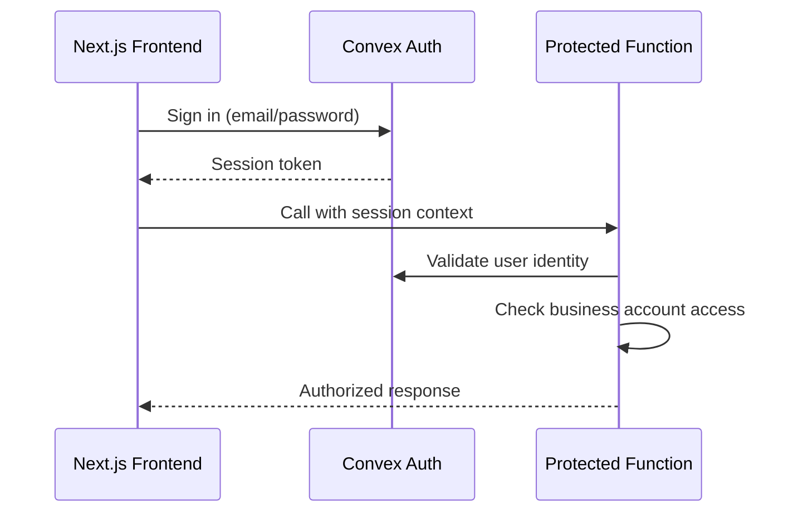

# Backend Architecture

## Service Architecture (Serverless)

BrickOps uses Convex serverless functions organized by domain with HTTP actions for webhooks and scheduled crons for background tasks:

```text
convex/
├── functions/
│   ├── auth.ts           # Authentication and user management
│   ├── catalog.ts        # Parts catalog and Bricklink API passthrough
│   ├── inventory.ts      # Inventory CRUD and real-time updates
│   ├── marketplace.ts    # Bricklink/Brickowl API integrations
│   ├── orders.ts         # Order processing and status management
│   ├── picking.ts        # Pick session management and workflows
│   └── identification.ts # Brickognize API integration
├── http.ts               # HTTP actions for webhooks/external calls
├── crons.ts              # Scheduled functions for order sync
└── schema.ts             # Database schema definitions
```

### Catalog Data Refresh Lifecycle

- **Seed Data**: On bootstrap, load Bricklink XML exports (`docs/external-documentation/bricklink-data/*.xml`) and BrickOps sort lookup (`bin_lookup_v3.json`) into Convex tables for parts, colors, categories, part-color availability, and internal sort locations. This provides a ground-truth catalog snapshot before any API calls are made.
- **Element IDs**: Include `codes.xml` when seeding to populate `BricklinkElementReference` so each part-color combination retains its LEGO element identifiers for downstream integrations.
- **Primary Queries**: `catalog.searchParts` and `catalog.getPartDetails` always hit the BrickOps datastore first. Search must leverage indexed fields for part number, description, category, color arrays, and sort locations to satisfy Story 2.2 filtering requirements.
- **Staleness Windows**: Treat records older than 7 days as candidates for refresh and older than 30 days as expired. Persist `lastFetchedFromBricklink` timestamps to drive refresh decisions.
- **Bricklink Aggregation**: When data is stale/missing, orchestrate multiple Bricklink calls per part (item details, price guide, color availability) inside `CatalogService` helpers. Responses should update the local datastore atomically with rate limiting and exponential backoff applied.
- **Reference Syncs**: Scheduled jobs should refresh `/colors` and `/categories` endpoints weekly, reconciling against the seeded XML baseline.

### Function Template

```typescript
// convex/functions/inventory.ts
import { mutation, query } from "./_generated/server";
import { v } from "convex/values";

export const addInventoryItem = mutation({
  args: {
    businessAccountId: v.id("businessAccounts"),
    partNumber: v.string(),
    colorId: v.string(),
    location: v.string(),
    quantityAvailable: v.number(),
    condition: v.union(v.literal("new"), v.literal("used")),
  },
  handler: async (ctx, args) => {
    // Validate authentication and business account access
    const identity = await ctx.auth.getUserIdentity();
    if (!identity) throw new Error("Authentication required");

    // Business logic implementation
    const itemId = await ctx.db.insert("inventoryItems", {
      ...args,
      quantityReserved: 0,
      quantitySold: 0,
      createdAt: Date.now(),
      updatedAt: Date.now(),
    });

    return itemId;
  },
});
```

## Convex Function Patterns and Best Practices

Understanding when to use queries, mutations, and actions is critical for building reliable Convex applications. These patterns ensure data consistency, proper transaction boundaries, and maintainable code.

### Core Function Types

#### Queries: Read-Only, Pure Functions

**Characteristics:**

- Read-only operations that cannot write to the database
- Pure functions with no side effects
- Cannot perform non-deterministic work
- Cannot call mutations or schedule functions
- Run in a consistent snapshot of the database

**When to Use:**

- Fetching data for display
- Searching and filtering records
- Computing derived values from database state

**Example:**

```typescript
export const searchParts = query({
  args: { query: v.string() },
  handler: async (ctx, { query }) => {
    // Pure read operation
    return await ctx.db
      .query("parts")
      .withSearchIndex("search_parts", (q) => q.search("description", query))
      .take(50);
  },
});
```

#### Mutations: Transactional Read-Write Operations

**Characteristics:**

- Can read and write to the database
- Run as atomic transactions
- All database operations succeed or fail together
- Can call other mutations or queries
- Should await all promises (no fire-and-forget)

**When to Use:**

- Creating, updating, or deleting records
- Operations that need transactional consistency
- Scheduling background work via `ctx.scheduler`
- Helpers that need to write to the database

**Example:**

```typescript
export const createInventoryItem = mutation({
  args: {
    partNumber: v.string(),
    colorId: v.number(),
    quantity: v.number(),
  },
  handler: async (ctx, args) => {
    // Transactional write operation
    const itemId = await ctx.db.insert("inventory", {
      ...args,
      createdAt: Date.now(),
    });

    // Schedule follow-up work (must await!)
    await ctx.scheduler.runAfter(0, internal.catalog.checkAndScheduleRefresh, {
      tableName: "parts",
      primaryKey: args.partNumber,
    });

    return itemId;
  },
});
```

#### Actions: External API Orchestration

**Characteristics:**

- Can call external APIs and perform non-deterministic work
- Can call mutations via `ctx.runMutation` to persist results
- Can call queries via `ctx.runQuery` to read data
- Cannot directly read or write to the database
- Run in Node.js environment with full npm ecosystem access

**When to Use:**

- Calling external APIs (Bricklink, Brickognize, email services)
- Processing large datasets in batches
- Orchestrating multiple mutations/queries
- Non-deterministic operations (HTTP requests, AI calls)

**Example:**

```typescript
export const fetchPartFromBricklink = action({
  args: { partNumber: v.string() },
  handler: async (ctx, { partNumber }) => {
    // Call external API
    const response = await fetch(`https://api.bricklink.com/parts/${partNumber}`);
    const partData = await response.json();

    // Persist results via mutation
    await ctx.runMutation(internal.catalog.savePart, {
      partNumber,
      data: partData,
    });

    return partData;
  },
});
```

### Internal Functions: Server-Only Building Blocks

**Why Use Internal Functions:**

- Called from actions, crons, schedulers, or other internal functions
- Cannot be called directly from the client
- Skip client-facing validation and security checks
- Ideal for building blocks and background jobs

**Naming Convention:**

```typescript
// Public API (callable from client)
export const getPartDetails = mutation({ ... });

// Internal API (server-only)
export const checkAndScheduleRefresh = internalMutation({ ... });
export const processRefreshQueue = internalAction({ ... });
```

### Critical Patterns for BrickOps

#### Pattern 1: Never Schedule or Write from Queries

**❌ WRONG - Query trying to schedule work:**

```typescript
export const getPart = query({
  args: { partNumber: v.string() },
  handler: async (ctx, { partNumber }) => {
    const part = await ctx.db.query("parts")...;

    // ❌ ERROR: Queries cannot schedule or write!
    await ctx.scheduler.runAfter(0, internal.catalog.refresh, { ... });

    return part;
  },
});
```

**✅ CORRECT - Mutation schedules refresh:**

```typescript
// Helper function for mutation context
async function getPart(ctx: MutationCtx, partNumber: string): Promise<Doc<"parts">> {
  const part = await ctx.db
    .query("parts")
    .withIndex("by_no", (q) => q.eq("no", partNumber))
    .first();

  if (!part) {
    // Schedule high-priority refresh for missing part
    await ctx.runMutation(internal.bricklink.dataRefresher.checkAndScheduleRefresh, {
      tableName: "parts",
      primaryKey: partNumber,
      priority: REFRESH_PRIORITY.HIGH,
    });
    throw new ConvexError(`Part ${partNumber} not found, refresh scheduled`);
  }

  // Schedule standard freshness check
  await ctx.runMutation(internal.bricklink.dataRefresher.checkAndScheduleRefresh, {
    tableName: "parts",
    primaryKey: partNumber,
    lastFetched: part.lastFetched,
    freshnessThresholdDays: 30,
  });

  return part;
}

// Exported mutation uses the helper
export const getPartDetails = mutation({
  args: { partNumber: v.string() },
  handler: async (ctx, { partNumber }) => {
    return await getPart(ctx, partNumber);
  },
});
```

#### Pattern 2: Always Await Promises

**❌ WRONG - Fire and forget:**

```typescript
export const updatePart = mutation({
  args: { partId: v.id("parts"), data: v.object({...}) },
  handler: async (ctx, { partId, data }) => {
    await ctx.db.patch(partId, data);

    // ❌ Not awaited - may fail silently!
    ctx.scheduler.runAfter(0, internal.catalog.refresh, { ... });
  },
});
```

**✅ CORRECT - Await all promises:**

```typescript
export const updatePart = mutation({
  args: { partId: v.id("parts"), data: v.object({...}) },
  handler: async (ctx, { partId, data }) => {
    await ctx.db.patch(partId, data);

    // ✅ Properly awaited
    await ctx.scheduler.runAfter(0, internal.catalog.refresh, { ... });
  },
});
```

#### Pattern 3: Action Orchestrates, Mutation Writes

**✅ CORRECT - Proper separation:**

```typescript
// Action orchestrates external API and persistence
export const processRefreshQueue = internalAction({
  args: {},
  handler: async (ctx) => {
    // Read queue (query)
    const batch = await ctx.runQuery(internal.bricklink.dataRefresher.getBatch, {
      limit: 10,
    });

    // Call external API
    const results = await Promise.all(
      batch.map(item => fetchFromBricklink(item))
    );

    // Update database (mutation)
    await ctx.runMutation(internal.bricklink.dataRefresher.updateRefreshStatus, {
      items: results,
    });
  },
});

// Internal query for reading
export const getBatch = internalQuery({
  args: { limit: v.number() },
  handler: async (ctx, { limit }) => {
    return await ctx.db.query("refreshQueue")
      .withIndex("by_priority_and_nextAttempt")
      .take(limit);
  },
});

// Internal mutation for writing
export const updateRefreshStatus = internalMutation({
  args: { items: v.array(v.object({...})) },
  handler: async (ctx, { items }) => {
    for (const item of items) {
      await ctx.db.patch(item.id, {
        status: "completed",
        lastFetched: Date.now(),
      });
    }
  },
});
```

### Helper Functions: Type-Safe Composition

Helper functions should be typed with the appropriate context type:

```typescript
import { QueryCtx, MutationCtx, ActionCtx } from "./_generated/server";

// Query helper
async function findPartByNumber(ctx: QueryCtx, partNumber: string): Promise<Doc<"parts"> | null> {
  return await ctx.db
    .query("parts")
    .withIndex("by_no", (q) => q.eq("no", partNumber))
    .first();
}

// Mutation helper
async function createRefreshRequest(
  ctx: MutationCtx,
  args: { tableName: string; primaryKey: string },
): Promise<Id<"refreshQueue">> {
  return await ctx.db.insert("refreshQueue", {
    ...args,
    status: "pending",
    priority: REFRESH_PRIORITY.STANDARD,
    nextAttemptAt: Date.now(),
  });
}

// Action helper
async function callBricklinkAPI(ctx: ActionCtx, endpoint: string): Promise<any> {
  const response = await fetch(`${BRICKLINK_API_BASE}${endpoint}`, {
    headers: { Authorization: process.env.BRICKLINK_TOKEN! },
  });
  return await response.json();
}
```

### Summary: Decision Tree

```
Need to read data only?
  └─> Use Query

Need to write to database?
  └─> Use Mutation

Need to call external API?
  └─> Use Action
      └─> Call Mutation to persist results

Building block for internal use only?
  └─> Use internalQuery / internalMutation / internalAction

Background job or scheduled task?
  └─> Use internalAction (for external calls)
      OR internalMutation (for database-only work)
```

**Key Principles:**

1. Queries are pure and read-only - no writes, no scheduling
2. Mutations are transactional - all writes succeed or fail together
3. Actions orchestrate - call external APIs, then persist via mutations
4. Internal functions are for server-side building blocks
5. Always await promises - no fire-and-forget
6. Helpers use typed contexts - QueryCtx, MutationCtx, ActionCtx

**Reference Documentation:**

- [Convex Queries](../external-documentation/convex/queries.md)
- [Convex Mutations](../external-documentation/convex/mutations.md)
- [Convex Actions](../external-documentation/convex/actions.md)
- [Convex Best Practices](../external-documentation/convex/best-practices.md)

---

## Authentication and Authorization

Convex Auth with JWT/session management enforces role-based access control at every function boundary:

**External Documentation References:**

- [Convex Auth Setup Guide](../external-documentation/convex-auth/setup.md) - Initial project setup and schema configuration
- [Convex Auth Configuration](../external-documentation/convex-auth/configure-auth.md) - Authentication methods and providers
- [Convex Auth Authorization](../external-documentation/convex-auth/authorization.md) - Backend function authentication patterns
- [Next.js Authorization](../external-documentation/convex-auth/authorization-nextjs.md) - Server-side authentication in Next.js



Every protected function validates:

1. User authentication via `ctx.auth.getUserIdentity()`
2. Business account membership and role permissions
3. Tenant isolation by filtering all queries with `businessAccountId`

---

## Global Catalog & Tenant Overlays (Update 2025-09-26)

- The LEGO parts catalog and Bricklink references are GLOBAL datasets and are not tenant-filtered.
- `catalog.searchParts` and `catalog.getPartDetails` read from global tables; they still require authentication but do not apply tenant filters.
- Tenant-specific attributes (tags, notes, sort grid/bin) live in a separate `catalogPartOverlay` table keyed by `(businessAccountId, partNumber)` and are not merged into search results for now.
- Overlay APIs: `catalog.getPartOverlay` and `catalog.upsertPartOverlay` expose per-tenant metadata with RBAC enforced at the `(businessAccountId, partNumber)` boundary.
- System maintenance endpoints (`savePartToLocalCatalog`, `batchImportParts`, `refreshCatalogEntries`, `seed*`) require accounts listed in `BRICKOPS_SYSTEM_ADMIN_EMAILS`; without configuration the tenant owner role is used as a safe fallback for bootstrap workflows.
- Inventory stays tenant-scoped and references catalog by `partNumber`.
- Seeding runs once globally (script no longer requires `--businessAccount`).
