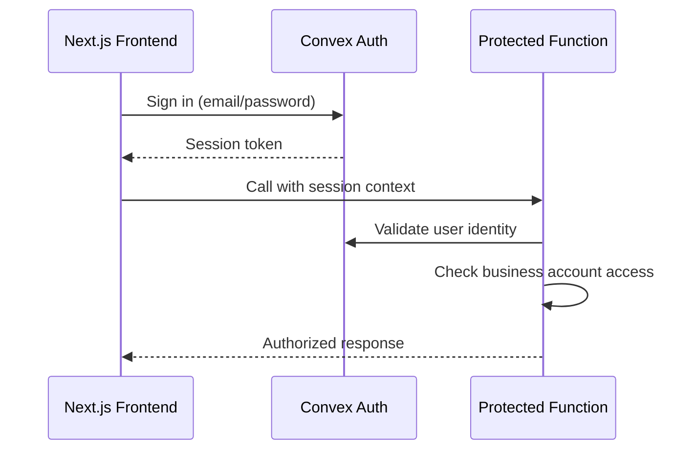

# Backend Architecture

## Service Architecture (Serverless)

BrickOps uses Convex serverless functions organized by domain with HTTP actions for webhooks and scheduled crons for background tasks:

```text
convex/
├── functions/
│   ├── auth.ts           # Authentication and user management
│   ├── catalog.ts        # Parts catalog and Bricklink API passthrough
│   ├── inventory.ts      # Inventory CRUD and real-time updates
│   ├── marketplace.ts    # Bricklink/Brickowl API integrations
│   ├── orders.ts         # Order processing and status management
│   ├── picking.ts        # Pick session management and workflows
│   └── identification.ts # Brickognize API integration
├── http.ts               # HTTP actions for webhooks/external calls
├── crons.ts              # Scheduled functions for order sync
└── schema.ts             # Database schema definitions
```

### Catalog Data Refresh Lifecycle

- **Seed Data**: On bootstrap, load Bricklink XML exports (`docs/external-documentation/bricklink-data/*.xml`) and BrickOps sort lookup (`bin_lookup_v3.json`) into Convex tables for parts, colors, categories, part-color availability, and internal sort locations. This provides a ground-truth catalog snapshot before any API calls are made.
- **Element IDs**: Include `codes.xml` when seeding to populate `BricklinkElementReference` so each part-color combination retains its LEGO element identifiers for downstream integrations.
- **Primary Queries**: `catalog.searchParts` and `catalog.getPartDetails` always hit the BrickOps datastore first. Search must leverage indexed fields for part number, description, category, color arrays, and sort locations to satisfy Story 2.2 filtering requirements.
- **Staleness Windows**: Treat records older than 7 days as candidates for refresh and older than 30 days as expired. Persist `lastFetchedFromBricklink` timestamps to drive refresh decisions.
- **Bricklink Aggregation**: When data is stale/missing, orchestrate multiple Bricklink calls per part (item details, price guide, color availability) inside `CatalogService` helpers. Responses should update the local datastore atomically with rate limiting and exponential backoff applied.
- **Reference Syncs**: Scheduled jobs should refresh `/colors` and `/categories` endpoints weekly, reconciling against the seeded XML baseline.

### Function Template

```typescript
// convex/functions/inventory.ts
import { mutation, query } from "./_generated/server";
import { v } from "convex/values";

export const addInventoryItem = mutation({
  args: {
    businessAccountId: v.id("businessAccounts"),
    partNumber: v.string(),
    colorId: v.string(),
    location: v.string(),
    quantityAvailable: v.number(),
    condition: v.union(v.literal("new"), v.literal("used")),
  },
  handler: async (ctx, args) => {
    // Validate authentication and business account access
    const identity = await ctx.auth.getUserIdentity();
    if (!identity) throw new Error("Authentication required");

    // Business logic implementation
    const itemId = await ctx.db.insert("inventoryItems", {
      ...args,
      quantityReserved: 0,
      quantitySold: 0,
      createdAt: Date.now(),
      updatedAt: Date.now(),
    });

    return itemId;
  },
});
```

## Authentication and Authorization

Convex Auth with JWT/session management enforces role-based access control at every function boundary:

**External Documentation References:**

- [Convex Auth Setup Guide](../external-documentation/convex-auth/setup.md) - Initial project setup and schema configuration
- [Convex Auth Configuration](../external-documentation/convex-auth/configure-auth.md) - Authentication methods and providers
- [Convex Auth Authorization](../external-documentation/convex-auth/authorization.md) - Backend function authentication patterns
- [Next.js Authorization](../external-documentation/convex-auth/authorization-nextjs.md) - Server-side authentication in Next.js



Every protected function validates:

1. User authentication via `ctx.auth.getUserIdentity()`
2. Business account membership and role permissions
3. Tenant isolation by filtering all queries with `businessAccountId`

---

## Global Catalog & Tenant Overlays (Update 2025-09-26)

- The LEGO parts catalog and Bricklink references are GLOBAL datasets and are not tenant-filtered.
- `catalog.searchParts` and `catalog.getPartDetails` read from global tables; they still require authentication but do not apply tenant filters.
- Tenant-specific attributes (tags, notes, sort grid/bin) live in a separate `catalogPartOverlay` table keyed by `(businessAccountId, partNumber)` and are not merged into search results for now.
- Inventory stays tenant-scoped and references catalog by `partNumber`.
- Seeding runs once globally (script no longer requires `--businessAccount`).
