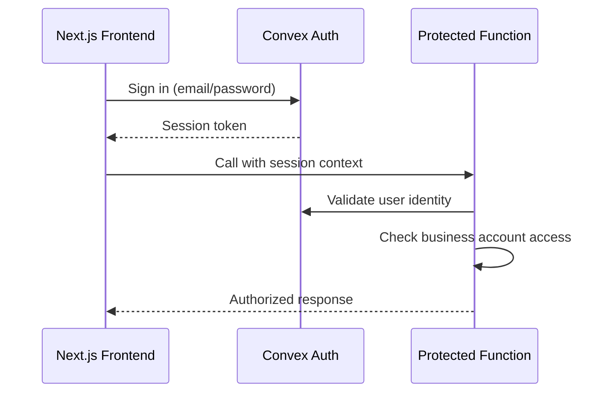

# Backend Architecture

## Service Architecture (Serverless)

BrickOps uses Convex serverless functions organized by domain with HTTP actions for webhooks and scheduled crons for background tasks:

```text
convex/
├── functions/
│   ├── auth.ts           # Authentication and user management
│   ├── catalog.ts        # Parts catalog and Bricklink API passthrough
│   ├── inventory.ts      # Inventory CRUD and real-time updates
│   ├── marketplace.ts    # Bricklink/Brickowl API integrations
│   ├── orders.ts         # Order processing and status management
│   ├── picking.ts        # Pick session management and workflows
│   └── identification.ts # Brickognize API integration
├── http.ts               # HTTP actions for webhooks/external calls
├── crons.ts              # Scheduled functions for order sync
└── schema.ts             # Database schema definitions
```

### Function Template

```typescript
// convex/functions/inventory.ts
import { mutation, query } from "./_generated/server";
import { v } from "convex/values";

export const addInventoryItem = mutation({
  args: {
    businessAccountId: v.id("businessAccounts"),
    partNumber: v.string(),
    colorId: v.string(),
    location: v.string(),
    quantityAvailable: v.number(),
    condition: v.union(v.literal("new"), v.literal("used")),
  },
  handler: async (ctx, args) => {
    // Validate authentication and business account access
    const identity = await ctx.auth.getUserIdentity();
    if (!identity) throw new Error("Authentication required");

    // Business logic implementation
    const itemId = await ctx.db.insert("inventoryItems", {
      ...args,
      quantityReserved: 0,
      quantitySold: 0,
      createdAt: Date.now(),
      updatedAt: Date.now(),
    });

    return itemId;
  },
});
```

## Authentication and Authorization

Convex Auth with JWT/session management enforces role-based access control at every function boundary:



Every protected function validates:

1. User authentication via `ctx.auth.getUserIdentity()`
2. Business account membership and role permissions
3. Tenant isolation by filtering all queries with `businessAccountId`
