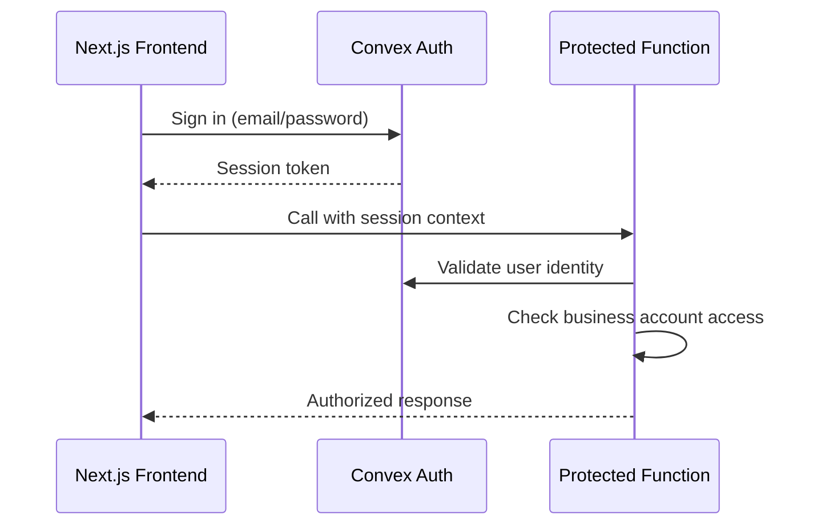

# Backend Architecture

## Service Architecture (Serverless)

BrickOps uses Convex serverless functions organized by business domain with specialized marketplace clients and HTTP actions for webhooks:

```text
convex/
├── bricklink/                  # BrickLink marketplace integration (Stories 2.3, 3.2)
│   ├── catalogClient.ts        # Global catalog queries (BrickOps credentials)
│   ├── bricklinkMappers.ts     # Catalog data mappers
│   ├── dataRefresher.ts        # Catalog refresh background jobs
│   ├── notifications.ts        # BrickLink push notifications processing
│   ├── oauth.ts                # Shared OAuth 1.0a signing helpers
│   ├── storeClient.ts          # User store client (inventory + orders, BYOK credentials)
│   ├── storeMappers.ts         # Store data mappers (inventory + orders)
│   └── webhook.ts              # Webhook endpoint handlers
│
├── brickowl/                   # BrickOwl marketplace integration (Story 3.3)
│   ├── auth.ts                 # API key authentication helpers
│   ├── storeClient.ts          # User store client (inventory + orders, BYOK credentials)
│   └── storeMappers.ts         # Store data mappers (inventory + orders)
│
├── catalog/                    # Catalog domain functions (Story 2.2-2.3)
│   ├── actions.ts              # External API orchestration
│   ├── helpers.ts              # Catalog business logic helpers
│   ├── mutations.ts            # Catalog write operations
│   ├── queries.ts              # Catalog read operations and search
│   ├── refreshWorker.ts        # Catalog refresh outbox processing
│   ├── schema.ts               # Catalog table schemas
│   └── validators.ts           # Catalog input validation
│
├── identify/                   # Part identification domain (Story 2.1)
│   ├── actions.ts              # Brickognize API integration actions
│   ├── helpers.ts              # Identification business logic
│   ├── mutations.ts            # Identification write operations
│   └── schema.ts               # Identification table schemas
│
├── inventory/                  # Inventory domain functions (Story 3.4)
│   ├── files/                  # Inventory file upload subdomain
│   │   ├── actions.ts          # File processing actions
│   │   ├── helpers.ts          # File parsing helpers
│   │   ├── mutations.ts        # File mutations
│   │   ├── queries.ts          # File queries
│   │   └── validators.ts       # File validation
│   ├── helpers.ts              # Inventory business logic helpers
│   ├── mutations.ts            # Inventory CRUD operations
│   ├── queries.ts              # Inventory read operations
│   ├── schema.ts               # Inventory table schemas
│   ├── sync.ts                 # Marketplace sync orchestration
│   ├── syncWorker.ts           # Background sync processing
│   └── validators.ts           # Inventory input validation
│
├── marketplace/                # Marketplace orchestration domain (Stories 3.1-3.3)
│   ├── actions.ts              # External marketplace API actions
│   ├── helpers.ts              # Marketplace business logic
│   ├── mutations.ts            # Marketplace write operations
│   ├── queries.ts              # Marketplace read operations
│   ├── rateLimitConfig.ts      # Rate limit configs per provider
│   ├── schema.ts               # Marketplace table schemas
│   └── types.ts                # Shared TypeScript interfaces (StoreOperationResult, etc.)
│
├── users/                      # User management domain (Story 1.3)
│   ├── actions.ts              # User-related actions (email, invitations)
│   ├── helpers.ts              # User business logic and RBAC
│   ├── mutations.ts            # User write operations
│   ├── queries.ts              # User read operations
│   └── schema.ts               # User table schemas
│
├── ratelimit/                  # Rate limiting domain
│   ├── mutations.ts            # Rate limit write operations
│   ├── rateLimitConfig.ts      # Rate limit configuration
│   └── schema.ts               # Rate limit table schemas
│
├── lib/                        # Shared utilities
│   ├── dbRateLimiter.ts        # Database-backed rate limiting helpers
│   ├── encryption.ts           # AES-GCM encryption for credentials (Story 3.1)
│   ├── external/               # External API utilities
│   │   ├── brickognize.ts      # Brickognize API client
│   │   ├── brickowl.ts         # BrickOwl API client
│   │   ├── circuitBreaker.ts   # Circuit breaker pattern implementation
│   │   ├── email.ts            # Email service client
│   │   ├── env.ts              # Environment variable helpers
│   │   ├── httpClient.ts       # Generic HTTP client
│   │   ├── inMemoryRateLimiter.ts # In-memory rate limiting
│   │   ├── metrics.ts          # Metrics recording helpers
│   │   ├── rateLimiter.ts      # Rate limiting abstractions
│   │   ├── retry.ts            # Retry logic implementation
│   │   ├── types.ts            # Shared external API types
│   │   └── validate.ts         # API response validation
│   ├── rateLimiterAdapter.ts   # Rate limiter adapter
│   └── webcrypto.ts            # Web Crypto API helpers
│
├── auth.config.ts              # Convex Auth configuration
├── auth.ts                     # Auth functions
├── crons.ts                    # Scheduled functions (catalog refresh, inventory sync)
├── hello.ts                    # Example public functions
├── hello_impl.ts               # Example implementation helpers
├── http.ts                     # HTTP endpoints for webhooks
└── schema.ts                   # Root database schema (aggregates domain schemas)
```

### Marketplace Integration Architecture

**Dual Client Pattern (Stories 3.2-3.3)**:

BrickOps uses separate specialized clients for different marketplace operations:

1. **Catalog Clients** - Query global parts catalog using BrickOps credentials (Story 2.3)
2. **Store Clients** - Manage user marketplace stores using user credentials/BYOK model (Stories 3.2-3.3)

**Example: BrickLink Integration**

```typescript
// System catalog operations (BrickOps credentials)
import { catalogClient } from "../bricklink/catalogClient";
const partData = await catalogClient.getRefreshedPart("3001");

// User store operations (user BYOK credentials)
import { createBricklinkStoreClient } from "../marketplace/helpers";
const storeClient = await createBricklinkStoreClient(ctx, businessAccountId);
const inventory = await storeClient.getInventories();
```

**Why Separate Clients?**

| Aspect        | Catalog Client                          | Store Client                |
| ------------- | --------------------------------------- | --------------------------- |
| Credentials   | BrickOps env vars                       | User database (encrypted)   |
| Rate Limiting | Static in-memory                        | Database-backed per-tenant  |
| Scope         | Global catalog data                     | User's marketplace store    |
| Methods       | Parts, colors, categories, price guides | Inventory, orders, settings |

**Database-Backed Rate Limiting (Stories 3.2-3.3)**:

All user store operations use persistent rate limiting via the `marketplaceRateLimits` table:

```typescript
// Pre-flight quota check before API request
const quota = await ctx.runQuery(internal.marketplace.queries.getQuotaState, {
  businessAccountId,
  provider: "bricklink",
});

// Make API request...

// Post-request quota recording
await ctx.runMutation(internal.marketplace.mutations.incrementQuota, {
  businessAccountId,
  provider: "bricklink",
});
```

Benefits:

- Persists across Convex isolate restarts
- Shared state across distributed backend instances
- Per-tenant quota isolation
- Circuit breaker support
- Future UI quota dashboards

### Catalog Data Refresh Lifecycle

- **Seed Data**: On bootstrap, load Bricklink XML exports (`docs/external-documentation/bricklink-data/*.xml`) and BrickOps sort lookup (`bin_lookup_v3.json`) into Convex tables for parts, colors, categories, part-color availability, and internal sort locations. This provides a ground-truth catalog snapshot before any API calls are made.
- **Element IDs**: Include `codes.xml` when seeding to populate `BricklinkElementReference` so each part-color combination retains its LEGO element identifiers for downstream integrations.
- **Primary Queries**: `catalog.searchParts` and `catalog.getPartDetails` always hit the BrickOps datastore first. Search must leverage indexed fields for part number, description, category, color arrays, and sort locations to satisfy Story 2.2 filtering requirements.
- **Staleness Windows**: Treat records older than 7 days as candidates for refresh and older than 30 days as expired. Persist `lastFetchedFromBricklink` timestamps to drive refresh decisions.
- **Bricklink Aggregation**: When data is stale/missing, orchestrate multiple Bricklink calls per part (item details, price guide, color availability) inside `CatalogService` helpers. Responses should update the local datastore atomically with rate limiting and exponential backoff applied.
- **Reference Syncs**: Scheduled jobs should refresh `/colors` and `/categories` endpoints weekly, reconciling against the seeded XML baseline.

### Domain Function Structure Example

Each domain follows a consistent structure with queries, mutations, actions, helpers, and schemas:

```typescript
// convex/inventory/mutations.ts
import { mutation } from "../_generated/server";
import { v } from "convex/values";

export const addInventoryItem = mutation({
  args: {
    businessAccountId: v.id("businessAccounts"),
    partNumber: v.string(),
    colorId: v.string(),
    location: v.string(),
    quantityAvailable: v.number(),
    condition: v.union(v.literal("new"), v.literal("used")),
  },
  handler: async (ctx, args) => {
    // Validate authentication and business account access
    const identity = await ctx.auth.getUserIdentity();
    if (!identity) throw new Error("Authentication required");

    // Business logic implementation
    const itemId = await ctx.db.insert("inventoryItems", {
      ...args,
      quantityReserved: 0,
      quantitySold: 0,
      createdAt: Date.now(),
      updatedAt: Date.now(),
    });

    return itemId;
  },
});
```

## Convex Function Patterns and Best Practices

Understanding when to use queries, mutations, and actions is critical for building reliable Convex applications. These patterns ensure data consistency, proper transaction boundaries, and maintainable code.

### Core Function Types

#### Queries: Read-Only, Pure Functions

**Characteristics:**

- Read-only operations that cannot write to the database
- Pure functions with no side effects
- Cannot perform non-deterministic work
- Cannot call mutations or schedule functions
- Run in a consistent snapshot of the database

**When to Use:**

- Fetching data for display
- Searching and filtering records
- Computing derived values from database state

**Example:**

```typescript
export const searchParts = query({
  args: { query: v.string() },
  handler: async (ctx, { query }) => {
    // Pure read operation
    return await ctx.db
      .query("parts")
      .withSearchIndex("search_parts", (q) => q.search("description", query))
      .take(50);
  },
});
```

#### Mutations: Transactional Read-Write Operations

**Characteristics:**

- Can read and write to the database
- Run as atomic transactions
- All database operations succeed or fail together
- Can call other mutations or queries
- Should await all promises (no fire-and-forget)

**When to Use:**

- Creating, updating, or deleting records
- Operations that need transactional consistency
- Scheduling background work via `ctx.scheduler`
- Helpers that need to write to the database

**Example:**

```typescript
export const createInventoryItem = mutation({
  args: {
    partNumber: v.string(),
    colorId: v.number(),
    quantity: v.number(),
  },
  handler: async (ctx, args) => {
    // Transactional write operation
    const itemId = await ctx.db.insert("inventory", {
      ...args,
      createdAt: Date.now(),
    });

    // Schedule follow-up work (must await!)
    await ctx.scheduler.runAfter(0, internal.catalog.checkAndScheduleRefresh, {
      tableName: "parts",
      primaryKey: args.partNumber,
    });

    return itemId;
  },
});
```

#### Actions: External API Orchestration

**Characteristics:**

- Can call external APIs and perform non-deterministic work
- Can call mutations via `ctx.runMutation` to persist results
- Can call queries via `ctx.runQuery` to read data
- Cannot directly read or write to the database
- Run in Node.js environment with full npm ecosystem access

**When to Use:**

- Calling external APIs (Bricklink, Brickognize, email services)
- Processing large datasets in batches
- Orchestrating multiple mutations/queries
- Non-deterministic operations (HTTP requests, AI calls)

**Example:**

```typescript
export const fetchPartFromBricklink = action({
  args: { partNumber: v.string() },
  handler: async (ctx, { partNumber }) => {
    // Call external API
    const response = await fetch(`https://api.bricklink.com/parts/${partNumber}`);
    const partData = await response.json();

    // Persist results via mutation
    await ctx.runMutation(internal.catalog.savePart, {
      partNumber,
      data: partData,
    });

    return partData;
  },
});
```

### Internal Functions: Server-Only Building Blocks

**Why Use Internal Functions:**

- Called from actions, crons, schedulers, or other internal functions
- Cannot be called directly from the client
- Skip client-facing validation and security checks
- Ideal for building blocks and background jobs

**Naming Convention:**

```typescript
// Public API (callable from client)
export const getPartDetails = mutation({ ... });

// Internal API (server-only)
export const checkAndScheduleRefresh = internalMutation({ ... });
export const processRefreshQueue = internalAction({ ... });
```

### Critical Patterns for BrickOps

#### Pattern 1: Never Schedule or Write from Queries

**❌ WRONG - Query trying to schedule work:**

```typescript
export const getPart = query({
  args: { partNumber: v.string() },
  handler: async (ctx, { partNumber }) => {
    const part = await ctx.db.query("parts")...;

    // ❌ ERROR: Queries cannot schedule or write!
    await ctx.scheduler.runAfter(0, internal.catalog.refresh, { ... });

    return part;
  },
});
```

**✅ CORRECT - Mutation schedules refresh:**

```typescript
// convex/catalog/helpers.ts
import { MutationCtx } from "../_generated/server";
import { internal } from "../_generated/api";
import { Doc } from "../_generated/dataModel";
import { ConvexError } from "convex/values";

// Helper function for mutation context
export async function getPart(ctx: MutationCtx, partNumber: string): Promise<Doc<"parts">> {
  const part = await ctx.db
    .query("parts")
    .withIndex("by_no", (q) => q.eq("no", partNumber))
    .first();

  if (!part) {
    // Schedule high-priority refresh for missing part
    await ctx.runMutation(internal.bricklink.dataRefresher.checkAndScheduleRefresh, {
      tableName: "parts",
      primaryKey: partNumber,
      priority: "HIGH",
    });
    throw new ConvexError(`Part ${partNumber} not found, refresh scheduled`);
  }

  // Schedule standard freshness check
  await ctx.runMutation(internal.bricklink.dataRefresher.checkAndScheduleRefresh, {
    tableName: "parts",
    primaryKey: partNumber,
    lastFetched: part.lastFetched,
    freshnessThresholdDays: 30,
  });

  return part;
}

// convex/catalog/mutations.ts
import { mutation } from "../_generated/server";
import { v } from "convex/values";
import { getPart } from "./helpers";

// Exported mutation uses the helper
export const getPartDetails = mutation({
  args: { partNumber: v.string() },
  handler: async (ctx, { partNumber }) => {
    return await getPart(ctx, partNumber);
  },
});
```

#### Pattern 2: Always Await Promises

**❌ WRONG - Fire and forget:**

```typescript
export const updatePart = mutation({
  args: { partId: v.id("parts"), data: v.object({...}) },
  handler: async (ctx, { partId, data }) => {
    await ctx.db.patch(partId, data);

    // ❌ Not awaited - may fail silently!
    ctx.scheduler.runAfter(0, internal.catalog.refresh, { ... });
  },
});
```

**✅ CORRECT - Await all promises:**

```typescript
export const updatePart = mutation({
  args: { partId: v.id("parts"), data: v.object({...}) },
  handler: async (ctx, { partId, data }) => {
    await ctx.db.patch(partId, data);

    // ✅ Properly awaited
    await ctx.scheduler.runAfter(0, internal.catalog.refresh, { ... });
  },
});
```

#### Pattern 3: Action Orchestrates, Mutation Writes

**✅ CORRECT - Proper separation:**

```typescript
// convex/catalog/actions.ts (or bricklink/dataRefresher.ts)
import { internalAction } from "../_generated/server";
import { internal } from "../_generated/api";

// Action orchestrates external API and persistence
export const processRefreshQueue = internalAction({
  args: {},
  handler: async (ctx) => {
    // Read queue (query)
    const batch = await ctx.runQuery(internal.catalog.queries.getBatch, {
      limit: 10,
    });

    // Call external API
    const results = await Promise.all(
      batch.map(item => fetchFromBricklink(item))
    );

    // Update database (mutation)
    await ctx.runMutation(internal.catalog.mutations.updateRefreshStatus, {
      items: results,
    });
  },
});

// convex/catalog/queries.ts
import { internalQuery } from "../_generated/server";
import { v } from "convex/values";

// Internal query for reading
export const getBatch = internalQuery({
  args: { limit: v.number() },
  handler: async (ctx, { limit }) => {
    return await ctx.db.query("catalogRefreshQueue")
      .withIndex("by_priority_and_nextAttempt")
      .take(limit);
  },
});

// convex/catalog/mutations.ts
import { internalMutation } from "../_generated/server";
import { v } from "convex/values";

// Internal mutation for writing
export const updateRefreshStatus = internalMutation({
  args: { items: v.array(v.object({...})) },
  handler: async (ctx, { items }) => {
    for (const item of items) {
      await ctx.db.patch(item.id, {
        status: "completed",
        lastFetched: Date.now(),
      });
    }
  },
});
```

### Helper Functions: Type-Safe Composition

Helper functions should be typed with the appropriate context type:

```typescript
// convex/catalog/helpers.ts
import { QueryCtx, MutationCtx, ActionCtx } from "../_generated/server";
import { Doc, Id } from "../_generated/dataModel";

// Query helper
export async function findPartByNumber(
  ctx: QueryCtx,
  partNumber: string,
): Promise<Doc<"parts"> | null> {
  return await ctx.db
    .query("parts")
    .withIndex("by_no", (q) => q.eq("no", partNumber))
    .first();
}

// Mutation helper
export async function createRefreshRequest(
  ctx: MutationCtx,
  args: { tableName: string; primaryKey: string },
): Promise<Id<"catalogRefreshQueue">> {
  return await ctx.db.insert("catalogRefreshQueue", {
    ...args,
    status: "pending",
    priority: "STANDARD",
    nextAttemptAt: Date.now(),
  });
}

// Action helper (typically in a domain actions.ts or bricklink client)
export async function callBricklinkAPI(ctx: ActionCtx, endpoint: string): Promise<any> {
  const BRICKLINK_API_BASE = process.env.BRICKLINK_API_URL;
  const response = await fetch(`${BRICKLINK_API_BASE}${endpoint}`, {
    headers: { Authorization: `Bearer ${process.env.BRICKLINK_TOKEN}` },
  });
  return await response.json();
}
```

### Summary: Decision Tree

```
Need to read data only?
  └─> Use Query

Need to write to database?
  └─> Use Mutation

Need to call external API?
  └─> Use Action
      └─> Call Mutation to persist results

Building block for internal use only?
  └─> Use internalQuery / internalMutation / internalAction

Background job or scheduled task?
  └─> Use internalAction (for external calls)
      OR internalMutation (for database-only work)
```

**Key Principles:**

1. Queries are pure and read-only - no writes, no scheduling
2. Mutations are transactional - all writes succeed or fail together
3. Actions orchestrate - call external APIs, then persist via mutations
4. Internal functions are for server-side building blocks
5. Always await promises - no fire-and-forget
6. Helpers use typed contexts - QueryCtx, MutationCtx, ActionCtx

**Reference Documentation:**

- [Convex Queries](../external-documentation/convex/queries.md)
- [Convex Mutations](../external-documentation/convex/mutations.md)
- [Convex Actions](../external-documentation/convex/actions.md)
- [Convex Best Practices](../external-documentation/convex/best-practices.md)

---

## Validator Patterns and Type Safety

**CRITICAL**: Validators are the single source of truth for all API contracts. They provide both runtime validation and type inference for end-to-end type safety.

### Validator Organization

Each domain should have a dedicated `validators.ts` file that exports:

1. **Shared component validators** (reusable across functions)
2. **Function argument validators** (for `args` property)
3. **Function return validators** (for `returns` property)
4. **TypeScript type exports** (convenience exports using `Infer<>`)

### Example: Complete Validator Pattern

```typescript
// convex/inventory/validators.ts
import { v } from "convex/values";
import type { Infer } from "convex/values";

// ============================================================================
// SHARED COMPONENT VALIDATORS (Reusable)
// ============================================================================

export const itemCondition = v.union(v.literal("new"), v.literal("used"));
export const syncStatus = v.union(
  v.literal("pending"),
  v.literal("syncing"),
  v.literal("synced"),
  v.literal("failed"),
);

// ============================================================================
// FUNCTION ARGUMENT VALIDATORS
// ============================================================================

export const addInventoryItemArgs = v.object({
  name: v.string(),
  partNumber: v.string(),
  colorId: v.string(),
  location: v.string(),
  quantityAvailable: v.number(),
  condition: itemCondition, // Reuse shared validator
  price: v.optional(v.number()),
});

// ============================================================================
// FUNCTION RETURN VALIDATORS
// ============================================================================

export const listInventoryItemsReturns = v.array(
  v.object({
    _id: v.id("inventoryItems"),
    name: v.string(),
    partNumber: v.string(),
    quantityAvailable: v.number(),
    condition: itemCondition, // Reuse shared validator
    // ... other fields
  }),
);

// ============================================================================
// TYPESCRIPT TYPE EXPORTS (Convenience)
// ============================================================================

export type AddInventoryItemArgs = Infer<typeof addInventoryItemArgs>;
export type ItemCondition = Infer<typeof itemCondition>;
```

### Using Validators in Functions

**CRITICAL**: Always define both `args` and `returns` validators:

```typescript
// convex/inventory/queries.ts
import { query } from "../_generated/server";
import { listInventoryItemsArgs, listInventoryItemsReturns } from "./validators";

export const listInventoryItems = query({
  args: listInventoryItemsArgs, // ✅ Always define args validator
  returns: listInventoryItemsReturns, // ✅ Always define returns validator
  handler: async (ctx, args) => {
    // Implementation - TypeScript types are inferred from validators
    const items = await ctx.db.query("inventoryItems").collect();
    return items; // TypeScript ensures return matches validator
  },
});
```

### Frontend Type Derivation

Frontend types MUST be derived from backend validators (never duplicated):

```typescript
// src/types/inventory.ts
import type { Infer } from "convex/values";
import type { listInventoryItemsReturns } from "@/convex/inventory/validators";

// ✅ GOOD: Type derived from validator
export type InventoryItem = Infer<typeof listInventoryItemsReturns>[0];

// ❌ BAD: Manually defined (can drift)
export type InventoryItem = { name: string /* ... */ };
```

For function return types, use `FunctionReturnType`:

```typescript
// src/types/inventory.ts
import type { FunctionReturnType } from "convex/server";
import { api } from "@/convex/_generated/api";

export type ListInventoryItemsResult = FunctionReturnType<
  typeof api.inventory.queries.listInventoryItems
>;
```

### Validator Best Practices

1. **Always define return validators**: Every public function should have a `returns` validator
2. **Reuse shared validators**: Extract common patterns (e.g., `itemCondition`, `syncStatus`)
3. **Validate at runtime**: Validators provide runtime safety, not just TypeScript types
4. **Export types for convenience**: Backend can export `Infer<>` types for internal use
5. **Organize by function**: Group validators logically (args, returns, shared components)

### Domain Validator Files

Each domain should have a `validators.ts` file:

- `convex/catalog/validators.ts` - Catalog function validators
- `convex/inventory/validators.ts` - Inventory function validators
- `convex/users/validators.ts` - User function validators
- `convex/marketplace/validators.ts` - Marketplace function validators

See [Coding Standards - Type Safety](../development/coding-standards.md#type-safety-and-validator-patterns) for complete validator patterns and examples.

---

## Scheduled Jobs and Cron

BrickOps uses Convex cron jobs for background processing defined in `convex/crons.ts`:

**Catalog Refresh Jobs (Story 2.3)**:

- Refresh stale catalog data from BrickLink API
- Process `catalogRefreshQueue` table for on-demand updates
- Run weekly to sync colors and categories reference data

**Inventory Sync Job (Story 3.4)**:

```typescript
// Run every 30 seconds to process pending marketplace syncs
schedules.interval(
  "inventory sync",
  { seconds: 30 },
  internal.inventory.sync.processPendingChanges,
);
```

**Cron Implementation Pattern**:

```typescript
// convex/crons.ts
import { cronJobs } from "convex/server";
import { internal } from "./_generated/api";

const crons = cronJobs();

// Process inventory sync queue every 30 seconds
crons.interval("inventory sync", { seconds: 30 }, internal.inventory.sync.processPendingChanges);

// Refresh stale catalog data (runs daily)
crons.daily(
  "catalog refresh",
  { hourUTC: 2, minuteUTC: 0 },
  internal.bricklink.dataRefresher.processRefreshQueue,
);

export default crons;
```

**Key Characteristics**:

- Cron jobs call internal actions for external API orchestration
- Convex automatically serializes actions per business account (prevents concurrent sync for same tenant)
- 30-second interval balances responsiveness with resource usage
- Max 30s latency for marketplace sync (acceptable for background operations)

---

## Authentication and Authorization

Convex Auth with JWT/session management enforces role-based access control at every function boundary:

**External Documentation References:**

- [Convex Auth Setup Guide](../external-documentation/convex-auth/setup.md) - Initial project setup and schema configuration
- [Convex Auth Configuration](../external-documentation/convex-auth/configure-auth.md) - Authentication methods and providers
- [Convex Auth Authorization](../external-documentation/convex-auth/authorization.md) - Backend function authentication patterns
- [Next.js Authorization](../external-documentation/convex-auth/authorization-nextjs.md) - Server-side authentication in Next.js



Every protected function validates:

1. User authentication via `ctx.auth.getUserIdentity()`
2. Business account membership and role permissions
3. Tenant isolation by filtering all queries with `businessAccountId`

---

## Global Catalog & Tenant Overlays (Update 2025-09-26)

- The LEGO parts catalog and Bricklink references are GLOBAL datasets and are not tenant-filtered.
- `catalog.searchParts` and `catalog.getPartDetails` read from global tables; they still require authentication but do not apply tenant filters.
- Tenant-specific attributes (tags, notes, sort grid/bin) live in a separate `catalogPartOverlay` table keyed by `(businessAccountId, partNumber)` and are not merged into search results for now.
- Overlay APIs: `catalog.getPartOverlay` and `catalog.upsertPartOverlay` expose per-tenant metadata with RBAC enforced at the `(businessAccountId, partNumber)` boundary.
- System maintenance endpoints (`savePartToLocalCatalog`, `batchImportParts`, `refreshCatalogEntries`, `seed*`) require accounts listed in `BRICKOPS_SYSTEM_ADMIN_EMAILS`; without configuration the tenant owner role is used as a safe fallback for bootstrap workflows.
- Inventory stays tenant-scoped and references catalog by `partNumber`.
- Seeding runs once globally (script no longer requires `--businessAccount`).
