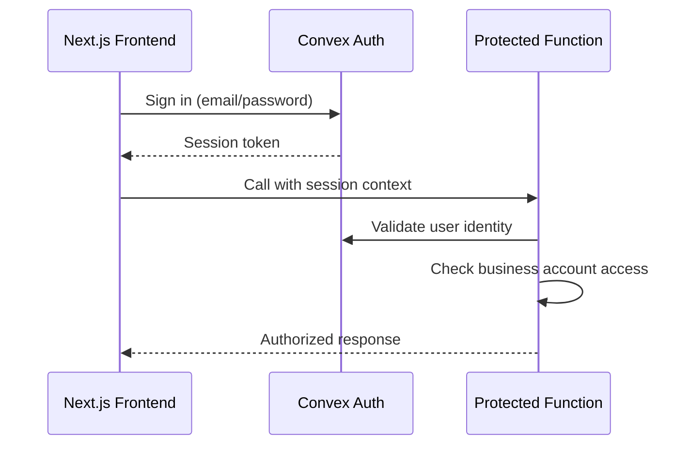

# Backend Architecture

## Service Architecture (Serverless)

BrickOps uses Convex serverless functions organized by business domain following a modular architecture pattern. Each domain is self-contained with clear inputs/outputs and minimal coupling. The architecture enforces unidirectional dependencies through a dedicated orchestration layer.

### Module READMEs

Each domain module contains a `README.md` documenting its purpose, public API, and integration patterns:

- [`convex/catalog/README.md`](../../../convex/catalog/README.md) - Global LEGO parts catalog
- [`convex/identify/README.md`](../../../convex/identify/README.md) - Part identification service
- [`convex/inventory/README.md`](../../../convex/inventory/README.md) - Inventory management
- [`convex/orders/README.md`](../../../convex/orders/README.md) - Order management
- [`convex/users/README.md`](../../../convex/users/README.md) - User and business account management
- [`convex/sync/README.md`](../../../convex/sync/README.md) - Marketplace synchronization orchestration
- [`convex/marketplaces/README.md`](../../../convex/marketplaces/README.md) - External marketplace API integrations
- [`convex/shared/README.md`](../../../convex/shared/README.md) - Cross-cutting infrastructure

### Directory Structure

```text
convex/
├── shared/                     # Cross-cutting infrastructure (no business logic)
│   ├── auth/                   # Authentication helpers
│   │   └── oauth.ts            # OAuth 1.0a signing utilities
│   ├── email/                  # Email service client
│   │   └── index.ts
│   ├── encryption/             # Credential encryption (AES-GCM)
│   │   ├── index.ts
│   │   └── webcrypto.ts
│   ├── env.ts                  # Environment variable helpers
│   ├── http/                   # Generic HTTP client and retry logic
│   │   ├── client.ts
│   │   ├── retry.ts
│   │   ├── types.ts
│   │   └── upstreamRequest.ts
│   ├── metrics/                # Metrics recording helpers
│   │   └── index.ts
│   ├── ratelimit/              # Database-backed rate limiting
│   │   ├── config.ts           # Provider rate limit configuration
│   │   ├── consume.ts          # Token consumption helpers
│   │   ├── dbRateLimiter.ts    # Rate limiter implementation
│   │   └── schema.ts           # Rate limit table schema
│   └── README.md
│
├── catalog/                    # Global LEGO Parts Catalog (Core Domain)
│   ├── README.md               # Module documentation
│   ├── schema.ts               # Catalog table schemas
│   ├── validators.ts           # Input validation
│   ├── ensure.ts               # Self-scheduling catalog orchestrator
│   ├── helpers.ts              # Business logic helpers
│   ├── mutations.ts            # Write operations
│   ├── categories.ts           # Category queries and refresh
│   ├── colors.ts               # Color queries and refresh
│   ├── parts.ts                # Part queries and refresh
│   ├── prices.ts               # Price guide queries and refresh
│   └── rebrickable.ts          # Rebrickable ID mapping
│
├── identify/                   # Part Identification Service (Core Domain)
│   ├── README.md               # Module documentation
│   ├── schema.ts               # (Empty - stateless module)
│   ├── actions.ts              # Brickognize API integration
│   ├── client.ts               # API client wrapper
│   ├── helpers.ts              # Business logic helpers
│   └── mutations.ts            # Write operations
│
├── inventory/                  # Inventory Management (Core Domain)
│   ├── README.md               # Module documentation
│   ├── schema.ts               # Inventory table schemas (items, ledgers)
│   ├── validators.ts           # Input validation
│   ├── actions.ts              # Inventory actions
│   ├── helpers.ts              # Business logic helpers
│   ├── mutations.ts            # CRUD operations
│   ├── queries.ts              # Read operations
│   ├── import.ts               # Marketplace import validation
│   ├── types.ts                # Type definitions
│   └── mocks.ts                # Test utilities
│
├── orders/                     # Order Management (Core Domain)
│   ├── README.md               # Module documentation
│   ├── schema.ts               # Order table schemas
│   ├── ingestion.ts            # Order ingestion from marketplaces
│   ├── mutations.ts            # Write operations
│   ├── queries.ts              # Read operations
│   ├── mocks.ts                # Test utilities
│   └── mockHelpers.ts          # Mock generation helpers
│
├── users/                      # User & Business Account Management (Core Domain)
│   ├── README.md               # Module documentation
│   ├── schema.ts               # User table schemas
│   ├── authorization.ts        # RBAC enforcement
│   ├── actions.ts              # User-related actions (invitations)
│   ├── mutations.ts            # Write operations
│   └── queries.ts              # Read operations
│
├── sync/                       # Marketplace Sync Orchestration Layer
│   ├── README.md               # Module documentation
│   ├── schema.ts               # Sync state tables (inventorySyncState, marketplaceOutbox)
│   ├── validators.ts           # Sync validators
│   ├── inventory/              # Inventory → Marketplace sync
│   │   ├── helpers.ts          # Sync business logic
│   │   ├── orchestrator.ts     # Sync coordination
│   │   └── worker.ts           # Background sync processing
│   ├── orders/                 # Marketplace → Orders ingestion
│   │   ├── actions.ts          # Order sync actions
│   │   └── normalizers/        # Provider-specific normalization
│   │       ├── index.ts
│   │       ├── bricklink.ts
│   │       ├── brickowl.ts
│   │       ├── types.ts
│   │       └── shared/
│   │           ├── errors.ts
│   │           ├── normalization.ts
│   │           └── types.ts
│   └── migrations/             # Data migration utilities
│       └── migrateInventorySyncState.ts
│
├── marketplaces/               # External Marketplace API Integrations
│   ├── README.md               # Module documentation
│   ├── shared/                 # Shared marketplace infrastructure
│   │   ├── schema.ts           # Credential and notification schemas
│   │   ├── auth.ts             # Owner guard utilities
│   │   ├── credentials.ts      # Credential CRUD operations
│   │   ├── credentialHelpers.ts
│   │   ├── credentialTypes.ts
│   │   ├── getCredentialDoc.ts
│   │   ├── rateLimitTypes.ts
│   │   ├── storeTypes.ts
│   │   ├── webhooks.ts
│   │   └── webhookTokens.ts
│   │
│   ├── bricklink/              # BrickLink API integration
│   │   ├── README.md
│   │   ├── catalog/            # Catalog API operations
│   │   │   ├── categories/
│   │   │   ├── colors/
│   │   │   ├── parts/
│   │   │   ├── priceGuides/
│   │   │   ├── shared/
│   │   │   └── refresh.ts
│   │   ├── inventory/          # Inventory API operations
│   │   ├── orders/             # Order API operations
│   │   ├── notifications/      # Push notification handling
│   │   ├── credentials.ts
│   │   ├── oauth.ts
│   │   ├── rateLimit.ts
│   │   ├── request.ts
│   │   └── transport.ts
│   │
│   └── brickowl/               # BrickOwl API integration
│       ├── README.md
│       ├── inventory/          # Inventory API operations
│       ├── orders/             # Order API operations
│       ├── notifications/      # Notification handling
│       ├── credentials.ts
│       ├── client.ts
│       ├── httpClient.ts
│       ├── rateLimit.ts
│       └── request.ts
│
├── auth.config.ts              # Convex Auth configuration (MUST stay at root)
├── auth.ts                     # Auth functions (MUST stay at root)
├── crons.ts                    # Scheduled functions
├── http.ts                     # HTTP endpoints for webhooks
└── schema.ts                   # Root database schema (aggregates domain schemas)
```

### Dependency Hierarchy

The architecture enforces strict unidirectional dependencies to prevent circular imports and maintain clear module boundaries:

```
┌─────────────────────────────────────────────────────────┐
│                    UI / Frontend                         │
└─────────────────────────────────────────────────────────┘
                          │
                          ▼
┌─────────────────────────────────────────────────────────┐
│              sync/ (Orchestration Layer)                 │
│   Coordinates inventory ↔ marketplaces ↔ orders         │
│   ONLY place where cross-module coordination happens    │
└─────────────────────────────────────────────────────────┘
                          │
          ┌───────────────┼───────────────┐
          ▼               ▼               ▼
    ┌──────────┐    ┌──────────┐    ┌──────────┐
    │ inventory │    │  orders  │    │ catalog  │
    │  (core)   │    │  (core)  │    │ (global) │
    └──────────┘    └──────────┘    └──────────┘
                          │
                          ▼
┌─────────────────────────────────────────────────────────┐
│              marketplaces/ (External APIs)               │
│         bricklink/  |  brickowl/  |  shared/            │
└─────────────────────────────────────────────────────────┘
                          │
                          ▼
┌─────────────────────────────────────────────────────────┐
│               shared/ (Infrastructure)                   │
│      auth  |  ratelimit  |  encryption  |  http         │
└─────────────────────────────────────────────────────────┘
```

**Dependency Rules:**

| Module         | Can Import                                                   | Cannot Import                                            |
| -------------- | ------------------------------------------------------------ | -------------------------------------------------------- |
| `shared/*`     | Nothing                                                      | All domains                                              |
| `catalog`      | `shared/*`                                                   | inventory, orders, sync, marketplaces                    |
| `identify`     | `shared/*`                                                   | catalog, inventory, orders, sync, marketplaces           |
| `inventory`    | `shared/*`, `catalog`                                        | orders, sync, marketplaces                               |
| `orders`       | `shared/*`, `catalog`                                        | inventory, sync, marketplaces                            |
| `sync`         | `shared/*`, `catalog`, `inventory`, `orders`, `marketplaces` | -                                                        |
| `marketplaces` | `shared/*`                                                   | catalog, inventory, orders, sync                         |
| `users`        | `shared/*`                                                   | catalog, identify, inventory, orders, sync, marketplaces |

**Key Principles:**

- Core modules (`inventory`, `orders`, `catalog`) do NOT import from each other
- `sync/` orchestrates between modules - it's the only place cross-module coordination happens
- `marketplaces/` is a pure API wrapper with no business logic
- `shared/` has no business domain knowledge

See [`docs/architecture/backend/module-dependencies.md`](./module-dependencies.md) for the complete dependency visualization.

### Sync Layer Architecture

The `sync/` module is the orchestration layer that coordinates between core domains and external marketplaces. It owns all synchronization state and is the only place where cross-module coordination happens.

**Key Components:**

- **`sync/schema.ts`** - Defines `inventorySyncState` (per-item, per-provider sync status) and `marketplaceOutbox` (transactional outbox for sync operations)
- **`sync/inventory/`** - Handles inventory → marketplace synchronization
- **`sync/orders/`** - Handles marketplace → orders ingestion with provider-specific normalizers

**Sync State Tables:**

```typescript
// inventorySyncState: Tracks per-item, per-provider sync status
{
  itemId: Id<"inventoryItems">,
  provider: "bricklink" | "brickowl",
  lotId: string | number,           // Marketplace identifier
  status: "pending" | "syncing" | "synced" | "failed" | "disabled",
  lastSyncAttempt: number,
  lastSyncedSeq: number,            // Cursor for retry logic
  error: string | undefined,
}

// marketplaceOutbox: Transactional outbox for marketplace operations
{
  businessAccountId: Id<"businessAccounts">,
  itemId: Id<"inventoryItems">,
  provider: "bricklink" | "brickowl",
  kind: "create" | "update" | "delete",
  status: "pending" | "inflight" | "succeeded" | "failed",
  // ... additional fields for idempotency and retry
}
```

### Marketplace Integration Architecture

**Dual Client Pattern**:

BrickOps uses separate specialized clients for different marketplace operations:

1. **Catalog Clients** - Query global parts catalog using BrickOps credentials
2. **Store Clients** - Manage user marketplace stores using user credentials (BYOK model)

**Example: BrickLink Integration**

```typescript
// Catalog operations (shared BrickOps credentials)
import { fetchBlPart } from "../marketplaces/bricklink/catalog/parts/actions";
const partData = await fetchBlPart(ctx, { itemNo: "3001" });

// User store operations (user BYOK credentials)
import { getBLInventories } from "../marketplaces/bricklink/inventory/actions";
const inventory = await getBLInventories(ctx, {
  businessAccountId,
  filters: { page: 1, pageSize: 50 },
});
```

**Why Separate Clients?**

| Aspect        | Catalog Client                          | Store Helpers (Inventories/Orders/etc.) |
| ------------- | --------------------------------------- | --------------------------------------- |
| Credentials   | BrickOps env vars                       | User database (encrypted)               |
| Rate Limiting | Static in-memory                        | Database-backed per-tenant              |
| Scope         | Global catalog data                     | User's marketplace store                |
| Methods       | Parts, colors, categories, price guides | Inventory, orders, notifications        |

**Database-Backed Rate Limiting**:

All user store operations use persistent rate limiting via the `rateLimits` table in `shared/ratelimit/`:

```typescript
// Rate limit token consumption (from shared/ratelimit/consume.ts)
import { consumeRateLimitToken } from "../shared/ratelimit/consume";

await consumeRateLimitToken(ctx, {
  bucket: `bricklink:account:${businessAccountId}`,
  provider: "bricklink",
});

// Make API request...
```

Rate limit buckets map directly to business account identifiers. Reserve the `brickopsAdmin` bucket for BrickOps-owned global workloads (e.g., catalog refresh tasks).

Benefits:

- Persists across Convex isolate restarts
- Shared state across distributed backend instances
- Per-tenant quota isolation
- Circuit breaker support
- Future UI quota dashboards

### Catalog Data Refresh Lifecycle

- **Seed Data**: On bootstrap, load Bricklink XML exports (`docs/external-documentation/bricklink-data/*.xml`) and BrickOps sort lookup (`bin_lookup_v3.json`) into Convex tables for parts, colors, categories, part-color availability, and internal sort locations. This provides a ground-truth catalog snapshot before any API calls are made.
- **Element IDs**: Include `codes.xml` when seeding to populate `BricklinkElementReference` so each part-color combination retains its LEGO element identifiers for downstream integrations.
- **Primary Queries**: `catalog.searchParts` and `catalog.getPartDetails` always hit the BrickOps datastore first. Search must leverage indexed fields for part number, description, category, color arrays, and sort locations to satisfy Story 2.2 filtering requirements.
- **Staleness Windows**: Treat records older than 7 days as candidates for refresh and older than 30 days as expired. Persist `lastFetchedFromBricklink` timestamps to drive refresh decisions.
- **Bricklink Aggregation**: When data is stale/missing, orchestrate multiple Bricklink calls per part (item details, price guide, color availability) inside `CatalogService` helpers. Responses should update the local datastore atomically with rate limiting and exponential backoff applied.
- **Reference Syncs**: Scheduled jobs should refresh `/colors` and `/categories` endpoints weekly, reconciling against the seeded XML baseline.

### Domain Function Structure Example

Each domain follows a consistent structure with queries, mutations, actions, helpers, and schemas:

```typescript
// convex/inventory/mutations.ts
import { mutation } from "../_generated/server";
import { v } from "convex/values";

export const addInventoryItem = mutation({
  args: {
    businessAccountId: v.id("businessAccounts"),
    partNumber: v.string(),
    colorId: v.string(),
    location: v.string(),
    quantityAvailable: v.number(),
    condition: v.union(v.literal("new"), v.literal("used")),
  },
  handler: async (ctx, args) => {
    // Validate authentication and business account access
    const identity = await ctx.auth.getUserIdentity();
    if (!identity) throw new Error("Authentication required");

    // Business logic implementation
    const itemId = await ctx.db.insert("inventoryItems", {
      ...args,
      quantityReserved: 0,
      quantitySold: 0,
      createdAt: Date.now(),
      updatedAt: Date.now(),
    });

    return itemId;
  },
});
```

## Convex Function Patterns and Best Practices

Understanding when to use queries, mutations, and actions is critical for building reliable Convex applications. These patterns ensure data consistency, proper transaction boundaries, and maintainable code.

### Core Function Types

#### Queries: Read-Only, Pure Functions

**Characteristics:**

- Read-only operations that cannot write to the database
- Pure functions with no side effects
- Cannot perform non-deterministic work
- Cannot call mutations or schedule functions
- Run in a consistent snapshot of the database

**When to Use:**

- Fetching data for display
- Searching and filtering records
- Computing derived values from database state

**Example:**

```typescript
export const searchParts = query({
  args: { query: v.string() },
  handler: async (ctx, { query }) => {
    // Pure read operation
    return await ctx.db
      .query("parts")
      .withSearchIndex("search_parts", (q) => q.search("description", query))
      .take(50);
  },
});
```

#### Mutations: Transactional Read-Write Operations

**Characteristics:**

- Can read and write to the database
- Run as atomic transactions
- All database operations succeed or fail together
- Can call other mutations or queries
- Should await all promises (no fire-and-forget)

**When to Use:**

- Creating, updating, or deleting records
- Operations that need transactional consistency
- Scheduling background work via `ctx.scheduler`
- Helpers that need to write to the database

**Example:**

```typescript
export const createInventoryItem = mutation({
  args: {
    partNumber: v.string(),
    colorId: v.number(),
    quantity: v.number(),
  },
  handler: async (ctx, args) => {
    // Transactional write operation
    const itemId = await ctx.db.insert("inventory", {
      ...args,
      createdAt: Date.now(),
    });

    // Schedule follow-up work (must await!)
    await ctx.scheduler.runAfter(0, internal.catalog.checkAndScheduleRefresh, {
      tableName: "parts",
      primaryKey: args.partNumber,
    });

    return itemId;
  },
});
```

#### Actions: External API Orchestration

**Characteristics:**

- Can call external APIs and perform non-deterministic work
- Can call mutations via `ctx.runMutation` to persist results
- Can call queries via `ctx.runQuery` to read data
- Cannot directly read or write to the database
- Run in Node.js environment with full npm ecosystem access

**When to Use:**

- Calling external APIs (Bricklink, Brickognize, email services)
- Processing large datasets in batches
- Orchestrating multiple mutations/queries
- Non-deterministic operations (HTTP requests, AI calls)

**Example:**

```typescript
export const fetchPartFromBricklink = action({
  args: { partNumber: v.string() },
  handler: async (ctx, { partNumber }) => {
    // Call external API
    const response = await fetch(`https://api.bricklink.com/parts/${partNumber}`);
    const partData = await response.json();

    // Persist results via mutation
    await ctx.runMutation(internal.catalog.savePart, {
      partNumber,
      data: partData,
    });

    return partData;
  },
});
```

### Internal Functions: Server-Only Building Blocks

**Why Use Internal Functions:**

- Called from actions, crons, schedulers, or other internal functions
- Cannot be called directly from the client
- Skip client-facing validation and security checks
- Ideal for building blocks and background jobs

**Naming Convention:**

```typescript
// Public API (callable from client)
export const getPartDetails = mutation({ ... });

// Internal API (server-only)
export const checkAndScheduleRefresh = internalMutation({ ... });
export const processCatalogRefreshJobs = internalAction({ ... });
```

### Critical Patterns for BrickOps

#### Pattern 1: Never Schedule or Write from Queries

**❌ WRONG - Query trying to schedule work:**

```typescript
export const getPart = query({
  args: { partNumber: v.string() },
  handler: async (ctx, { partNumber }) => {
    const part = await ctx.db.query("parts")...;

    // ❌ ERROR: Queries cannot schedule or write!
    await ctx.scheduler.runAfter(0, internal.catalog.ensure.enqueueCatalogRefresh, {
      tableName: "parts",
      primaryKey: partNumber,
    });

    return part;
  },
});
```

**✅ CORRECT - Mutation schedules refresh:**

```typescript
// convex/catalog/helpers.ts
import { MutationCtx } from "../_generated/server";
import { internal } from "../_generated/api";
import { Doc } from "../_generated/dataModel";
import { ConvexError } from "convex/values";

// Helper function for mutation context
export async function getPart(ctx: MutationCtx, partNumber: string): Promise<Doc<"parts">> {
  const part = await ctx.db
    .query("parts")
    .withIndex("by_no", (q) => q.eq("no", partNumber))
    .first();

  if (!part) {
    // Schedule high-priority refresh for missing part
    await ctx.scheduler.runAfter(0, internal.catalog.ensure.enqueueCatalogRefresh, {
      tableName: "parts",
      primaryKey: partNumber,
      priority: 1,
    });
    throw new ConvexError(`Part ${partNumber} not found, refresh scheduled`);
  }

  // Schedule standard freshness check if stale
  const isStale = Date.now() - part.lastFetched > 30 * 24 * 60 * 60 * 1000;
  if (isStale) {
    await ctx.scheduler.runAfter(0, internal.catalog.ensure.enqueueCatalogRefresh, {
      tableName: "parts",
      primaryKey: partNumber,
    });
  }

  return part;
}

// convex/catalog/mutations.ts
import { mutation } from "../_generated/server";
import { v } from "convex/values";
import { getPart } from "./helpers";

// Exported mutation uses the helper
export const getPartDetails = mutation({
  args: { partNumber: v.string() },
  handler: async (ctx, { partNumber }) => {
    return await getPart(ctx, partNumber);
  },
});
```

#### Pattern 2: Always Await Promises

**❌ WRONG - Fire and forget:**

```typescript
export const updatePart = mutation({
  args: { partId: v.id("parts"), data: v.object({...}) },
  handler: async (ctx, { partId, data }) => {
    await ctx.db.patch(partId, data);

    // ❌ Not awaited - may fail silently!
    ctx.scheduler.runAfter(
      0,
      internal.catalog.ensure.enqueueCatalogRefresh,
      { tableName: "parts", primaryKey: data.no },
    );
  },
});
```

**✅ CORRECT - Await all promises:**

```typescript
export const updatePart = mutation({
  args: { partId: v.id("parts"), data: v.object({...}) },
  handler: async (ctx, { partId, data }) => {
    await ctx.db.patch(partId, data);

    // ✅ Properly awaited
    await ctx.scheduler.runAfter(
      0,
      internal.catalog.ensure.enqueueCatalogRefresh,
      { tableName: "parts", primaryKey: data.no },
    );
  },
});
```

#### Pattern 3: Action Orchestrates, Mutation Writes

**✅ CORRECT - Proper separation:**

```typescript
// convex/sync/inventory/worker.ts
import { internalAction } from "../../_generated/server";
import { internal } from "../../_generated/api";

// Action orchestrates external API and persistence
export const processPendingChanges = internalAction({
  args: {},
  handler: async (ctx) => {
    // Read outbox (query)
    const batch = await ctx.runQuery(internal.sync.inventory.helpers.getPendingOutbox, {
      limit: 10,
    });

    // Call external marketplace API
    const results = await Promise.all(
      batch.map(item => syncToMarketplace(ctx, item))
    );

    // Update sync state (mutation)
    await ctx.runMutation(internal.sync.inventory.helpers.updateSyncStatus, {
      items: results,
    });
  },
});

// convex/sync/inventory/helpers.ts
import { internalQuery, internalMutation } from "../../_generated/server";
import { v } from "convex/values";

// Internal query for reading outbox
export const getPendingOutbox = internalQuery({
  args: { limit: v.number() },
  handler: async (ctx, { limit }) => {
    return await ctx.db.query("marketplaceOutbox")
      .withIndex("by_status_time", (q) => q.eq("status", "pending"))
      .take(limit);
  },
});

// Internal mutation for writing
export const updateSyncStatus = internalMutation({
  args: { items: v.array(v.object({...})) },
  handler: async (ctx, { items }) => {
    for (const item of items) {
      await ctx.db.patch(item.id, {
        status: item.success ? "succeeded" : "failed",
        lastError: item.error,
      });
    }
  },
});
```

### Helper Functions: Type-Safe Composition

Helper functions should be typed with the appropriate context type:

```typescript
// convex/catalog/helpers.ts
import { QueryCtx, MutationCtx, ActionCtx } from "../_generated/server";
import { Doc, Id } from "../_generated/dataModel";

// Query helper
export async function findPartByNumber(
  ctx: QueryCtx,
  partNumber: string,
): Promise<Doc<"parts"> | null> {
  return await ctx.db
    .query("parts")
    .withIndex("by_no", (q) => q.eq("no", partNumber))
    .first();
}

// Mutation helper
export async function createRefreshRequest(
  ctx: MutationCtx,
  args: { tableName: string; primaryKey: string },
): Promise<Id<"catalogRefreshQueue">> {
  return await ctx.db.insert("catalogRefreshQueue", {
    ...args,
    status: "pending",
    priority: "STANDARD",
    nextAttemptAt: Date.now(),
  });
}

// Action helper (typically in a domain actions.ts or bricklink client)
export async function callBricklinkAPI(ctx: ActionCtx, endpoint: string): Promise<any> {
  const BRICKLINK_API_BASE = process.env.BRICKLINK_API_URL;
  const response = await fetch(`${BRICKLINK_API_BASE}${endpoint}`, {
    headers: { Authorization: `Bearer ${process.env.BRICKLINK_TOKEN}` },
  });
  return await response.json();
}
```

### Summary: Decision Tree

```
Need to read data only?
  └─> Use Query

Need to write to database?
  └─> Use Mutation

Need to call external API?
  └─> Use Action
      └─> Call Mutation to persist results

Building block for internal use only?
  └─> Use internalQuery / internalMutation / internalAction

Background job or scheduled task?
  └─> Use internalAction (for external calls)
      OR internalMutation (for database-only work)
```

**Key Principles:**

1. Queries are pure and read-only - no writes, no scheduling
2. Mutations are transactional - all writes succeed or fail together
3. Actions orchestrate - call external APIs, then persist via mutations
4. Internal functions are for server-side building blocks
5. Always await promises - no fire-and-forget
6. Helpers use typed contexts - QueryCtx, MutationCtx, ActionCtx

**Reference Documentation:**

- [Convex Queries](../external-documentation/convex/queries.md)
- [Convex Mutations](../external-documentation/convex/mutations.md)
- [Convex Actions](../external-documentation/convex/actions.md)
- [Convex Best Practices](../external-documentation/convex/best-practices.md)

---

## Validator Patterns and Type Safety

**CRITICAL**: Validators are the single source of truth for all API contracts. They provide both runtime validation and type inference for end-to-end type safety.

### Validator Organization

Each domain should have a dedicated `validators.ts` file that exports:

1. **Shared component validators** (reusable across functions)
2. **Function argument validators** (for `args` property)
3. **Function return validators** (for `returns` property)
4. **TypeScript type exports** (convenience exports using `Infer<>`)

### Example: Complete Validator Pattern

```typescript
// convex/inventory/validators.ts
import { v } from "convex/values";
import type { Infer } from "convex/values";

// ============================================================================
// SHARED COMPONENT VALIDATORS (Reusable)
// ============================================================================

export const itemCondition = v.union(v.literal("new"), v.literal("used"));
export const syncStatus = v.union(
  v.literal("pending"),
  v.literal("syncing"),
  v.literal("synced"),
  v.literal("failed"),
);

// ============================================================================
// FUNCTION ARGUMENT VALIDATORS
// ============================================================================

export const addInventoryItemArgs = v.object({
  name: v.string(),
  partNumber: v.string(),
  colorId: v.string(),
  location: v.string(),
  quantityAvailable: v.number(),
  condition: itemCondition, // Reuse shared validator
  price: v.optional(v.number()),
});

// ============================================================================
// FUNCTION RETURN VALIDATORS
// ============================================================================

export const listInventoryItemsReturns = v.array(
  v.object({
    _id: v.id("inventoryItems"),
    name: v.string(),
    partNumber: v.string(),
    quantityAvailable: v.number(),
    condition: itemCondition, // Reuse shared validator
    // ... other fields
  }),
);

// ============================================================================
// TYPESCRIPT TYPE EXPORTS (Convenience)
// ============================================================================

export type AddInventoryItemArgs = Infer<typeof addInventoryItemArgs>;
export type ItemCondition = Infer<typeof itemCondition>;
```

### Using Validators in Functions

**CRITICAL**: Always define both `args` and `returns` validators:

```typescript
// convex/inventory/queries.ts
import { query } from "../_generated/server";
import { listInventoryItemsArgs, listInventoryItemsReturns } from "./validators";

export const listInventoryItems = query({
  args: listInventoryItemsArgs, // ✅ Always define args validator
  returns: listInventoryItemsReturns, // ✅ Always define returns validator
  handler: async (ctx, args) => {
    // Implementation - TypeScript types are inferred from validators
    const items = await ctx.db.query("inventoryItems").collect();
    return items; // TypeScript ensures return matches validator
  },
});
```

### Frontend Type Derivation

Frontend types MUST be derived from backend validators (never duplicated):

```typescript
// src/types/inventory.ts
import type { Infer } from "convex/values";
import type { listInventoryItemsReturns } from "@/convex/inventory/validators";

// ✅ GOOD: Type derived from validator
export type InventoryItem = Infer<typeof listInventoryItemsReturns>[0];

// ❌ BAD: Manually defined (can drift)
export type InventoryItem = { name: string /* ... */ };
```

For function return types, use `FunctionReturnType`:

```typescript
// src/types/inventory.ts
import type { FunctionReturnType } from "convex/server";
import { api } from "@/convex/_generated/api";

export type ListInventoryItemsResult = FunctionReturnType<
  typeof api.inventory.queries.listInventoryItems
>;
```

### Validator Best Practices

1. **Always define return validators**: Every public function should have a `returns` validator
2. **Reuse shared validators**: Extract common patterns (e.g., `itemCondition`, `syncStatus`)
3. **Validate at runtime**: Validators provide runtime safety, not just TypeScript types
4. **Export types for convenience**: Backend can export `Infer<>` types for internal use
5. **Organize by function**: Group validators logically (args, returns, shared components)

### Domain Validator Files

Each domain should have a `validators.ts` file:

- `convex/catalog/validators.ts` - Catalog function validators
- `convex/inventory/validators.ts` - Inventory function validators
- `convex/users/validators.ts` - User function validators
- `convex/marketplaces/shared/validators.ts` - Marketplace function validators

See [Coding Standards - Type Safety](../development/coding-standards.md#type-safety-and-validator-patterns) for complete validator patterns and examples.

### Inventory Import Validation Flow

Marketplace inventory imports now run a structured validation pass before any mutations occur:

1. **Validate actions**: `inventory.import.validateBricklinkImport` and `inventory.import.validateBrickowlImport` traverse the full remote inventory, transform each lot into an `InventoryImportCandidate`, and classify the lot as `ready`, `skip-existing`, `skip-unavailable`, or `skip-invalid`. The response surfaces per-lot issues (missing catalog mappings, color mismatches, inactive lots) that the UI can display before import.
2. **User confirmation**: The Next.js settings page opens a confirmation dialog showing the lots that will be skipped, along with their issues. Only lots with `status === "ready"` are eligible for import.
3. **Gated import actions**: `importBricklinkInventory` and `importBrickowlInventory` now require an explicit list of `candidateIds`. The backend reruns classification, skips non-ready lots, and persists the successful imports while recording `skippedInvalid` counts in the `ImportSummary`.

This flow prevents partial imports caused by catalog mismatches, ensures owners understand which lots will be skipped, and keeps backend mutations idempotent and auditable.

---

## Scheduled Jobs and Cron

BrickOps uses Convex cron jobs for background processing defined in `convex/crons.ts`:

**Catalog Refresh Jobs**:

- Refresh stale catalog data from BrickLink API
- Process catalog refresh queue for on-demand updates
- Run weekly to sync colors and categories reference data

**Inventory Sync Job**:

The sync module (`convex/sync/`) handles marketplace synchronization via the outbox pattern:

```typescript
// Run every 30 seconds to process pending marketplace syncs
crons.interval(
  "inventory sync",
  { seconds: 30 },
  internal.sync.inventory.worker.processPendingChanges,
);
```

**Cron Implementation Pattern**:

```typescript
// convex/crons.ts
import { cronJobs } from "convex/server";
import { internal } from "./_generated/api";

const crons = cronJobs();

// Process marketplace sync outbox every 30 seconds
crons.interval(
  "process-marketplace-sync",
  { seconds: 30 },
  internal.sync.inventory.worker.processPendingChanges,
);

// Catalog refresh jobs (actual implementation varies by refresh type)
// Colors, categories, parts, and price guides each have their own refresh logic
// in convex/marketplaces/bricklink/catalog/*/actions.ts

export default crons;
```

**Key Characteristics**:

- Cron jobs call internal actions for external API orchestration
- Convex automatically serializes actions per business account (prevents concurrent sync for same tenant)
- 30-second interval balances responsiveness with resource usage
- Max 30s latency for marketplace sync (acceptable for background operations)

---

## Authentication and Authorization

Convex Auth with JWT/session management enforces role-based access control at every function boundary:

**External Documentation References:**

- [Convex Auth Setup Guide](../external-documentation/convex-auth/setup.md) - Initial project setup and schema configuration
- [Convex Auth Configuration](../external-documentation/convex-auth/configure-auth.md) - Authentication methods and providers
- [Convex Auth Authorization](../external-documentation/convex-auth/authorization.md) - Backend function authentication patterns
- [Next.js Authorization](../external-documentation/convex-auth/authorization-nextjs.md) - Server-side authentication in Next.js


```mermaid
sequenceDiagram
    participant UI as Next.js Frontend
    participant Auth as Convex Auth
    participant Fn as Protected Function

    UI->>Auth: Sign in (email/password)
    Auth-->>UI: Session token
    UI->>Fn: Call with session context
    Fn->>Auth: Validate user identity
    Fn->>Fn: Check business account access
    Fn-->>UI: Authorized response
```

Every protected function validates:

1. User authentication via `ctx.auth.getUserIdentity()`
2. Business account membership and role permissions
3. Tenant isolation by filtering all queries with `businessAccountId`

---

## Global Catalog & Tenant Overlays (Update 2025-09-26)

- The LEGO parts catalog and Bricklink references are GLOBAL datasets and are not tenant-filtered.
- `catalog.searchParts` and `catalog.getPartDetails` read from global tables; they still require authentication but do not apply tenant filters.
- Tenant-specific attributes (tags, notes, sort grid/bin) live in a separate `catalogPartOverlay` table keyed by `(businessAccountId, partNumber)` and are not merged into search results for now.
- Overlay APIs: `catalog.getPartOverlay` and `catalog.upsertPartOverlay` expose per-tenant metadata with RBAC enforced at the `(businessAccountId, partNumber)` boundary.
- System maintenance endpoints (`savePartToLocalCatalog`, `batchImportParts`, `refreshCatalogEntries`, `seed*`) require accounts listed in `BRICKOPS_SYSTEM_ADMIN_EMAILS`; without configuration the tenant owner role is used as a safe fallback for bootstrap workflows.
- Inventory stays tenant-scoped and references catalog by `partNumber`.
- Seeding runs once globally (script no longer requires `--businessAccount`).
