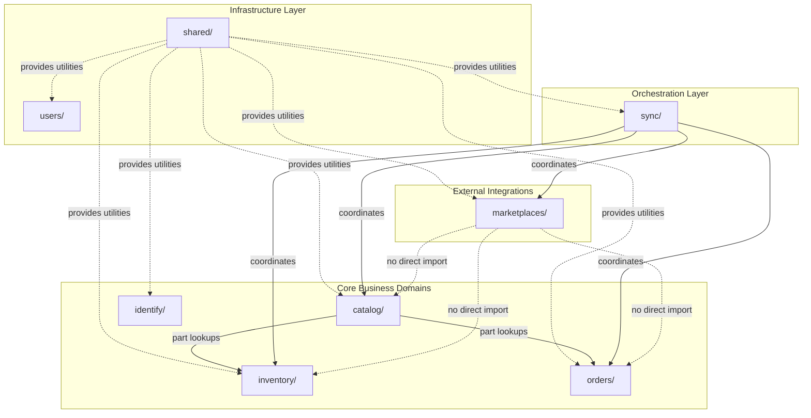
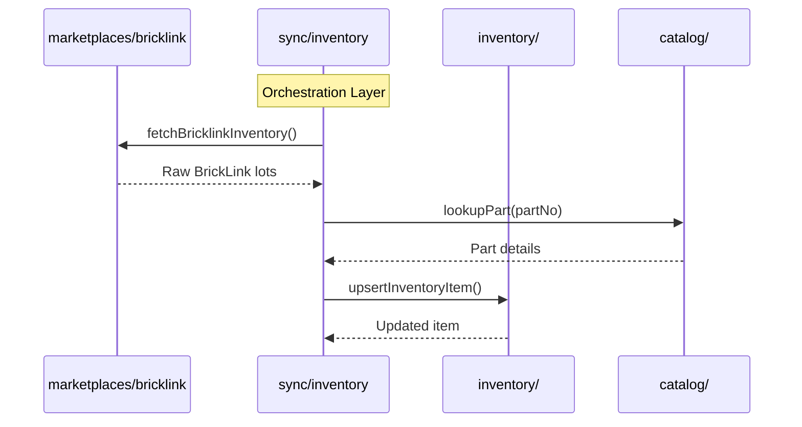
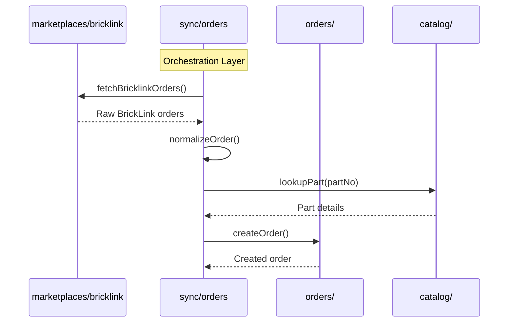

# Module Dependencies

This document defines the dependency rules and relationships between BrickOps backend modules. These rules ensure clean architecture with proper separation of concerns.

## Architecture Overview

BrickOps follows a layered module architecture with strict dependency rules:



## Detailed Dependency Diagram

```mermaid
flowchart LR
    subgraph shared["shared/ (Infrastructure)"]
        auth["auth/"]
        email["email/"]
        encryption["encryption/"]
        http["http/"]
        metrics["metrics/"]
        ratelimit["ratelimit/"]
        env["env.ts"]
    end

    subgraph users["users/"]
        u_actions["actions.ts"]
        u_auth["authorization.ts"]
        u_mutations["mutations.ts"]
        u_queries["queries.ts"]
        u_schema["schema.ts"]
    end

    subgraph catalog["catalog/"]
        c_ensure["ensure.ts"]
        c_helpers["helpers.ts"]
        c_mutations["mutations.ts"]
        c_parts["parts.ts"]
        c_colors["colors.ts"]
        c_prices["prices.ts"]
        c_schema["schema.ts"]
    end

    subgraph identify["identify/"]
        i_actions["actions.ts"]
        i_client["client.ts"]
        i_helpers["helpers.ts"]
        i_mutations["mutations.ts"]
        i_schema["schema.ts"]
    end

    subgraph inventory["inventory/"]
        inv_actions["actions.ts"]
        inv_helpers["helpers.ts"]
        inv_import["import.ts"]
        inv_mutations["mutations.ts"]
        inv_queries["queries.ts"]
        inv_schema["schema.ts"]
    end

    subgraph orders["orders/"]
        o_ingestion["ingestion.ts"]
        o_mutations["mutations.ts"]
        o_queries["queries.ts"]
        o_schema["schema.ts"]
    end

    subgraph marketplaces["marketplaces/"]
        subgraph bricklink["bricklink/"]
            bl_catalog["catalog/"]
            bl_inventory["inventory/"]
            bl_orders["orders/"]
            bl_notifications["notifications/"]
        end
        subgraph brickowl["brickowl/"]
            bo_inventory["inventory/"]
            bo_orders["orders/"]
            bo_notifications["notifications/"]
        end
        mp_shared["shared/"]
    end

    subgraph sync["sync/"]
        s_inventory["inventory/"]
        s_orders["orders/"]
        s_normalizers["orders/normalizers/"]
        s_schema["schema.ts"]
    end

    %% Allowed dependencies
    inventory --> catalog
    orders --> catalog
    sync --> catalog
    sync --> inventory
    sync --> orders
    sync --> marketplaces

    %% Shared utilities flow
    shared -.-> users
    shared -.-> catalog
    shared -.-> identify
    shared -.-> inventory
    shared -.-> orders
    shared -.-> marketplaces
    shared -.-> sync
```



## Dependency Rules

### Rule 1: Shared Utilities are Foundation

The `shared/` module provides infrastructure utilities used by all other modules:

- **Can be imported by**: All modules
- **Cannot import from**: Any domain modules

```typescript
// ✅ ALLOWED: Any module can import from shared/
import { takeRateLimitToken } from "@/convex/shared/ratelimit/consume";
import { encrypt, decrypt } from "@/convex/shared/encryption";
import { sendEmail } from "@/convex/shared/email";
```

### Rule 2: Core Domains are Independent

Core business domains (`catalog`, `identify`, `inventory`, `orders`) operate independently:

- **Cannot import from each other** (except allowed dependencies below)
- **inventory** and **orders** can import from **catalog** (for part lookups)
- This prevents circular dependencies and maintains clear boundaries

```typescript
// ✅ ALLOWED: inventory can import catalog for part lookups
import { getPartByNumber } from "@/convex/catalog/helpers";

// ❌ FORBIDDEN: inventory cannot import from orders
import { getOrder } from "@/convex/orders/queries"; // VIOLATION!

// ❌ FORBIDDEN: orders cannot import from inventory
import { getInventoryItem } from "@/convex/inventory/queries"; // VIOLATION!
```

### Rule 3: Marketplaces are Isolated

The `marketplaces/` module handles external API integrations and is isolated from core domains:

- **Cannot import from**: `catalog`, `inventory`, `orders`, `sync`
- **Can only import from**: `shared/`
- This ensures marketplace code is purely about API communication

```typescript
// ✅ ALLOWED: marketplaces can use shared utilities
import { encrypt } from "@/convex/shared/encryption";

// ❌ FORBIDDEN: marketplaces cannot import core domains
import { getPartByNumber } from "@/convex/catalog/helpers"; // VIOLATION!
import { getInventoryItem } from "@/convex/inventory/queries"; // VIOLATION!
```

### Rule 4: Sync Orchestrates All

The `sync/` module is the orchestration layer that coordinates between all modules:

- **Can import from**: `catalog`, `inventory`, `orders`, `marketplaces`, `shared`
- This is the ONLY module that can bridge core domains and marketplaces

```typescript
// ✅ ALLOWED: sync can import everything
import { getPartByNumber } from "@/convex/catalog/helpers";
import { updateInventoryItem } from "@/convex/inventory/mutations";
import { createOrder } from "@/convex/orders/mutations";
import { fetchBricklinkOrders } from "@/convex/marketplaces/bricklink/orders/actions";
```

### Rule 5: Users Module is Infrastructure

The `users/` module provides authentication and authorization:

- **Can only import from**: `shared/`
- **Cannot import from**: Any business domains

## Dependency Matrix

| Module         | Can Import                                                   | Cannot Import                                                        |
| -------------- | ------------------------------------------------------------ | -------------------------------------------------------------------- |
| `shared/*`     | Nothing (foundation layer)                                   | All domains                                                          |
| `users`        | `shared/*`                                                   | `catalog`, `identify`, `inventory`, `orders`, `sync`, `marketplaces` |
| `catalog`      | `shared/*`                                                   | `identify`, `inventory`, `orders`, `sync`, `marketplaces`            |
| `identify`     | `shared/*`                                                   | `catalog`, `inventory`, `orders`, `sync`, `marketplaces`             |
| `inventory`    | `shared/*`, `catalog`                                        | `identify`, `orders`, `sync`, `marketplaces`                         |
| `orders`       | `shared/*`, `catalog`                                        | `identify`, `inventory`, `sync`, `marketplaces`                      |
| `marketplaces` | `shared/*`                                                   | `catalog`, `identify`, `inventory`, `orders`, `sync`                 |
| `sync`         | `shared/*`, `catalog`, `inventory`, `orders`, `marketplaces` | `identify`, `users`                                                  |

## Data Flow Patterns

### Inventory Sync Flow



### Order Ingestion Flow



## Why These Rules?

### Preventing Circular Dependencies

Without strict rules, it's easy to create circular dependencies:

```typescript
// ❌ CIRCULAR DEPENDENCY EXAMPLE:
// inventory/helpers.ts imports from orders
import { getOrderItems } from "@/convex/orders/queries";

// orders/helpers.ts imports from inventory
import { reserveInventory } from "@/convex/inventory/mutations";

// This creates: inventory → orders → inventory (circular!)
```

### Maintaining Clear Boundaries

Each module has a clear responsibility:

| Module          | Responsibility                                             |
| --------------- | ---------------------------------------------------------- |
| `shared/`       | Infrastructure utilities (encryption, rate limiting, HTTP) |
| `users/`        | Authentication, authorization, RBAC                        |
| `catalog/`      | Part catalog management, search, enrichment                |
| `identify/`     | Part identification via Brickognize API                    |
| `inventory/`    | Local inventory tracking and management                    |
| `orders/`       | Order management and processing                            |
| `marketplaces/` | External marketplace API communication                     |
| `sync/`         | Orchestration between local and external systems           |

### Enabling Independent Testing

With clean boundaries, each module can be tested in isolation:

```typescript
// inventory/helpers.test.ts can mock catalog/ without worrying about orders/
vi.mock("@/convex/catalog/helpers", () => ({
  getPartByNumber: vi.fn(),
}));

// No need to mock orders/, marketplaces/, or sync/ because inventory doesn't use them
```

## Validation

To verify modules follow these rules, run the dependency check script:

```bash
pnpm check:module-deps
```

This script uses grep to detect import violations. It will:

- Report any NEW dependency violations and fail the check
- Document known architectural issues that are tracked for future refactoring
- Pass if only known issues exist (with a summary of tracked issues)

### Known Architectural Issues

The following are documented for awareness but don't block the dependency check:

1. **`marketplaces/bricklink/catalog/`**: Has type-only imports from `@/convex/catalog/mutations`
   - **Impact**: Low - These are TypeScript `import type` statements that are erased at compile time, so they don't create runtime dependencies
   - **Resolution**: Consider creating a `sync/catalog/` orchestration layer for cleaner architecture (see Task F1 in `_notes/modular-architecture-refactor-plan.md`)

### Resolved Issues

The following issues have been resolved:

1. ~~**`orders/ingestion.ts`**: Used inventory ledger helpers~~ - **RESOLVED**: Moved to `sync/orders/ingestion.ts` where it can legitimately import from both `orders/` and `inventory/` domains

## Related Documentation

- [Backend Architecture](./architecture.md) - Overall backend structure
- [Database Schema](./database-schema.md) - Table definitions and relationships
- [Coding Standards](../development/coding-standards.md) - Development conventions
