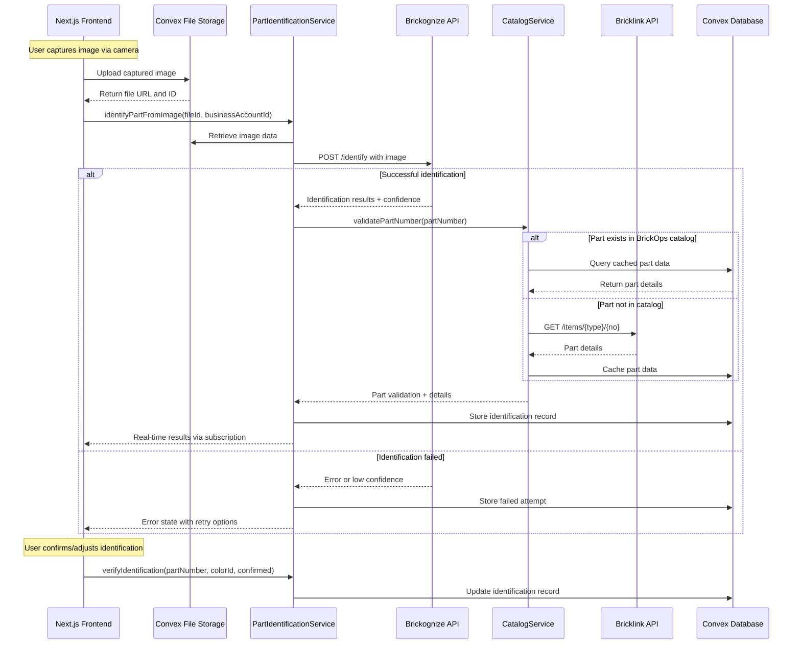
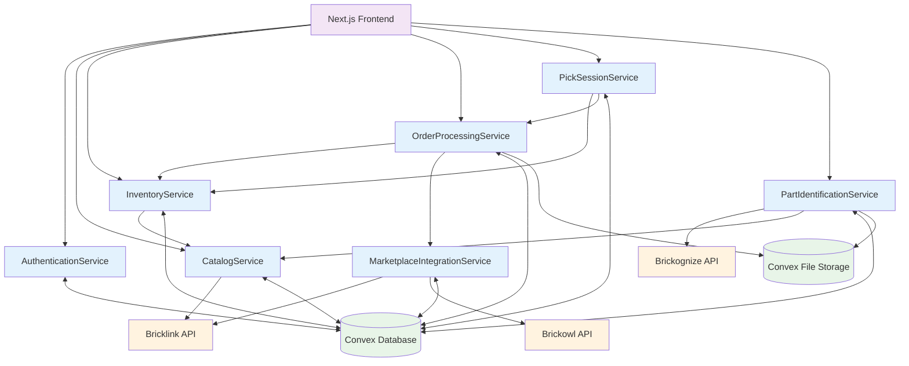

# Components

## AuthenticationService

**Responsibility:** Manages user authentication, role-based access control, and business account management using Convex Auth

**Key Interfaces:**

- `authenticate(email, password)` - User login with session creation
- `createBusinessAccount(ownerDetails, businessInfo)` - New business account setup
- `inviteUser(email, role, businessAccountId)` - Team member invitation
- `updateUserRole(userId, newRole)` - Role management by account owners
- `validateAccess(userId, resource, action)` - Permission checking

**Dependencies:** Convex Auth, User and BusinessAccount data models

**Technology Stack:** Convex functions with built-in authentication, encrypted credential storage

## CatalogService

**Responsibility:** Manages the centralized Lego parts catalog with intelligent API passthrough to Bricklink, implementing caching strategies and data freshness validation

**Key Interfaces:**

- `searchParts(query, filters)` - Part search across cached and live data
- `getPartDetails(partNumber)` - Detailed part information with price data
- `refreshPartData(partNumber)` - Force refresh from Bricklink API
- `batchImportParts(partNumbers)` - Bulk catalog population
- `validateDataFreshness(partNumber)` - Check if cached data is current

**Dependencies:** LegoPartCatalog model, Bricklink API integration, Convex file storage for images

**Technology Stack:** Convex functions with scheduled data refresh, intelligent caching logic

## InventoryService

**Responsibility:** Core inventory management with real-time updates, location tracking, and status management across available/reserved/sold quantities

**Key Interfaces:**

- `addInventoryItem(businessAccountId, partDetails, quantity, location)` - Add new inventory
- `updateQuantities(itemId, availableChange, reservedChange, soldChange)` - Quantity adjustments
- `searchInventory(businessAccountId, filters)` - Inventory search and filtering
- `getInventoryByLocation(businessAccountId, location)` - Location-based inventory lookup
- `auditInventoryChanges(businessAccountId, dateRange)` - Change history tracking

**Dependencies:** InventoryItem model, InventoryAuditLog, real-time subscriptions for live updates

**Technology Stack:** Convex mutations with real-time subscriptions, automatic audit logging

## MarketplaceIntegrationService

**Responsibility:** Handles bidirectional synchronization with Bricklink and Brickowl APIs, including order import, inventory sync, and rate limit management

**Key Interfaces:**

- `syncOrdersFromMarketplaces(businessAccountId)` - Import new and updated orders
- `syncInventoryToBricklink(businessAccountId, inventoryChanges)` - Push inventory changes
- `authenticateMarketplace(businessAccountId, marketplace, credentials)` - API credential management
- `handleRateLimits(apiProvider, operation)` - Smart rate limiting and throttling
- `getOrderUpdates(businessAccountId, sinceTimestamp)` - Incremental order sync

**Dependencies:** MarketplaceOrder model, external API wrappers, credential encryption

**Technology Stack:** Convex scheduled functions for periodic sync, API rate limiting middleware, encrypted credential storage

## OrderProcessingService

**Responsibility:** Manages order workflow from import to completion, including status updates, document generation, and marketplace synchronization

**Key Interfaces:**

- `processNewOrders(businessAccountId)` - New order intake and validation
- `generatePickSheets(orderIds)` - Pick sheet PDF generation
- `generateShippingLabels(orderIds)` - Shipping label creation
- `updateOrderStatus(orderId, newStatus)` - Status management with marketplace sync
- `exportOrdersToCSV(orderIds, format)` - Order data export

**Dependencies:** MarketplaceOrder model, InventoryService for quantity reservations, MarketplaceIntegrationService for status sync

**Technology Stack:** Convex functions with file generation, PDF creation libraries, CSV export utilities

## PickSessionService

**Responsibility:** Orchestrates the order picking workflow with optimized path generation, issue resolution, and inventory adjustments during picking

**Key Interfaces:**

- `createPickSession(userId, orderIds)` - Initialize picking session with path optimization
- `generateOptimizedPickPath(orderIds)` - Location-based picking route calculation
- `markPartPicked(sessionId, partNumber, quantityPicked)` - Progress tracking
- `reportPickingIssue(sessionId, partNumber, issueType, notes)` - Issue documentation
- `completePickSession(sessionId)` - Session finalization with inventory updates

**Dependencies:** PickSession model, InventoryService for location data, TodoItem creation for issues

**Technology Stack:** Convex functions with path optimization algorithms, real-time progress tracking

## PartIdentificationService

**Responsibility:** Integrates with Brickognize API for camera-based part identification, managing confidence scoring and manual verification workflows

**Key Interfaces:**

- `identifyPartFromImage(imageData, businessAccountId)` - Submit image for identification
- `getIdentificationResults(requestId)` - Retrieve identification results with confidence
- `verifyIdentification(partNumber, colorId, confirmed)` - Manual verification feedback
- `getIdentificationHistory(businessAccountId)` - Recent identification attempts
- `retryIdentification(imageData, hints)` - Re-attempt with user hints

**Dependencies:** Brickognize API integration, CatalogService for part validation, Convex file storage for image management

**Technology Stack:** Convex functions with external API integration, image processing utilities, confidence scoring logic

## Camera Integration Technical Flow

**Mobile/Desktop Camera → Brickognize → Catalog Validation → Inventory Addition**

**Technical Implementation Details:**

1. **Image Capture Standards:**

   - Minimum resolution: 640x480 pixels
   - Supported formats: JPEG, PNG, WebP
   - Maximum file size: 10MB
   - Auto-compression for optimal API performance

2. **Identification Processing Pipeline:**

   - Frontend uploads image → Convex File Storage
   - Convex HTTP action triggered for Brickognize API call
   - Real-time subscription updates frontend with results
   - Confidence threshold: 85% for auto-acceptance, <85% requires manual verification

3. **Error Handling & Retry Logic:**
   - Network failures: 3 retry attempts with exponential backoff
   - Low confidence results: Offer manual part selection
   - API rate limit hit: Queue request with user notification
   - Invalid image: Clear feedback with capture tips

## Component Diagrams

