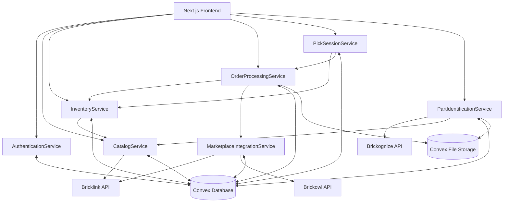

# Components

## AuthenticationService

- Responsibility: Manages authentication, RBAC, and business account management using Convex Auth
- Key Interfaces: authenticate, createBusinessAccount, inviteUser, updateUserRole, validateAccess
- Dependencies: Convex Auth; User and BusinessAccount models

## CatalogService

- Responsibility: Centralized Lego parts catalog with API passthrough to Bricklink and caching
- Key Interfaces: searchParts, getPartDetails, refreshPartData, batchImportParts, validateDataFreshness, syncBricklinkReferenceData
- Data Flow:
  - Prefers BrickOps datastore as source of truth, seeded from Bricklink XML exports stored in `docs/external-documentation/bricklink-data`
  - Refreshes stale or missing records via Bricklink APIs (`/items/part`, `/items/part/{no}`, `/items/part/{no}/price`, `/colors`, `/categories`) with multi-call aggregation handled inside the service
  - Maintains freshness windows (fresh <7 days, stale <30 days, expired >30 days) and records sync timestamps per part, color, and category entry
  - Enriches records with BrickOps sort locations from `bin_lookup_v3.json` so catalog rows expose grid/bin assignments alongside Bricklink metadata
- Error Handling: Implements rate limiting, exponential backoff, and structured error mapping to align with frontend retry UX

## InventoryService

- Responsibility: Inventory management with real-time updates and status management
- Key Interfaces: addInventoryItem, updateQuantities, searchInventory, getInventoryByLocation, auditInventoryChanges

## MarketplaceIntegrationService

- Responsibility: Bidirectional synchronization with Bricklink and Brickowl
- Key Interfaces: syncOrdersFromMarketplaces, syncInventoryToBricklink, authenticateMarketplace, handleRateLimits, getOrderUpdates

## OrderProcessingService

- Responsibility: Order workflow from import to completion
- Key Interfaces: processNewOrders, generatePickSheets, generateShippingLabels, updateOrderStatus, exportOrdersToCSV

## PickSessionService

- Responsibility: Picking workflow orchestration with optimized path generation and issue handling
- Key Interfaces: createPickSession, generateOptimizedPickPath, markPartPicked, reportPickingIssue, completePickSession

## PartIdentificationService

- Responsibility: Camera-based part identification via Brickognize, confidence scoring, and manual verification
- Key Interfaces: identifyPartFromImage, getIdentificationResults, verifyIdentification, getIdentificationHistory, retryIdentification

## Component Relationships Diagram

