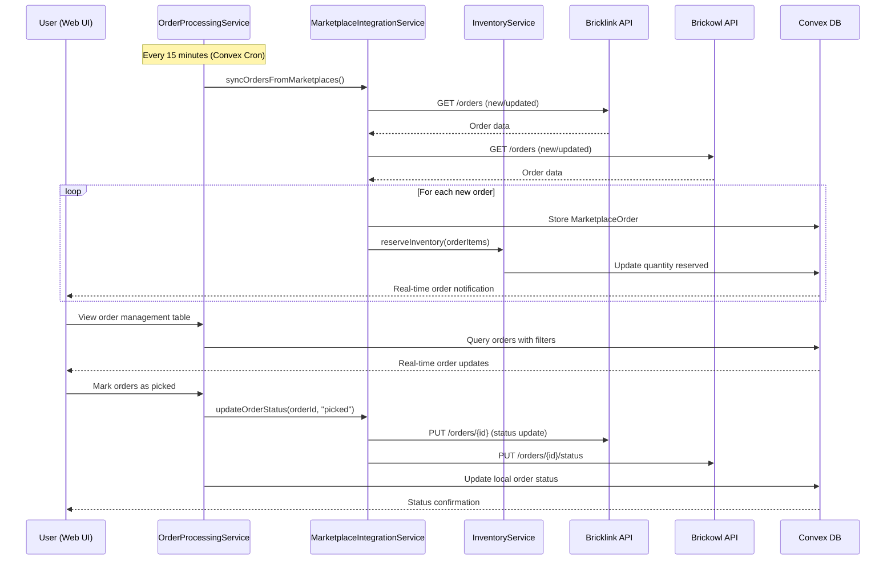
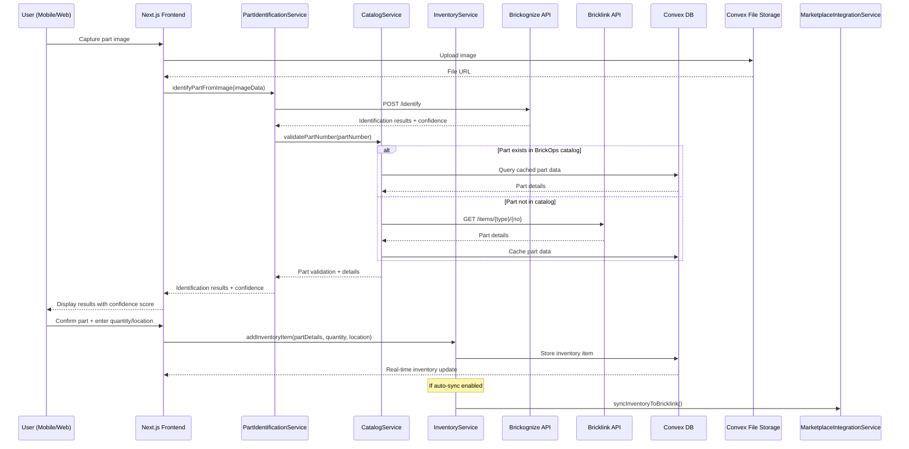
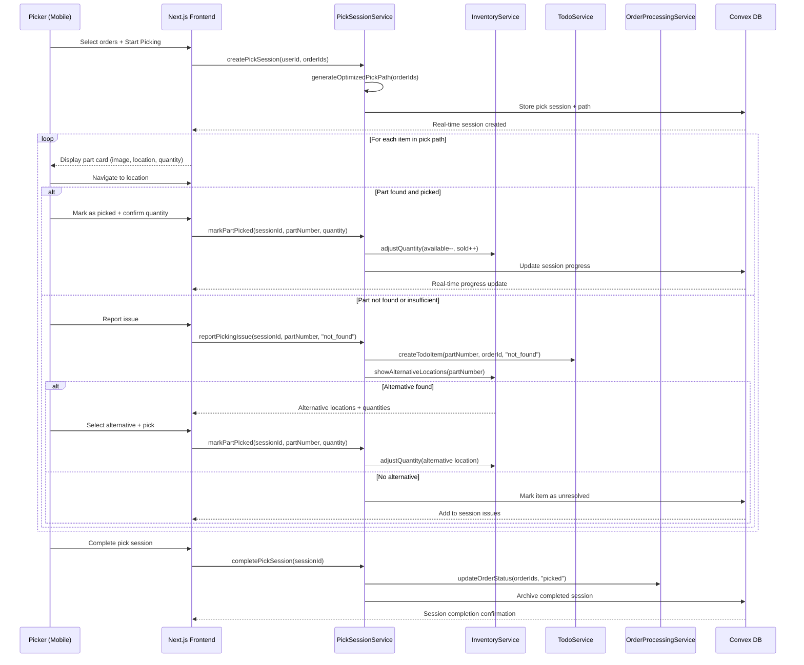

# Core Workflows

## Order Processing and Inventory Sync Workflow

```mermaid
sequenceDiagram
    participant User as User (Web UI)
    participant Order as OrderProcessingService
    participant Marketplace as MarketplaceIntegrationService
    participant Inventory as InventoryService
    participant BL as Bricklink API
    participant BO as Brickowl API
    participant DB as Convex DB

    %% Scheduled Order Sync
    Note over Order: Every 15 minutes (Convex Cron)
    Order->>Marketplace: syncOrdersFromMarketplaces()
    Marketplace->>BL: GET /orders (new/updated)
    BL-->>Marketplace: Order data
    Marketplace->>BO: GET /orders (new/updated)
    BO-->>Marketplace: Order data

    %% Process New Orders
    loop For each new order
        Marketplace->>DB: Store MarketplaceOrder
        Marketplace->>Inventory: reserveInventory(orderItems)
        Inventory->>DB: Update quantity reserved
        DB-->>User: Real-time order notification
    end

    %% User Reviews Orders
    User->>Order: View order management table
    Order->>DB: Query orders with filters
    DB-->>User: Real-time order updates

    %% Order Status Updates
    User->>Order: Mark orders as picked
    Order->>Marketplace: updateOrderStatus(orderId, "picked")
    Marketplace->>BL: PUT /orders/{id} (status update)
    Marketplace->>BO: PUT /orders/{id}/status
    Order->>DB: Update local order status
    DB-->>User: Status confirmation
```

## Part Identification and Inventory Addition Workflow

```mermaid
sequenceDiagram
    participant User as User (Mobile/Web)
    participant UI as Next.js Frontend
    participant Identify as PartIdentificationService
    participant Catalog as CatalogService
    participant Inventory as InventoryService
    participant Brickognize as Brickognize API
    participant Bricklink as Bricklink API
    participant DB as Convex DB
    participant Files as Convex File Storage

    %% Camera Capture
    User->>UI: Capture part image
    UI->>Files: Upload image
    Files-->>UI: File URL

    %% Part Identification
    UI->>Identify: identifyPartFromImage(imageData)
    Identify->>Brickognize: POST /identify
    Brickognize-->>Identify: Identification results + confidence

    %% Validate Against Catalog
    Identify->>Catalog: validatePartNumber(partNumber)
    alt Part exists in BrickOps catalog
        Catalog->>DB: Query cached part data
        DB-->>Catalog: Part details
    else Part not in catalog
        Catalog->>Bricklink: GET /items/{type}/{no}
        Bricklink-->>Catalog: Part details
        Catalog->>DB: Cache part data
    end

    Catalog-->>Identify: Part validation + details
    Identify-->>UI: Identification results + confidence

    %% User Confirmation & Inventory Addition
    UI-->>User: Display results with confidence score
    User->>UI: Confirm part + enter quantity/location
    UI->>Inventory: addInventoryItem(partDetails, quantity, location)
    Inventory->>DB: Store inventory item
    DB-->>UI: Real-time inventory update

    %% Optional: Sync to Bricklink
    Note over Inventory: If auto-sync enabled
    Inventory->>MarketplaceIntegrationService: syncInventoryToBricklink()
```

## Pick Session Workflow with Issue Resolution

```mermaid
sequenceDiagram
    participant User as Picker (Mobile)
    participant UI as Next.js Frontend
    participant Pick as PickSessionService
    participant Inventory as InventoryService
    participant Todo as TodoService
    participant Order as OrderProcessingService
    participant DB as Convex DB

    %% Session Initiation
    User->>UI: Select orders + Start Picking
    UI->>Pick: createPickSession(userId, orderIds)
    Pick->>Pick: generateOptimizedPickPath(orderIds)
    Pick->>DB: Store pick session + path
    DB-->>UI: Real-time session created

    %% Picking Loop
    loop For each item in pick path
        UI-->>User: Display part card (image, location, quantity)
        User->>UI: Navigate to location

        alt Part found and picked
            User->>UI: Mark as picked + confirm quantity
            UI->>Pick: markPartPicked(sessionId, partNumber, quantity)
            Pick->>Inventory: adjustQuantity(available--, sold++)
            Pick->>DB: Update session progress
            DB-->>UI: Real-time progress update
        else Part not found or insufficient
            User->>UI: Report issue
            UI->>Pick: reportPickingIssue(sessionId, partNumber, "not_found")
            Pick->>Todo: createTodoItem(partNumber, orderId, "not_found")
            Pick->>Inventory: showAlternativeLocations(partNumber)

            alt Alternative found
                Inventory-->>UI: Alternative locations + quantities
                User->>UI: Select alternative + pick
                UI->>Pick: markPartPicked(sessionId, partNumber, quantity)
                Pick->>Inventory: adjustQuantity(alternative location)
            else No alternative
                Pick->>DB: Mark item as unresolved
                DB-->>UI: Add to session issues
            end
        end
    end

    %% Session Completion
    User->>UI: Complete pick session
    UI->>Pick: completePickSession(sessionId)
    Pick->>Order: updateOrderStatus(orderIds, "picked")
    Pick->>DB: Archive completed session
    DB-->>UI: Session completion confirmation
```
