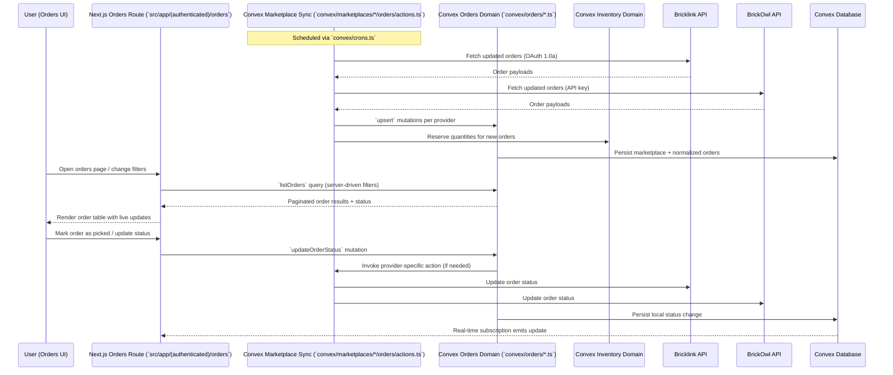
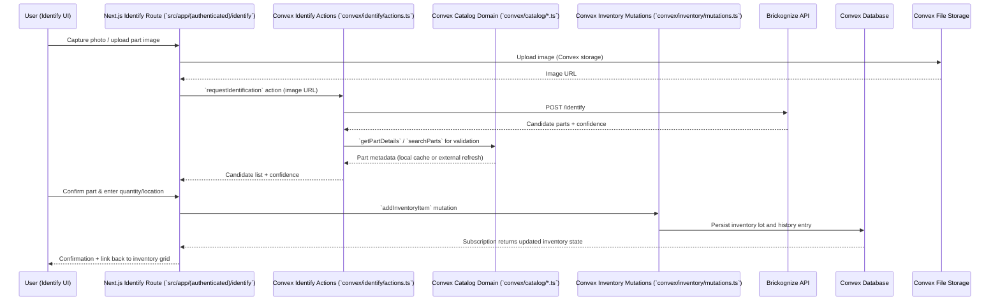
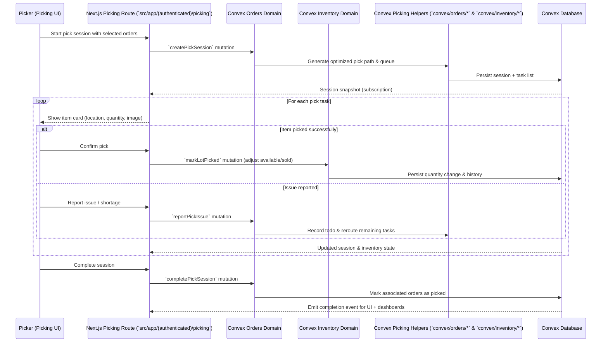

# Core Workflows

These diagrams show how the Next.js frontend coordinates with Convex domains and external providers for the most important user journeys. Each step references the current UI routes and backend modules so you can trace behaviour directly in the codebase.

## Order Sync & Management

## Part Identification & Inventory Addition

## Pick Session Lifecycle

Use these flows alongside the architecture diagrams to trace concrete file locations (`src/app/...`, `src/components/...`, `convex/...`) when adding new behaviour or debugging existing features.
