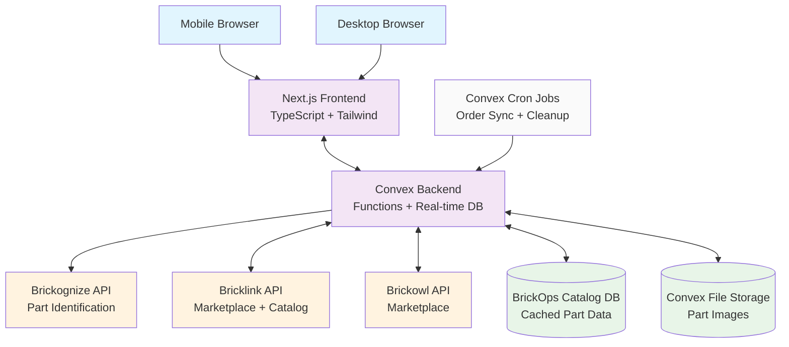

# High Level Architecture

## Technical Summary

BrickOps employs a serverless-first, real-time, event-driven architecture built on Convex with a Next.js frontend. It integrates three external APIs (Brickognize, Bricklink, Brickowl) with intelligent rate limiting and caching strategies. Real-time subscriptions ensure data consistency across clients, with Bricklink acting as the authoritative inventory source during MVP. Event-driven workflows orchestrate order processing and picking, while location-optimized algorithms improve fulfillment efficiency.

## Platform and Infrastructure Choice

- Platform: Vercel (frontend) + Convex (backend)
- Key Services: Convex Functions, Convex Database, Convex File Storage, Convex Auth, Convex Cron; Vercel hosting and CI/CD
- Deployment Regions: Global edge (Vercel) + US-based Convex

## Repository Structure

- Structure: Monorepo containing Next.js frontend and Convex backend
- Package Organization: Shared types and utilities between frontend and backend, simplified deployment and dependency management

## High Level Architecture Diagram

## Architectural Patterns

- Serverless Functions: Convex functions provide scalable, stateless business logic with automatic deployment and versioning. Rationale: eliminates infrastructure management while scaling inventory operations.
- Event-Driven Architecture: Order processing, inventory sync, and pick workflows leverage events with Convex subscriptions. Rationale: ensures consistency across multi-step processes and enables real-time UI updates.
- API Gateway: Convex functions act as an intelligent gateway for external APIs with rate limiting and caching. Rationale: centralizes API management and error handling.
- Repository Pattern: Data access via Convex schema and query functions. Rationale: clear separation of business logic and data persistence.
- Circuit Breaker: External API calls include fallback mechanisms/degraded modes. Rationale: maintains availability when external services degrade.
- Eventual Consistency with Conflict Resolution: Bricklink is the authoritative source with conflict resolution. Rationale: simplifies MVP complexity while ensuring accuracy.
