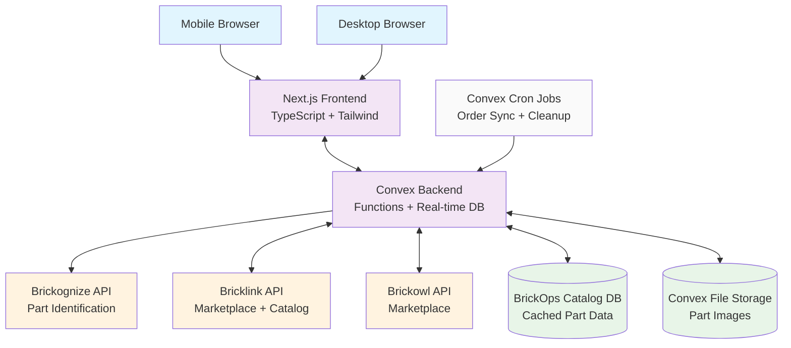

# High Level Architecture

## Technical Summary

BrickOps employs a **serverless-first architecture** built on Convex's real-time backend platform with a Next.js frontend, designed to handle complex inventory synchronization across multiple marketplaces. The system integrates three critical external APIs (Brickognize for part identification, Bricklink and Brickowl for marketplace operations) with intelligent rate limiting and caching strategies. The architecture prioritizes **real-time data consistency** through Convex's subscription model, ensuring inventory changes propagate instantly across all connected clients while maintaining Bricklink as the authoritative inventory source during MVP phase. Core architectural patterns include **event-driven workflows** for order processing, **intelligent API passthrough** for catalog management, and **location-optimized picking algorithms** for order fulfillment.

## High Level Overview

**Architectural Style:** **Serverless + Real-time Event-Driven**

- Convex serverless functions handle all business logic with automatic scaling
- Real-time subscriptions provide instant data synchronization across clients
- Event-driven workflows orchestrate complex multi-step processes (picking, order sync)

**Repository Structure:** **Monorepo** (from PRD Technical Assumptions)

- Single repository containing Next.js frontend and Convex backend
- Shared types and utilities between frontend and backend
- Simplified deployment and dependency management

**Service Architecture:** **Unified Serverless Backend** (from PRD Technical Assumptions)

- Convex functions serve as microservice-style boundaries
- Real-time database with built-in subscriptions
- No traditional server infrastructure to manage

**Primary Data Flow:**

1. **Inbound:** External API data (orders, catalog) → Convex functions → Real-time DB → Live UI updates
2. **User Actions:** UI interactions → Convex mutations → External API sync → Real-time propagation
3. **Background:** Scheduled functions handle periodic sync, rate limit management, and data validation

**Key Architectural Decisions:**

- **Convex as Single Backend:** Eliminates need for separate API server, database, and real-time infrastructure
- **Bricklink as Ground Truth:** Simplifies MVP by using existing inventory system as authoritative source
- **Intelligent Caching Layer:** BrickOps catalog database reduces API calls while ensuring data freshness
- **Event-Driven Workflows:** Pick sessions, order processing, and sync operations use event patterns for reliability

## High Level Project Diagram

## Architectural and Design Patterns

- **Serverless Functions Pattern:** Convex functions provide scalable, stateless business logic with automatic deployment and versioning - _Rationale:_ Eliminates infrastructure management while providing enterprise-grade scalability for inventory operations

- **Event-Driven Architecture:** Order processing, inventory sync, and pick workflows use event patterns with Convex subscriptions - _Rationale:_ Ensures data consistency across complex multi-step processes while enabling real-time UI updates

- **API Gateway Pattern:** Convex functions act as intelligent gateway for external API interactions with rate limiting and caching - _Rationale:_ Centralizes API management, implements consistent error handling, and respects rate limits across Brickognize, Bricklink, and Brickowl

- **Repository Pattern:** Data access abstracted through Convex schema definitions and query functions - _Rationale:_ Provides clean separation between business logic and data persistence while leveraging Convex's real-time capabilities

- **Circuit Breaker Pattern:** External API calls include fallback mechanisms and degraded service modes - _Rationale:_ Maintains system availability when external services are unavailable, critical for marketplace integrations

- **Eventual Consistency with Conflict Resolution:** Bricklink serves as authoritative source with intelligent conflict resolution - _Rationale:_ Simplifies MVP complexity while ensuring inventory accuracy across multiple systems
