# Inventory Sync Architecture

## Overview

This document describes the architecture of the inventory synchronization system, showing how inventory operations flow from user actions through the sync orchestration layer to external marketplace APIs (BrickLink and BrickOwl).

## System Architecture Diagram

```mermaid
graph TB
    subgraph "Frontend Layer"
        UI[User Interface<br/>Inventory Management]
    end

    subgraph "Convex Backend"
        subgraph "Inventory Core"
            IM[inventory/mutations.ts<br/>Add/Update/Delete Items]
            IQ[inventory/queries.ts<br/>Read Inventory]
            IH[inventoryHistory table<br/>Audit Trail]
            II[inventoryItems table<br/>Master Data]
            ISQ[inventorySyncQueue table<br/>Pending Changes]
        end

        subgraph "Sync Orchestration"
            CRON[crons.ts<br/>Every 5 minutes]
            SO[inventory/sync.ts<br/>Sync Orchestrator]
            SO_GET[getBusinessAccountsWithPendingChanges]
            SO_PROC[processPendingChanges<br/>Per Account]
        end

        subgraph "Marketplace Integration"
            MH[marketplace/helpers.ts<br/>Client Factory]
            MA[marketplace/actions.ts<br/>Test Connection]
            MQ[marketplace/queries.ts<br/>Credential Status]
            MM[marketplace/mutations.ts<br/>Store Credentials]
            MC[marketplaceCredentials table<br/>Encrypted Keys]
        end

        subgraph "BrickLink Client"
            BL[bricklink/storeClient.ts<br/>OAuth 1.0a Client]
            BLM[bricklink/storeMappers.ts<br/>Data Transform]
        end

        subgraph "BrickOwl Client"
            BO[brickowl/storeClient.ts<br/>API Key Client]
            BOM[brickowl/storeMappers.ts<br/>Data Transform]
        end
    end

    subgraph "External APIs"
        BL_API[BrickLink Store API<br/>OAuth 1.0a]
        BO_API[BrickOwl Store API<br/>API Key Auth]
    end

    %% User Flow
    UI -->|Add/Update/Delete| IM
    UI -->|Query Inventory| IQ

    %% Mutation Flow
    IM -->|1. Write Item| II
    IM -->|2. Log Change| IH
    IM -->|3. Queue Sync| ISQ

    %% Query Flow
    IQ -->|Read| II
    IQ -->|Read History| IH
    IQ -->|Check Sync Status| ISQ

    %% Sync Orchestration Flow
    CRON -->|Trigger| SO
    SO -->|Query| SO_GET
    SO_GET -->|Find Pending| ISQ
    SO -->|For Each Account| SO_PROC
    SO_PROC -->|Read Changes| ISQ
    SO_PROC -->|Create Client| MH

    %% Marketplace Client Factory
    MH -->|Get Credentials| MM
    MM -->|Read Encrypted| MC
    MH -->|BrickLink?| BL
    MH -->|BrickOwl?| BO

    %% BrickLink Flow
    BL -->|Map Data| BLM
    BL -->|OAuth Request| BL_API
    BL_API -->|Response| BL
    BL -->|Result| SO_PROC

    %% BrickOwl Flow
    BO -->|Map Data| BOM
    BO -->|API Key Request| BO_API
    BO_API -->|Response| BO
    BO -->|Result| SO_PROC

    %% Results Flow
    SO_PROC -->|Update Status| ISQ
    SO_PROC -->|Log Result| IH

    %% Credential Management
    UI -->|Test Connection| MA
    MA -->|Validate| MC
    UI -->|Save Credentials| MM
    MM -->|Encrypt & Store| MC
    UI -->|Check Status| MQ
    MQ -->|Read| MC

    %% Styling
    classDef frontend fill:#e1f5ff,stroke:#01579b,stroke-width:2px
    classDef inventory fill:#fff3e0,stroke:#e65100,stroke-width:2px
    classDef sync fill:#f3e5f5,stroke:#4a148c,stroke-width:2px
    classDef marketplace fill:#e8f5e9,stroke:#1b5e20,stroke-width:2px
    classDef bricklink fill:#fff8e1,stroke:#f57f17,stroke-width:2px
    classDef brickowl fill:#fce4ec,stroke:#880e4f,stroke-width:2px
    classDef external fill:#efebe9,stroke:#3e2723,stroke-width:2px
    classDef table fill:#e0f2f1,stroke:#004d40,stroke-width:2px

    class UI frontend
    class IM,IQ inventory
    class IH,II,ISQ table
    class CRON,SO,SO_GET,SO_PROC sync
    class MH,MA,MQ,MM,MC marketplace
    class BL,BLM bricklink
    class BO,BOM brickowl
    class BL_API,BO_API external
```



## Component Responsibilities

### Frontend Layer

- **User Interface**: React components for inventory management and marketplace credential configuration

### Inventory Core

- **inventory/mutations.ts**: Handles create, update, delete operations on inventory items

  - Validates ownership permissions
  - Writes to `inventoryItems` table
  - Logs changes to `inventoryHistory` (audit trail)
  - Queues changes to `inventorySyncQueue` (async sync)

- **inventory/queries.ts**: Read-only operations for inventory data, history, and sync status

- **Tables**:
  - `inventoryItems`: Master inventory data (source of truth)
  - `inventoryHistory`: Audit trail with delta tracking for rollback support
  - `inventorySyncQueue`: Pending changes awaiting marketplace sync

### Sync Orchestration Layer

- **crons.ts**: Scheduled job (every 5 minutes) that triggers sync processing

- **inventory/sync.ts**: Core sync orchestrator
  - `getBusinessAccountsWithPendingChanges`: Identifies accounts with pending changes
  - `processAllPendingChanges`: Cron wrapper that processes all accounts
  - `processPendingChanges`: Per-account sync processor
    - Fetches pending changes from queue
    - Routes to appropriate marketplace client
    - Updates sync status (success/failed)
    - Records results in history

### Marketplace Integration Layer

- **marketplace/helpers.ts**: Client factory pattern

  - `createBricklinkStoreClient`: Creates authenticated BrickLink client
  - `createBrickOwlStoreClient`: Creates authenticated BrickOwl client

- **marketplace/actions.ts**: Connection testing for credential validation

- **marketplace/queries.ts**: Read credential status and configuration

- **marketplace/mutations.ts**: Store and manage encrypted marketplace credentials

- **marketplaceCredentials table**: Stores encrypted API keys and OAuth tokens (BYOK model)

### BrickLink Client

- **bricklink/storeClient.ts**: OAuth 1.0a authenticated API client

  - Handles OAuth signature generation
  - Supports CRUD operations: create, update, delete inventory
  - Implements rollback patterns with compensating transactions
  - Dry-run mode for validation

- **bricklink/storeMappers.ts**: Data transformation layer
  - Maps Convex data model to BrickLink API format
  - Handles field name conversions and type transformations

### BrickOwl Client

- **brickowl/storeClient.ts**: API Key authenticated client

  - Handles API key authentication
  - Supports CRUD operations with relative quantity updates
  - Implements rollback patterns
  - Dry-run mode for validation

- **brickowl/storeMappers.ts**: Data transformation layer
  - Maps Convex data model to BrickOwl API format
  - Handles field name conversions and type transformations

## Data Flow

### 1. User Creates Inventory Item

```
User → UI → inventory/mutations.addInventoryItem()
  ├─→ Write to inventoryItems table
  ├─→ Write to inventoryHistory table (changeType: "create")
  └─→ Write to inventorySyncQueue table (syncStatus: "pending")
```

### 2. Cron Triggers Sync

```
Every 5 minutes → crons.ts → inventory/sync.processAllPendingChanges()
  ├─→ getBusinessAccountsWithPendingChanges() → Find accounts with pending changes
  └─→ For each account → processPendingChanges(accountId)
```

### 3. Process Pending Changes

```
processPendingChanges(accountId)
  ├─→ Fetch pending changes from inventorySyncQueue
  ├─→ For each change:
  │   ├─→ marketplace/helpers.createClient() → Get marketplace-specific client
  │   ├─→ Map data via storeMappers
  │   ├─→ Call marketplace API (BrickLink or BrickOwl)
  │   ├─→ Update inventorySyncQueue.syncStatus (completed/failed)
  │   └─→ Write to inventoryHistory with API response
  └─→ Return summary metrics
```

### 4. Credential Management

```
User → Settings Page
  ├─→ marketplace/mutations.saveCredentials() → Encrypt & store
  ├─→ marketplace/actions.testConnection() → Validate credentials
  └─→ marketplace/queries.getCredentialStatus() → Check configuration
```

## Security Model

### Bring Your Own Keys (BYOK)

- Users provide their own marketplace API credentials
- All credentials are encrypted using Web Crypto API before storage
- Decryption only happens server-side during API calls
- No shared credentials or rate limits between users

### Permission Model

- **Owner Role Required**: All inventory mutations require business account owner role
- **Business Account Isolation**: Users can only access their own business account data
- **Credential Isolation**: Each business account has separate marketplace credentials

## Rollback Support

### Compensating Transactions

All marketplace operations support rollback via compensating transactions:

1. **CREATE Rollback**: Delete the created item (requires marketplace-specific ID)
2. **UPDATE Rollback**: Reverse the update (requires previous values and delta reversal)
3. **DELETE Rollback**: Recreate the item (requires full original payload)

### History Tracking

The `inventoryHistory` table stores:

- Change type (create/update/delete)
- Delta values (quantity changes)
- Previous state data (for rollback)
- Marketplace response data
- Correlation IDs for debugging

## Error Handling

### Retry Strategy

- Failed syncs remain in `inventorySyncQueue` with status "failed"
- Cron job retries failed changes on next run
- Max retry attempts tracked to prevent infinite loops

### Error Recording

- API errors captured in `inventorySyncQueue.lastError`
- Detailed error data stored in `inventoryHistory`
- Metrics recorded for monitoring and alerting

## Performance Considerations

### Batch Processing

- Changes processed in batches per business account
- Rate limiting enforced per marketplace API requirements
- Concurrent processing across different business accounts

### Queue Management

- Indexes on `syncStatus` and `businessAccountId` for efficient queries
- Soft deletes for completed syncs (archival)
- Cleanup of old completed records

## Testing Strategy

### Unit Tests

- Mock marketplace API responses
- Test data mappers independently
- Validate rollback logic with dry-run mode

### Integration Tests

- Use `DISABLE_EXTERNAL_CALLS=true` for offline testing
- Test credential encryption/decryption flow
- Validate sync orchestration logic

### E2E Tests

- Test full inventory create/sync flow
- Verify credential management UI
- Validate error handling and retry logic

## Future Enhancements

### Planned Features

- Manual sync trigger (Story 3.5)
- Bulk import/export (Story 3.6)
- Real-time sync status notifications (Story 3.7)
- Advanced rollback UI with preview (Story 3.8)

### Scalability Improvements

- Webhook-based real-time sync (eliminate polling)
- Distributed queue processing for high-volume accounts
- Caching layer for credential decryption
