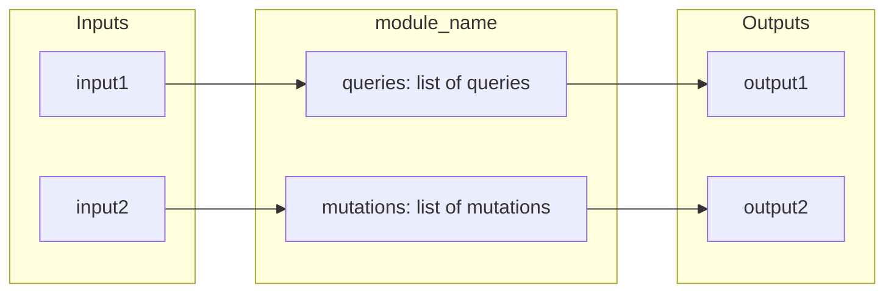

# {Module Name}

{Brief 1-2 sentence description of what this module handles.}

## Inputs and Outputs

## Tables Owned

| Table       | Description            |
| ----------- | ---------------------- |
| `tableName` | What this table stores |

## Public Functions

| Function       | Type     | Description  |
| -------------- | -------- | ------------ |
| `functionName` | query    | What it does |
| `functionName` | mutation | What it does |
| `functionName` | action   | What it does |

## Dependencies

- `shared/encryption` - Why needed
- `@convex-dev/auth/server` - Why needed

## Used By

- `inventory/` - Uses X for Y
- `orders/` - Uses X for Y

## Internal Functions

- `internalFunctionName` - Brief description
